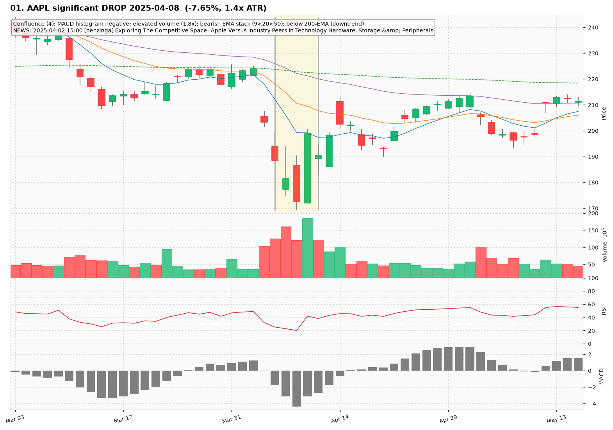
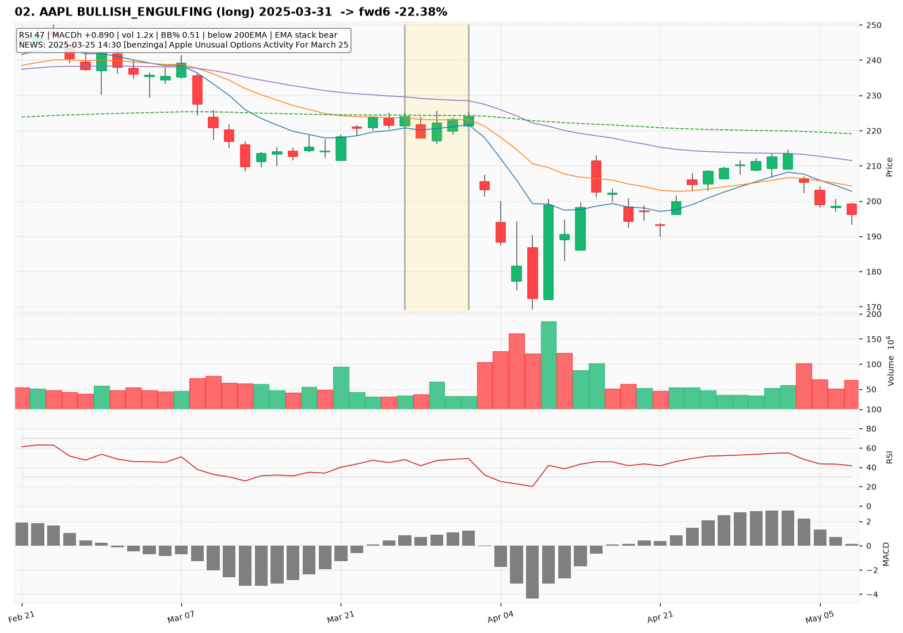
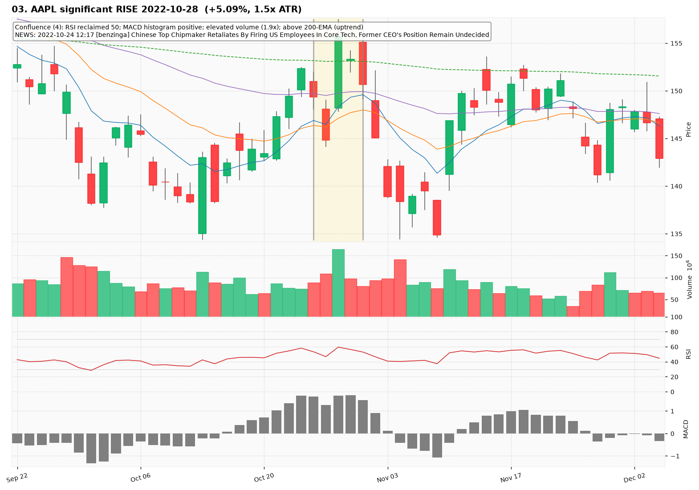
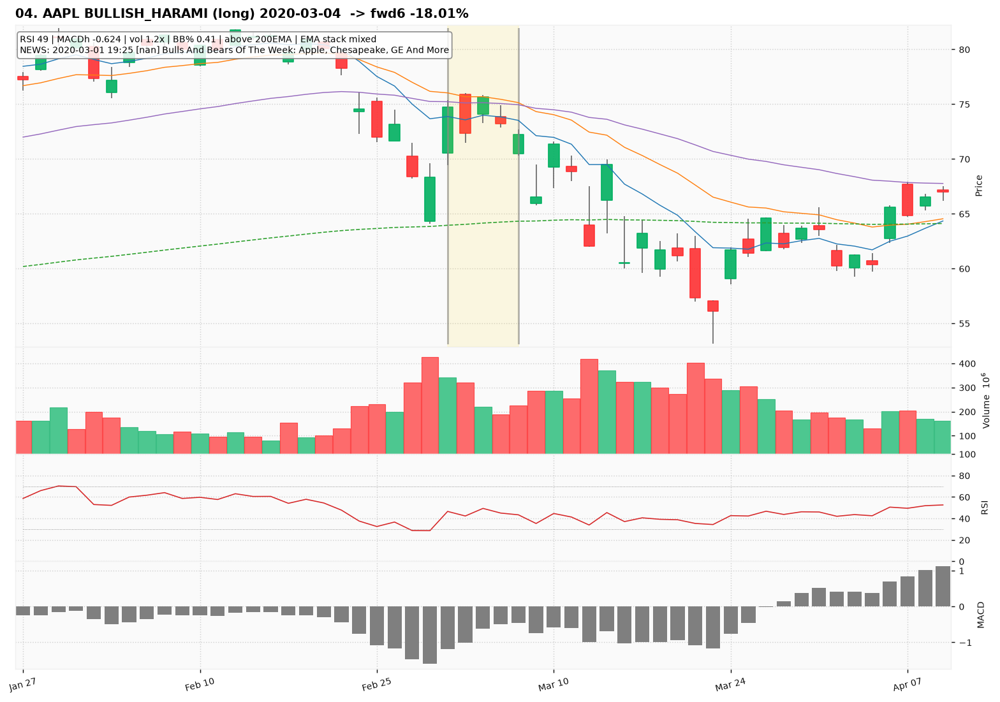
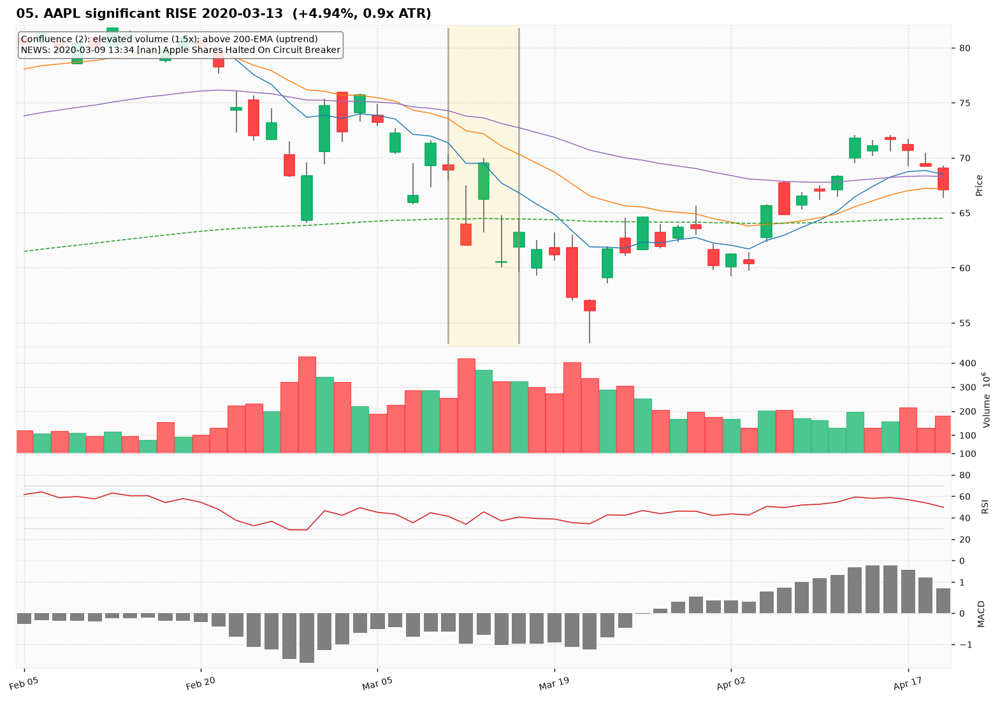
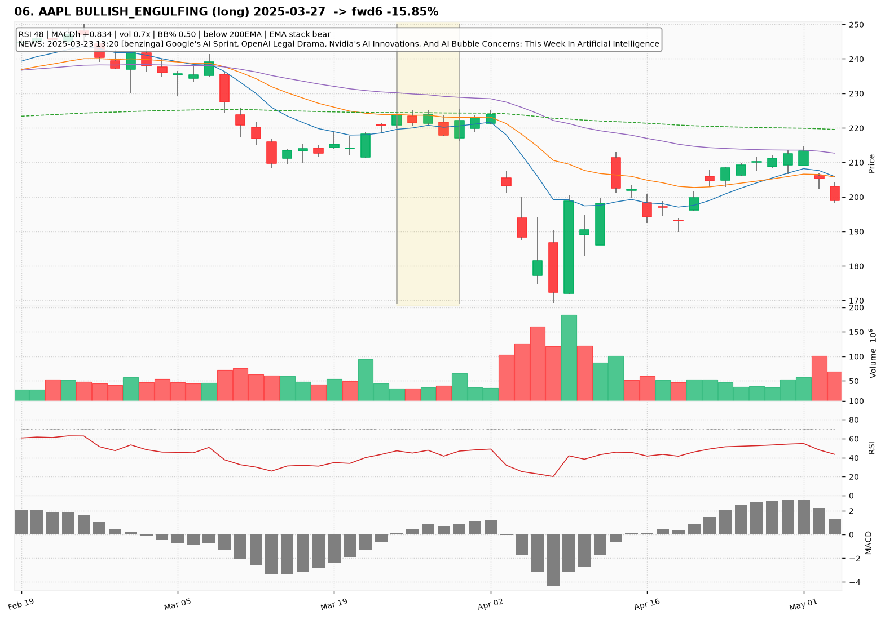
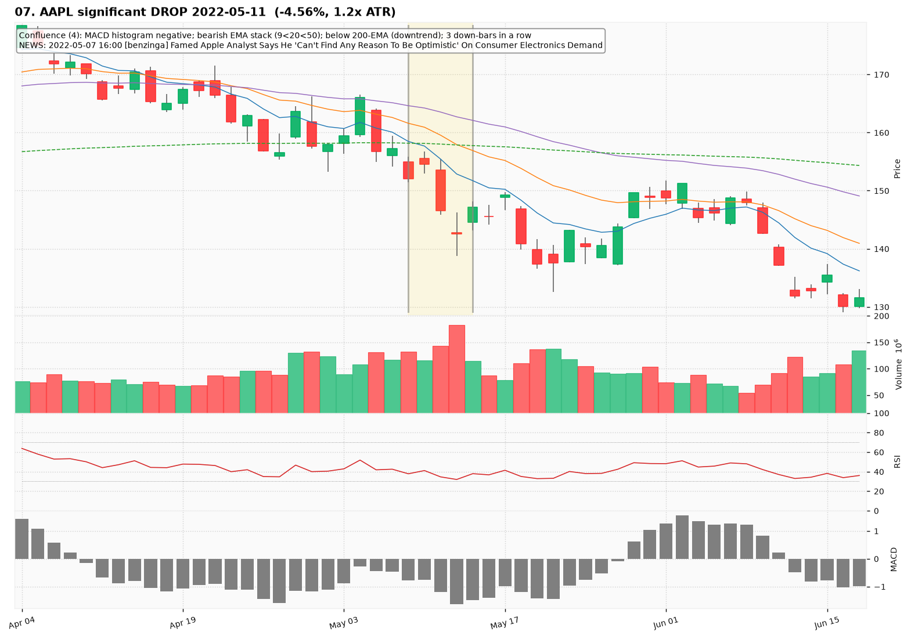
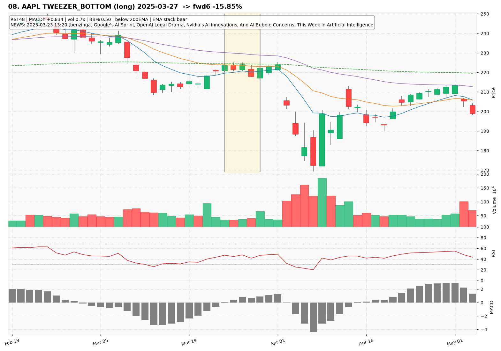
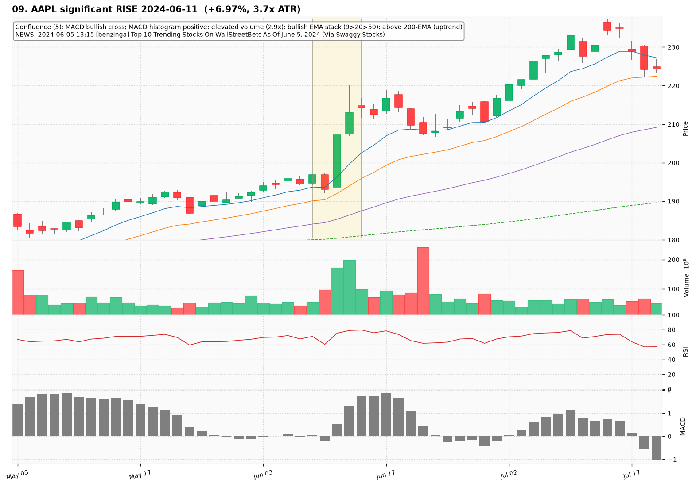
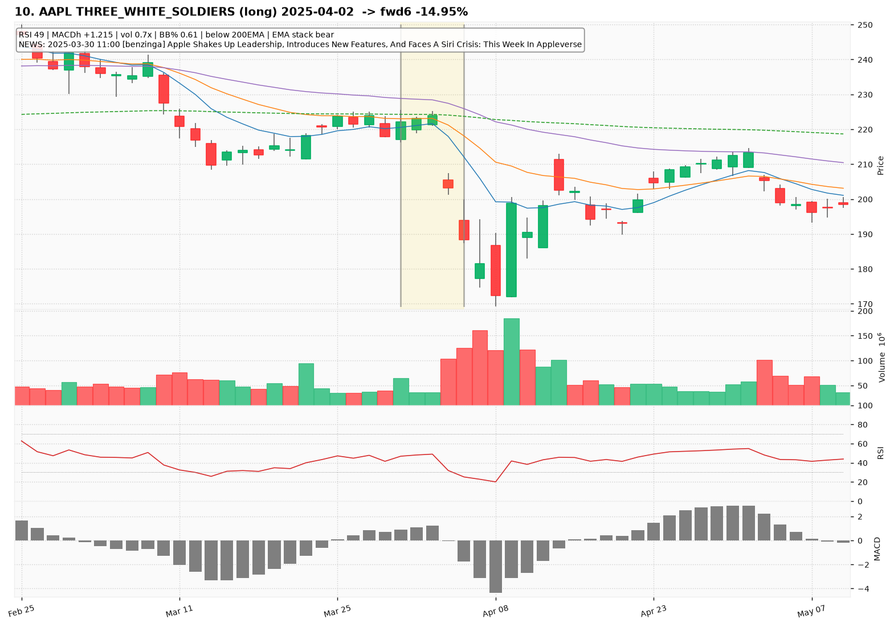

# AAPL — Deep TA Dive (daily candles)

**Bars:** 3,781 (2011-06-13 -> 2026-06-25)  |  **News headlines:** 22,675

TA layered per candle: 43 continuous indicators + 19 candlestick patterns + chart-structure (H&S / double top-bottom / flags).

## What was found

- Significant moves (|1-bar return| in the 0.5% tails): **37**
- Candlestick fulfillments: **1,614**
- Structure fulfillments: **297**

Full records (with t-2..t+2 TA windows): `all_events.parquet`, `significant_moves.csv`, `fulfilled_patterns.csv`.

## The 10 charted examples

### 01. AAPL significant DROP 2025-04-08  (-7.65%, 1.4x ATR)

- **TA read:** Confluence (4): MACD histogram negative; elevated volume (1.8x); bearish EMA stack (9<20<50); below 200-EMA (downtrend)
- **News:** 2025-04-02 15:00 [benzinga] Exploring The Competitive Space: Apple Versus Industry Peers In Technology Hardware, Storage &amp; Peripherals
- **Outcome (next 6 bars):** +12.67%

### 02. AAPL BULLISH_ENGULFING (long) 2025-03-31  -> fwd6 -22.38%

- **TA read:** RSI 47 | MACDh +0.890 | vol 1.2x | BB% 0.51 | below 200EMA | EMA stack bear
- **News:** 2025-03-25 14:30 [benzinga] Apple Unusual Options Activity For March 25
- **Outcome (next 6 bars):** -22.38%

### 03. AAPL significant RISE 2022-10-28  (+5.09%, 1.5x ATR)

- **TA read:** Confluence (4): RSI reclaimed 50; MACD histogram positive; elevated volume (1.9x); above 200-EMA (uptrend)
- **News:** 2022-10-24 12:17 [benzinga] Chinese Top Chipmaker Retaliates By Firing US Employees In Core Tech, Former CEO's Position Remain Undecided
- **Outcome (next 6 bars):** -10.80%

### 04. AAPL BULLISH_HARAMI (long) 2020-03-04  -> fwd6 -18.01%

- **TA read:** RSI 49 | MACDh -0.624 | vol 1.2x | BB% 0.41 | above 200EMA | EMA stack mixed
- **News:** 2020-03-01 19:25 [nan] Bulls And Bears Of The Week: Apple, Chesapeake, GE And More
- **Outcome (next 6 bars):** -18.01%

### 05. AAPL significant RISE 2020-03-13  (+4.94%, 0.9x ATR)

- **TA read:** Confluence (2): elevated volume (1.5x); above 200-EMA (uptrend)
- **News:** 2020-03-09 13:34 [nan] Apple Shares Halted On Circuit Breaker
- **Outcome (next 6 bars):** -19.28%

### 06. AAPL BULLISH_ENGULFING (long) 2025-03-27  -> fwd6 -15.85%

- **TA read:** RSI 48 | MACDh +0.834 | vol 0.7x | BB% 0.50 | below 200EMA | EMA stack bear
- **News:** 2025-03-23 13:20 [benzinga] Google's AI Sprint, OpenAI Legal Drama, Nvidia's AI Innovations, And AI Bubble Concerns: This Week In Artificial Intelligence
- **Outcome (next 6 bars):** -15.85%

### 07. AAPL significant DROP 2022-05-11  (-4.56%, 1.2x ATR)

- **TA read:** Confluence (4): MACD histogram negative; bearish EMA stack (9<20<50); below 200-EMA (downtrend); 3 down-bars in a row
- **News:** 2022-05-07 16:00 [benzinga] Famed Apple Analyst Says He 'Can't Find Any Reason To Be Optimistic' On Consumer Electronics Demand
- **Outcome (next 6 bars):** -6.25%

### 08. AAPL TWEEZER_BOTTOM (long) 2025-03-27  -> fwd6 -15.85%

- **TA read:** RSI 48 | MACDh +0.834 | vol 0.7x | BB% 0.50 | below 200EMA | EMA stack bear
- **News:** 2025-03-23 13:20 [benzinga] Google's AI Sprint, OpenAI Legal Drama, Nvidia's AI Innovations, And AI Bubble Concerns: This Week In Artificial Intelligence
- **Outcome (next 6 bars):** -15.85%

### 09. AAPL significant RISE 2024-06-11  (+6.97%, 3.7x ATR)

- **TA read:** Confluence (5): MACD bullish cross; MACD histogram positive; elevated volume (2.9x); bullish EMA stack (9>20>50); above 200-EMA (uptrend)
- **News:** 2024-06-05 13:15 [benzinga] Top 10 Trending Stocks On WallStreetBets As Of June 5, 2024 (Via Swaggy Stocks)
- **Outcome (next 6 bars):** +1.22%

### 10. AAPL THREE_WHITE_SOLDIERS (long) 2025-04-02  -> fwd6 -14.95%

- **TA read:** RSI 49 | MACDh +1.215 | vol 0.7x | BB% 0.61 | below 200EMA | EMA stack bear
- **News:** 2025-03-30 11:00 [benzinga] Apple Shakes Up Leadership, Introduces New Features, And Faces A Siri Crisis: This Week In Appleverse
- **Outcome (next 6 bars):** -14.95%
