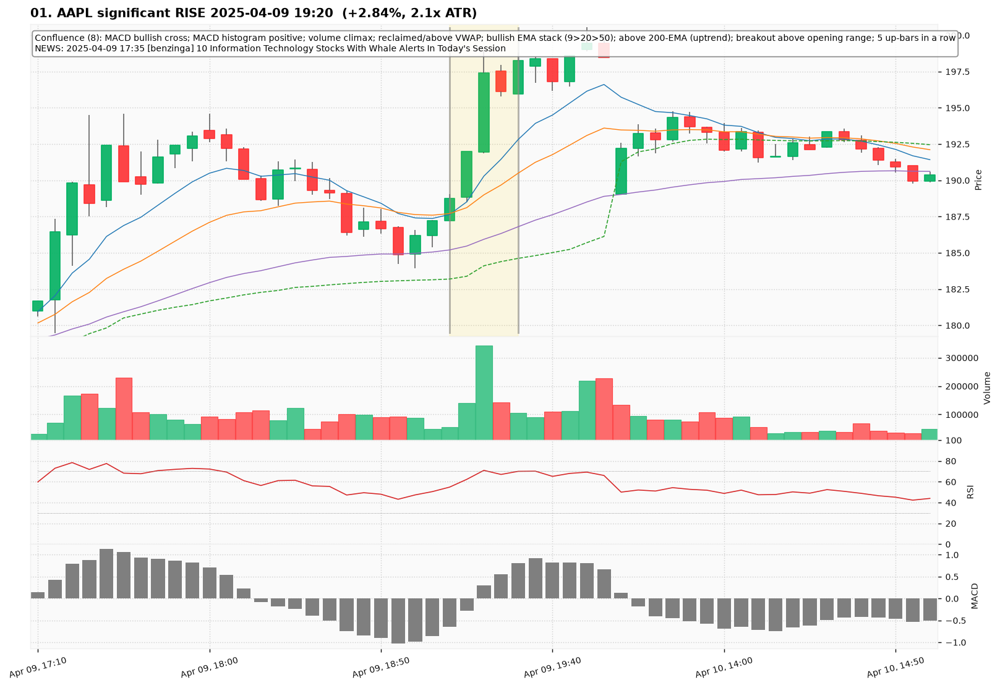
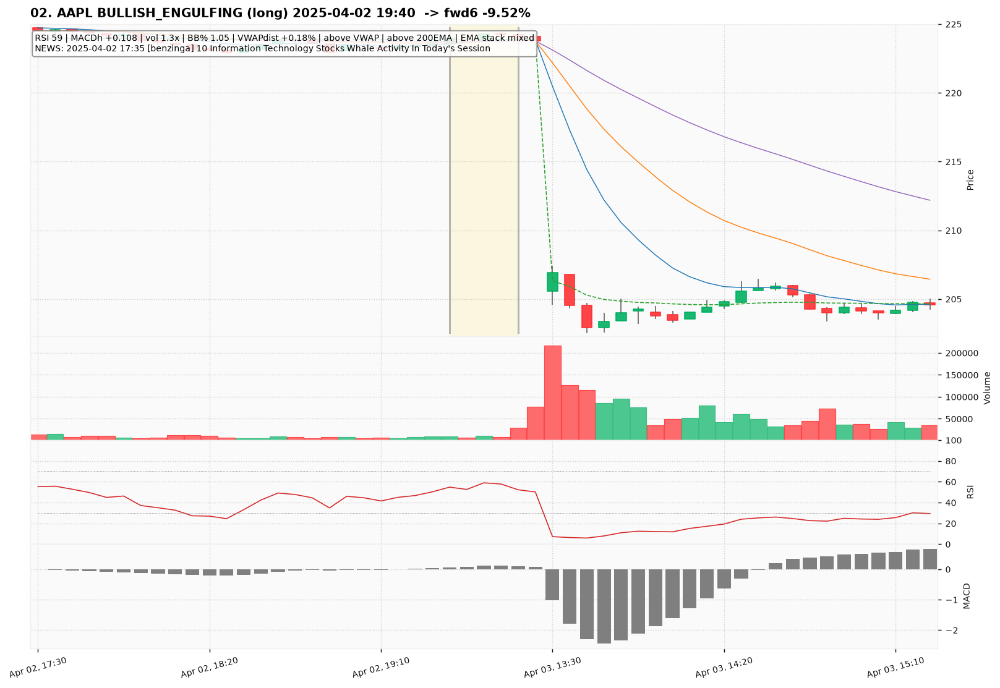
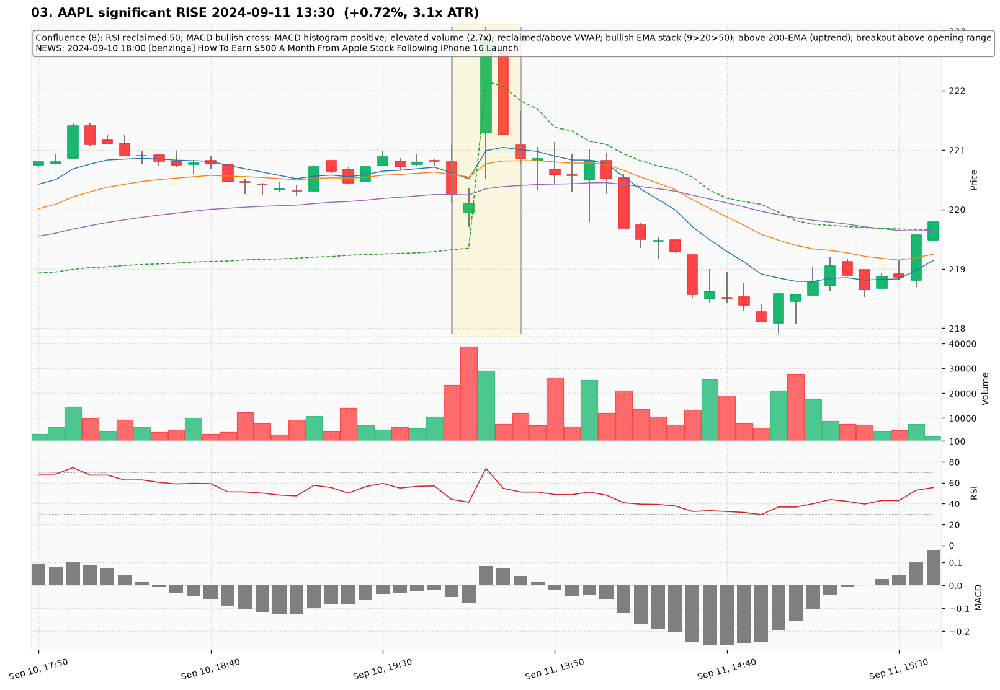
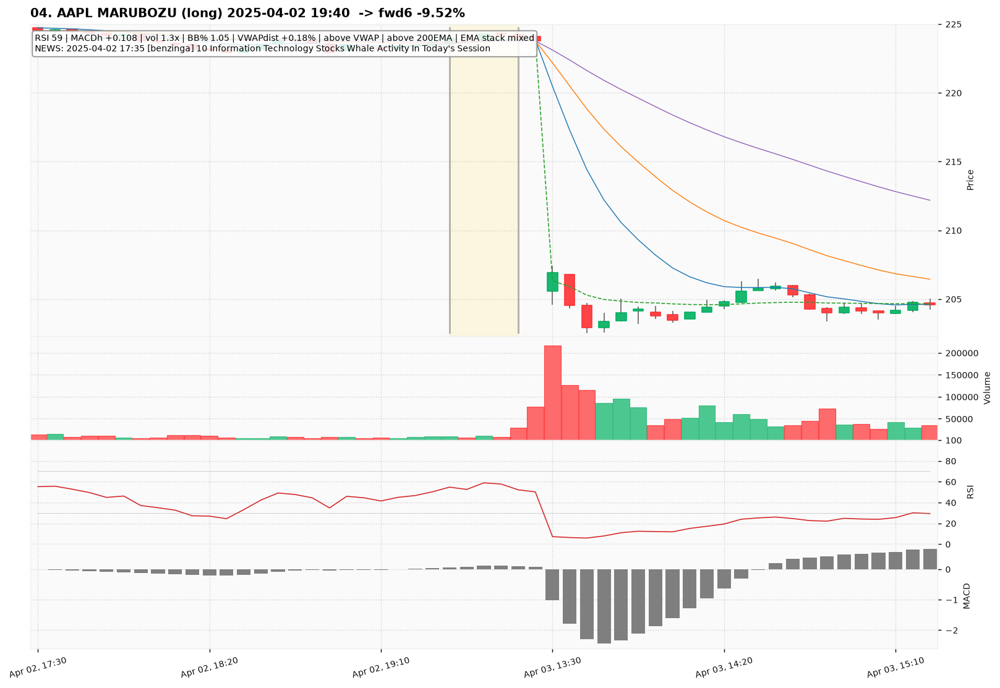
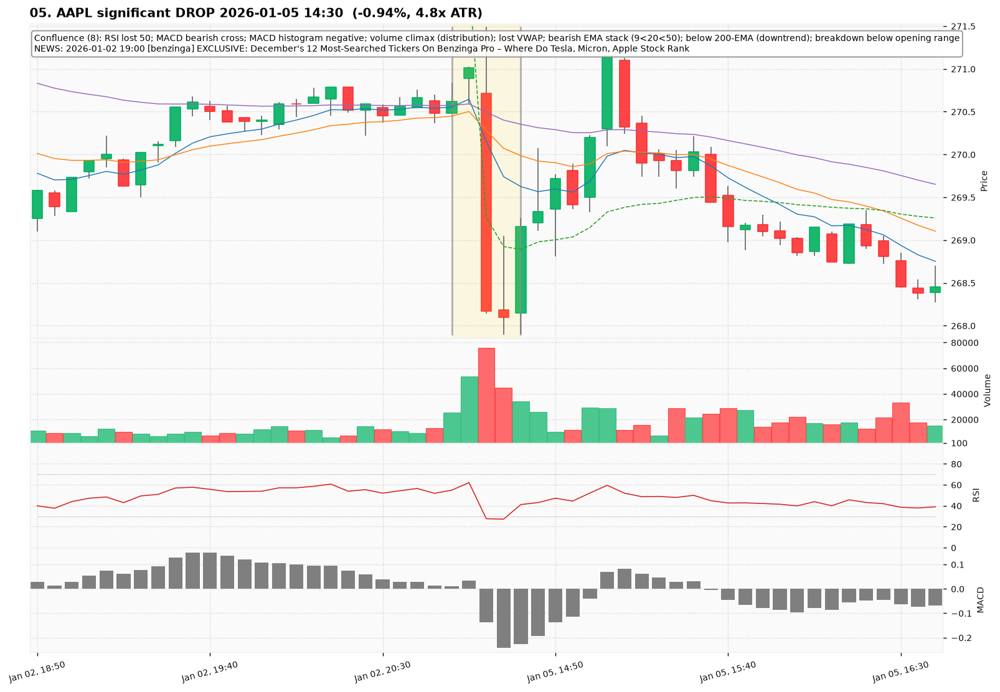
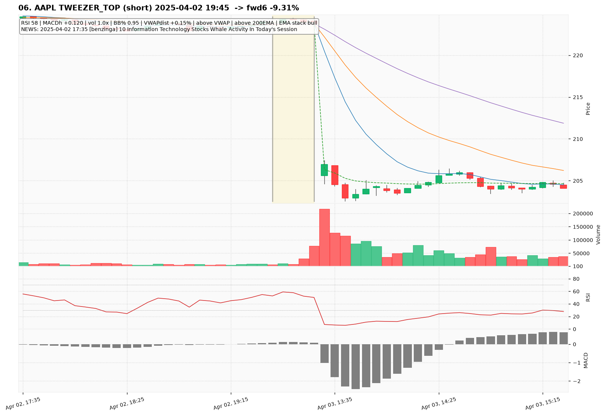
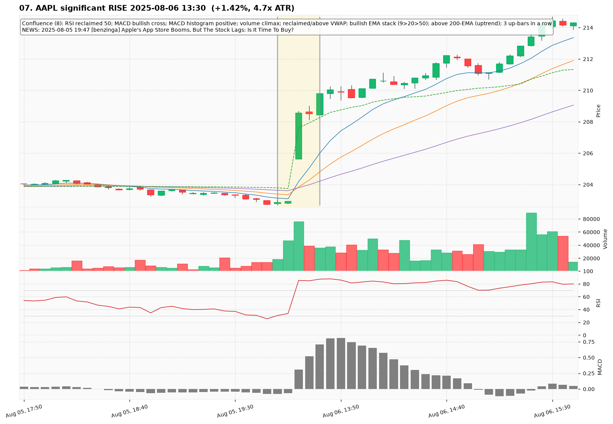
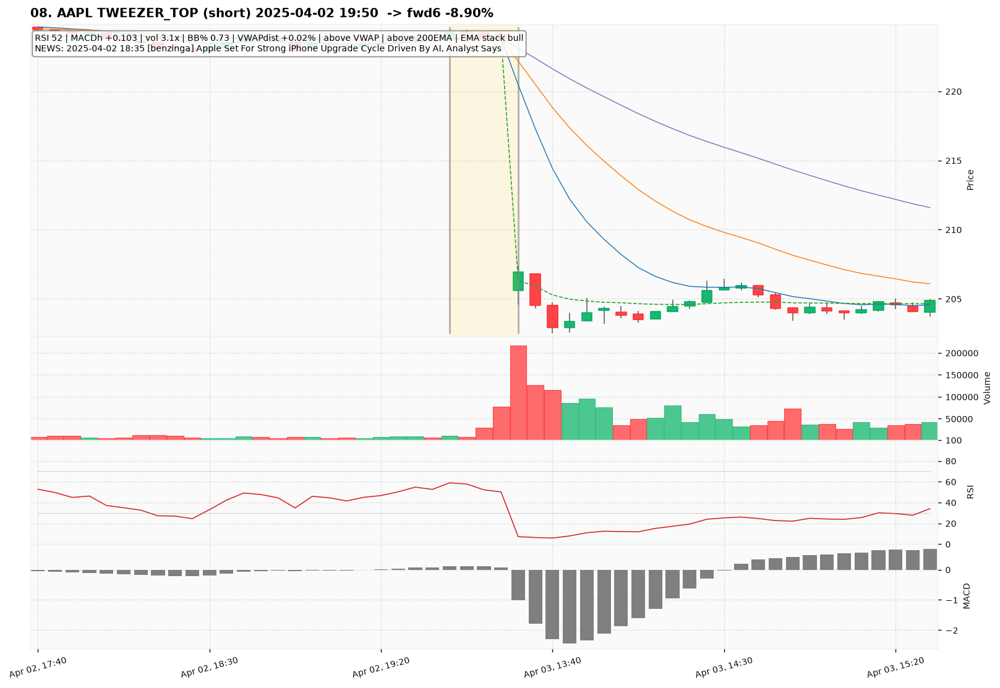
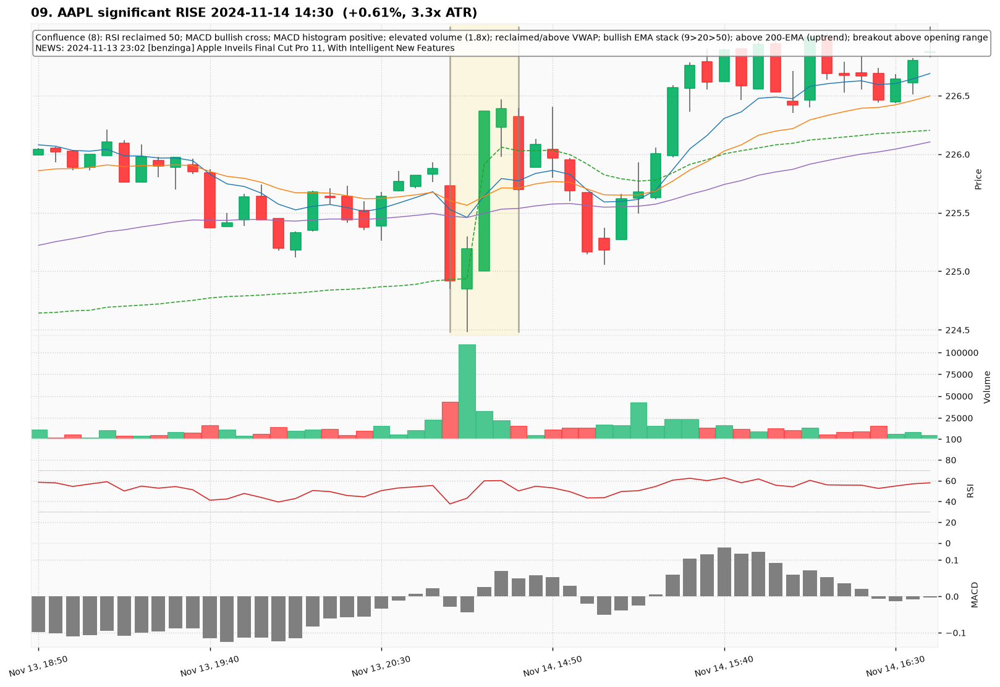
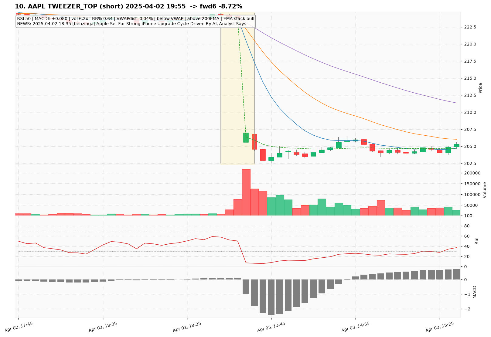

# AAPL — Deep TA Dive (5-minute candles)

**Bars:** 67,664 (2023-01-03 -> 2026-06-26)  |  **News headlines:** 22,675

TA layered per candle: 48 continuous indicators + 19 candlestick patterns + chart-structure (H&S / double top-bottom / flags).

## What was found

- Significant moves (|1-bar return| in the 0.5% tails): **676**
- Candlestick fulfillments: **62,402**
- Structure fulfillments: **6,683**

Full records (with t-2..t+2 TA windows): `all_events.parquet`, `significant_moves.csv`, `fulfilled_patterns.csv`.

## The 10 charted examples

### 01. AAPL significant RISE 2025-04-09 19:20  (+2.84%, 2.1x ATR)

- **TA read:** Confluence (8): MACD bullish cross; MACD histogram positive; volume climax; reclaimed/above VWAP; bullish EMA stack (9>20>50); above 200-EMA (uptrend); breakout above opening range; 5 up-bars in a row
- **News:** 2025-04-09 17:35 [benzinga] 10 Information Technology Stocks With Whale Alerts In Today's Session
- **Outcome (next 6 bars):** +1.03%

### 02. AAPL BULLISH_ENGULFING (long) 2025-04-02 19:40  -> fwd6 -9.52%

- **TA read:** RSI 59 | MACDh +0.108 | vol 1.3x | BB% 1.05 | VWAPdist +0.18% | above VWAP | above 200EMA | EMA stack mixed
- **News:** 2025-04-02 17:35 [benzinga] 10 Information Technology Stocks Whale Activity In Today's Session
- **Outcome (next 6 bars):** -9.52%

### 03. AAPL significant RISE 2024-09-11 13:30  (+0.72%, 3.1x ATR)

- **TA read:** Confluence (8): RSI reclaimed 50; MACD bullish cross; MACD histogram positive; elevated volume (2.7x); reclaimed/above VWAP; bullish EMA stack (9>20>50); above 200-EMA (uptrend); breakout above opening range
- **News:** 2024-09-10 18:00 [benzinga] How To Earn $500 A Month From Apple Stock Following iPhone 16 Launch
- **Outcome (next 6 bars):** -0.92%

### 04. AAPL MARUBOZU (long) 2025-04-02 19:40  -> fwd6 -9.52%

- **TA read:** RSI 59 | MACDh +0.108 | vol 1.3x | BB% 1.05 | VWAPdist +0.18% | above VWAP | above 200EMA | EMA stack mixed
- **News:** 2025-04-02 17:35 [benzinga] 10 Information Technology Stocks Whale Activity In Today's Session
- **Outcome (next 6 bars):** -9.52%

### 05. AAPL significant DROP 2026-01-05 14:30  (-0.94%, 4.8x ATR)

- **TA read:** Confluence (8): RSI lost 50; MACD bearish cross; MACD histogram negative; volume climax (distribution); lost VWAP; bearish EMA stack (9<20<50); below 200-EMA (downtrend); breakdown below opening range
- **News:** 2026-01-02 19:00 [benzinga] EXCLUSIVE: December's 12 Most-Searched Tickers On Benzinga Pro – Where Do Tesla, Micron, Apple Stock Rank
- **Outcome (next 6 bars):** +0.76%

### 06. AAPL TWEEZER_TOP (short) 2025-04-02 19:45  -> fwd6 -9.31%

- **TA read:** RSI 58 | MACDh +0.120 | vol 1.0x | BB% 0.95 | VWAPdist +0.15% | above VWAP | above 200EMA | EMA stack bull
- **News:** 2025-04-02 17:35 [benzinga] 10 Information Technology Stocks Whale Activity In Today's Session
- **Outcome (next 6 bars):** -9.31%

### 07. AAPL significant RISE 2025-08-06 13:30  (+1.42%, 4.7x ATR)

- **TA read:** Confluence (8): RSI reclaimed 50; MACD bullish cross; MACD histogram positive; volume climax; reclaimed/above VWAP; bullish EMA stack (9>20>50); above 200-EMA (uptrend); 3 up-bars in a row
- **News:** 2025-08-05 19:47 [benzinga] Apple's App Store Booms, But The Stock Lags: Is It Time To Buy?
- **Outcome (next 6 bars):** +0.75%

### 08. AAPL TWEEZER_TOP (short) 2025-04-02 19:50  -> fwd6 -8.90%

- **TA read:** RSI 52 | MACDh +0.103 | vol 3.1x | BB% 0.73 | VWAPdist +0.02% | above VWAP | above 200EMA | EMA stack bull
- **News:** 2025-04-02 18:35 [benzinga] Apple Set For Strong iPhone Upgrade Cycle Driven By AI, Analyst Says
- **Outcome (next 6 bars):** -8.90%

### 09. AAPL significant RISE 2024-11-14 14:30  (+0.61%, 3.3x ATR)

- **TA read:** Confluence (8): RSI reclaimed 50; MACD bullish cross; MACD histogram positive; elevated volume (1.8x); reclaimed/above VWAP; bullish EMA stack (9>20>50); above 200-EMA (uptrend); breakout above opening range
- **News:** 2024-11-13 23:02 [benzinga] Apple Inveils Final Cut Pro 11, With Intelligent New Features
- **Outcome (next 6 bars):** -0.53%

### 10. AAPL TWEEZER_TOP (short) 2025-04-02 19:55  -> fwd6 -8.72%

- **TA read:** RSI 50 | MACDh +0.080 | vol 6.2x | BB% 0.64 | VWAPdist -0.04% | below VWAP | above 200EMA | EMA stack bull
- **News:** 2025-04-02 18:35 [benzinga] Apple Set For Strong iPhone Upgrade Cycle Driven By AI, Analyst Says
- **Outcome (next 6 bars):** -8.72%
