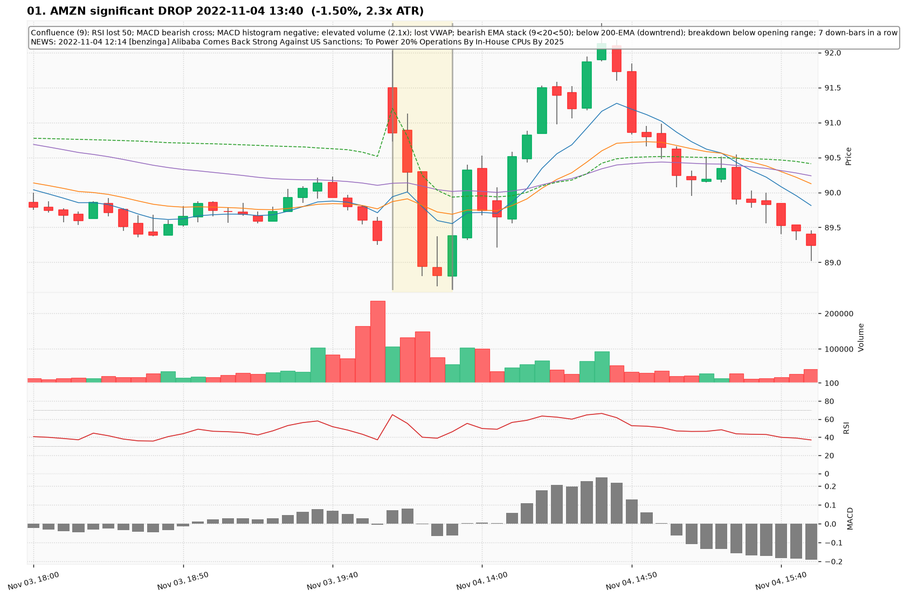
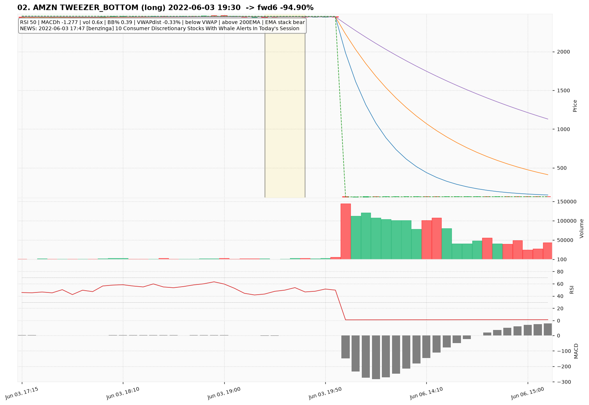
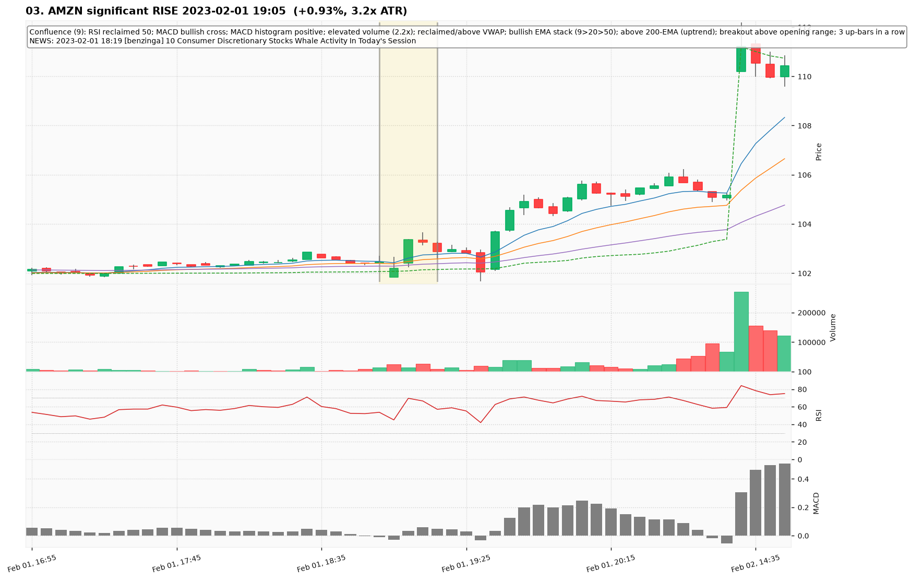
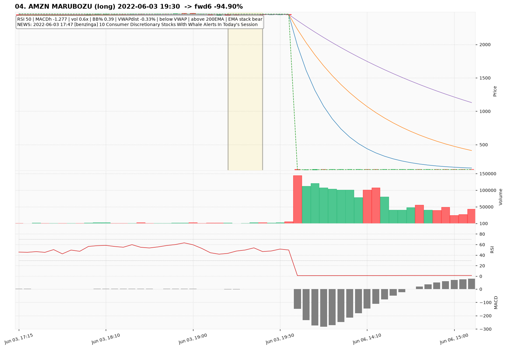
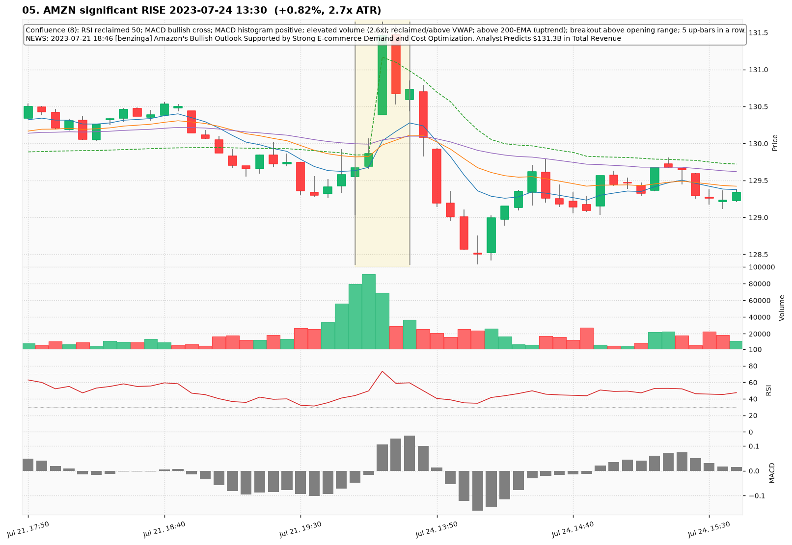
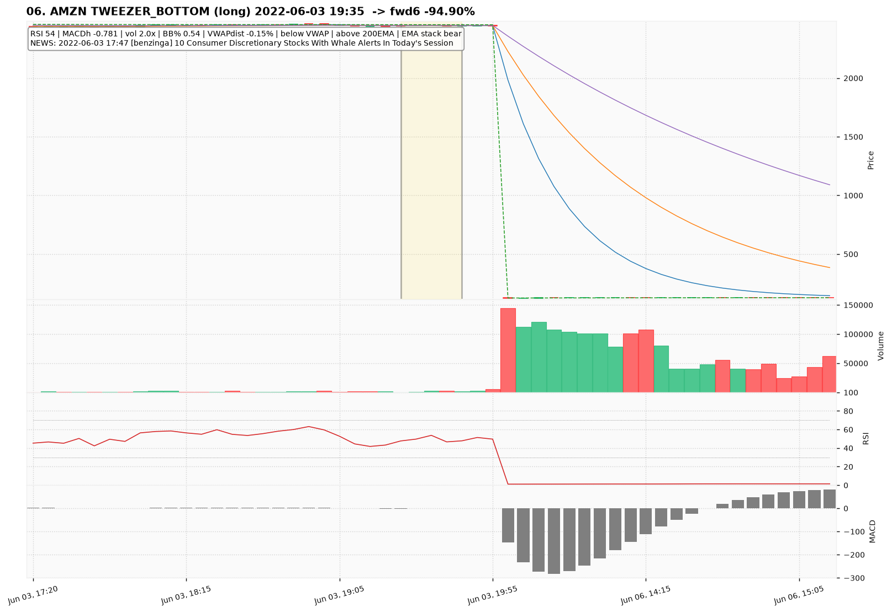
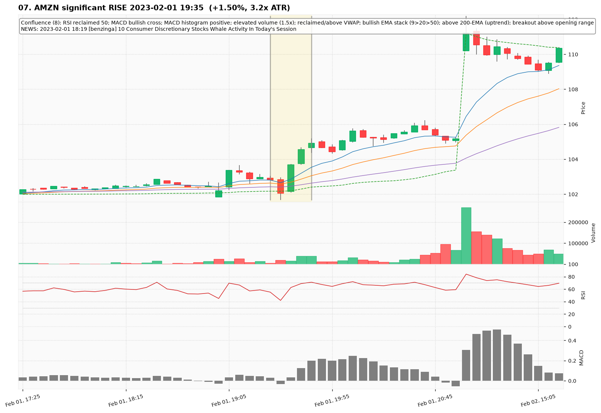
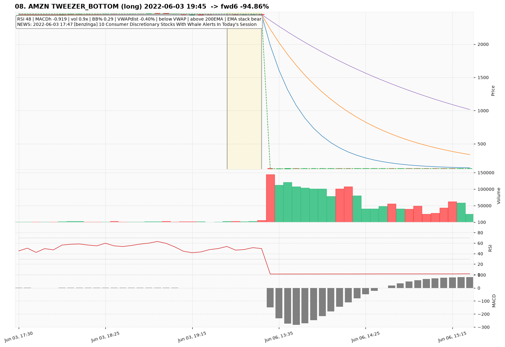
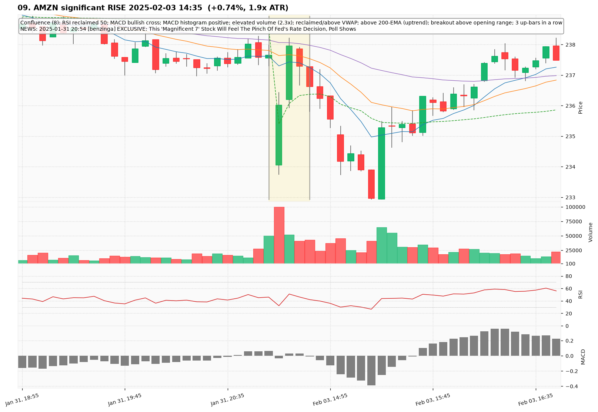
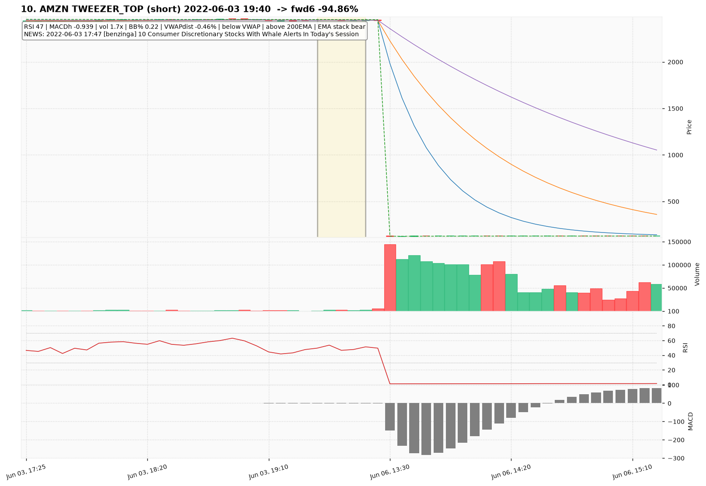

# AMZN — Deep TA Dive (5-minute candles)

**Bars:** 104,870 (2021-01-04 -> 2026-06-26)  |  **News headlines:** 18,608

TA layered per candle: 48 continuous indicators + 19 candlestick patterns + chart-structure (H&S / double top-bottom / flags).

## What was found

- Significant moves (|1-bar return| in the 0.5% tails): **1,048**
- Candlestick fulfillments: **98,692**
- Structure fulfillments: **10,339**

Full records (with t-2..t+2 TA windows): `all_events.parquet`, `significant_moves.csv`, `fulfilled_patterns.csv`.

## The 10 charted examples

### 01. AMZN significant DROP 2022-11-04 13:40  (-1.50%, 2.3x ATR)

- **TA read:** Confluence (9): RSI lost 50; MACD bearish cross; MACD histogram negative; elevated volume (2.1x); lost VWAP; bearish EMA stack (9<20<50); below 200-EMA (downtrend); breakdown below opening range; 7 down-bars in a row
- **News:** 2022-11-04 12:14 [benzinga] Alibaba Comes Back Strong Against US Sanctions; To Power 20% Operations By In-House CPUs By 2025
- **Outcome (next 6 bars):** +1.77%

### 02. AMZN TWEEZER_BOTTOM (long) 2022-06-03 19:30  -> fwd6 -94.90%

- **TA read:** RSI 50 | MACDh -1.277 | vol 0.6x | BB% 0.39 | VWAPdist -0.33% | below VWAP | above 200EMA | EMA stack bear
- **News:** 2022-06-03 17:47 [benzinga] 10 Consumer Discretionary Stocks With Whale Alerts In Today's Session
- **Outcome (next 6 bars):** -94.90%

### 03. AMZN significant RISE 2023-02-01 19:05  (+0.93%, 3.2x ATR)

- **TA read:** Confluence (9): RSI reclaimed 50; MACD bullish cross; MACD histogram positive; elevated volume (2.2x); reclaimed/above VWAP; bullish EMA stack (9>20>50); above 200-EMA (uptrend); breakout above opening range; 3 up-bars in a row
- **News:** 2023-02-01 18:19 [benzinga] 10 Consumer Discretionary Stocks Whale Activity In Today's Session
- **Outcome (next 6 bars):** +0.30%

### 04. AMZN MARUBOZU (long) 2022-06-03 19:30  -> fwd6 -94.90%

- **TA read:** RSI 50 | MACDh -1.277 | vol 0.6x | BB% 0.39 | VWAPdist -0.33% | below VWAP | above 200EMA | EMA stack bear
- **News:** 2022-06-03 17:47 [benzinga] 10 Consumer Discretionary Stocks With Whale Alerts In Today's Session
- **Outcome (next 6 bars):** -94.90%

### 05. AMZN significant RISE 2023-07-24 13:30  (+0.82%, 2.7x ATR)

- **TA read:** Confluence (8): RSI reclaimed 50; MACD bullish cross; MACD histogram positive; elevated volume (2.6x); reclaimed/above VWAP; above 200-EMA (uptrend); breakout above opening range; 5 up-bars in a row
- **News:** 2023-07-21 18:46 [benzinga] Amazon's Bullish Outlook Supported by Strong E-commerce Demand and Cost Optimization, Analyst Predicts $131.3B in Total Revenue
- **Outcome (next 6 bars):** -2.20%

### 06. AMZN TWEEZER_BOTTOM (long) 2022-06-03 19:35  -> fwd6 -94.90%

- **TA read:** RSI 54 | MACDh -0.781 | vol 2.0x | BB% 0.54 | VWAPdist -0.15% | below VWAP | above 200EMA | EMA stack bear
- **News:** 2022-06-03 17:47 [benzinga] 10 Consumer Discretionary Stocks With Whale Alerts In Today's Session
- **Outcome (next 6 bars):** -94.90%

### 07. AMZN significant RISE 2023-02-01 19:35  (+1.50%, 3.2x ATR)

- **TA read:** Confluence (8): RSI reclaimed 50; MACD bullish cross; MACD histogram positive; elevated volume (1.5x); reclaimed/above VWAP; bullish EMA stack (9>20>50); above 200-EMA (uptrend); breakout above opening range
- **News:** 2023-02-01 18:19 [benzinga] 10 Consumer Discretionary Stocks Whale Activity In Today's Session
- **Outcome (next 6 bars):** +1.87%

### 08. AMZN TWEEZER_BOTTOM (long) 2022-06-03 19:45  -> fwd6 -94.86%

- **TA read:** RSI 48 | MACDh -0.919 | vol 0.9x | BB% 0.29 | VWAPdist -0.40% | below VWAP | above 200EMA | EMA stack bear
- **News:** 2022-06-03 17:47 [benzinga] 10 Consumer Discretionary Stocks With Whale Alerts In Today's Session
- **Outcome (next 6 bars):** -94.86%

### 09. AMZN significant RISE 2025-02-03 14:35  (+0.74%, 1.9x ATR)

- **TA read:** Confluence (8): RSI reclaimed 50; MACD bullish cross; MACD histogram positive; elevated volume (2.3x); reclaimed/above VWAP; above 200-EMA (uptrend); breakout above opening range; 3 up-bars in a row
- **News:** 2025-01-31 20:54 [benzinga] EXCLUSIVE: This 'Magnificent 7' Stock Will Feel The Pinch Of Fed's Rate Decision, Poll Shows
- **Outcome (next 6 bars):** -1.48%

### 10. AMZN TWEEZER_TOP (short) 2022-06-03 19:40  -> fwd6 -94.86%

- **TA read:** RSI 47 | MACDh -0.939 | vol 1.7x | BB% 0.22 | VWAPdist -0.46% | below VWAP | above 200EMA | EMA stack bear
- **News:** 2022-06-03 17:47 [benzinga] 10 Consumer Discretionary Stocks With Whale Alerts In Today's Session
- **Outcome (next 6 bars):** -94.86%
