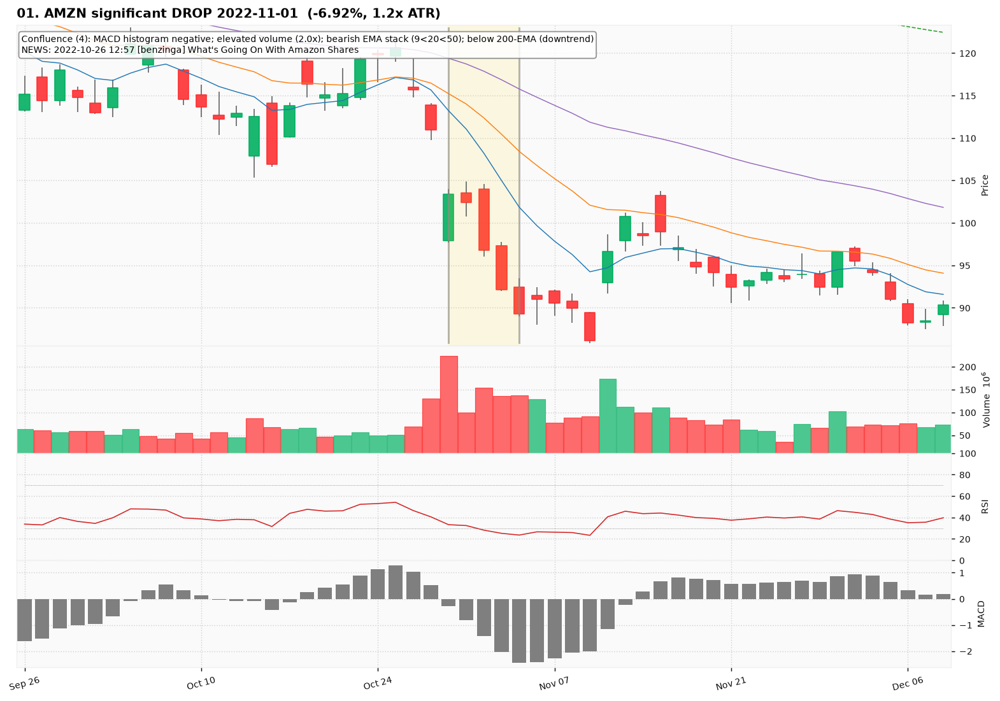
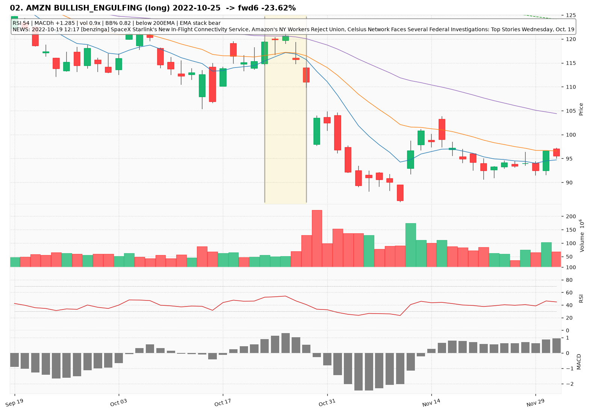
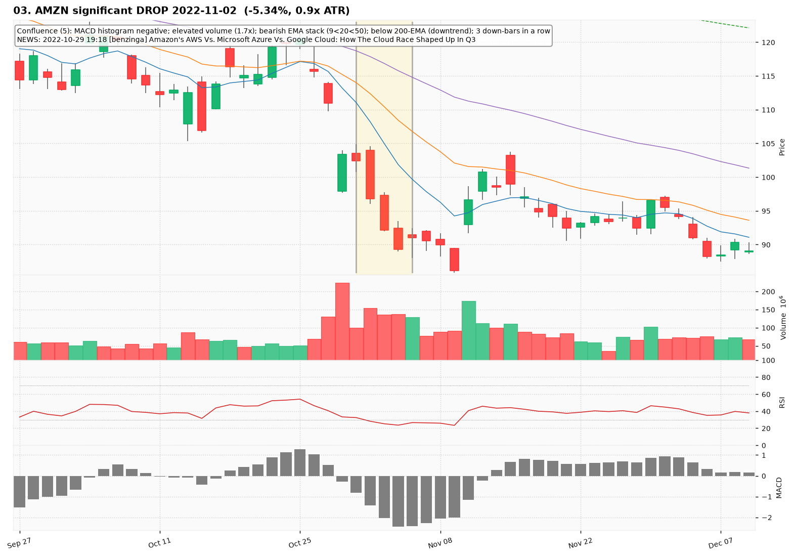
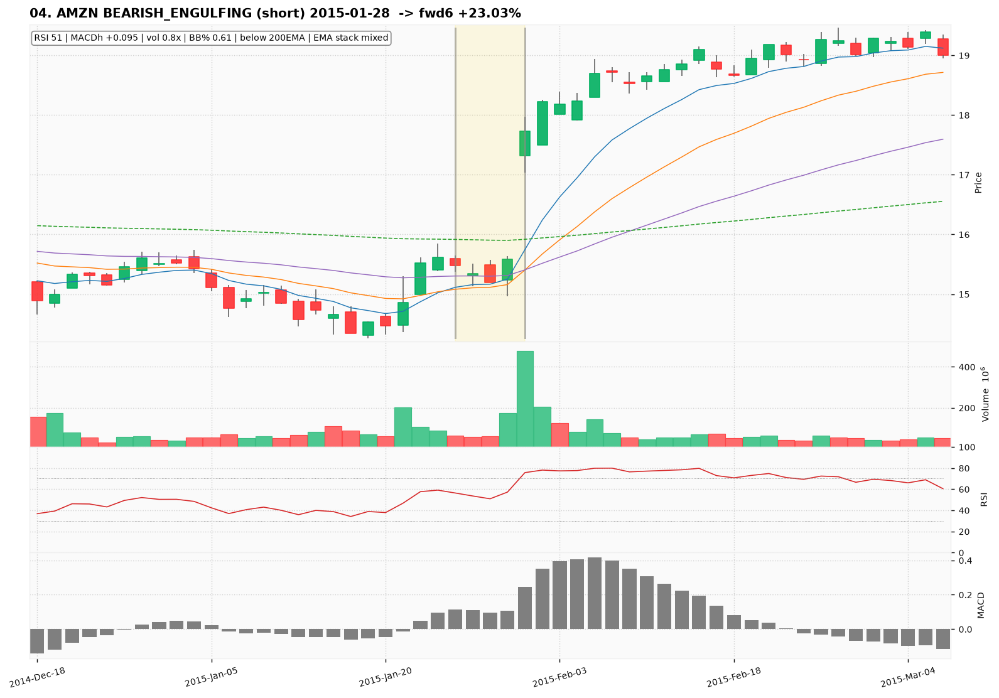
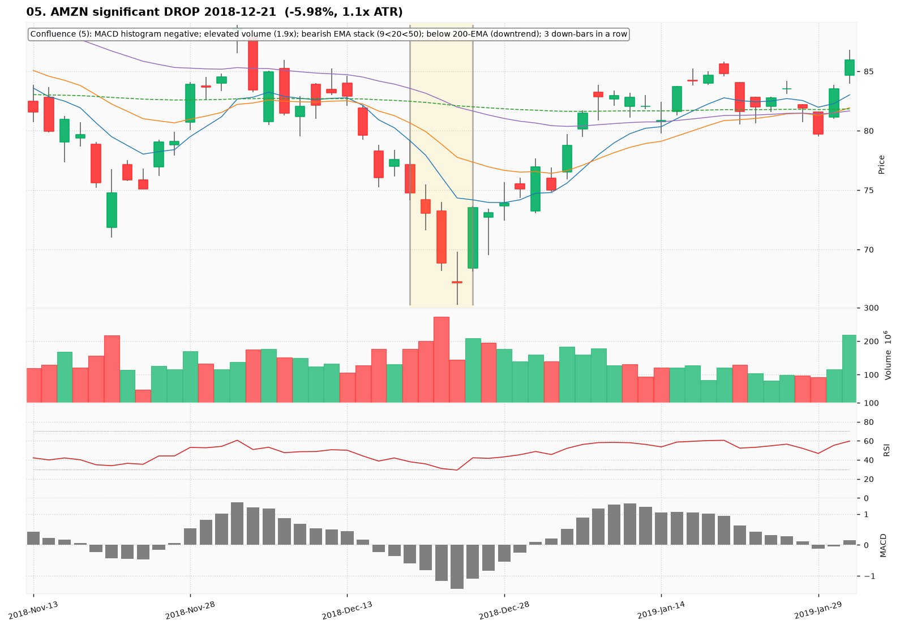
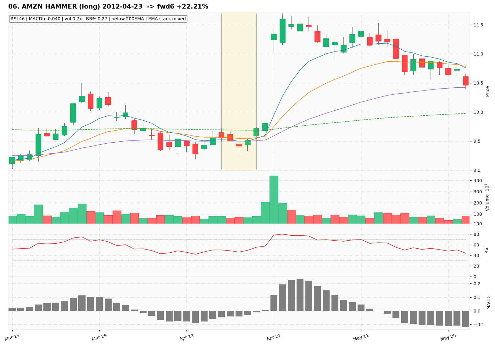
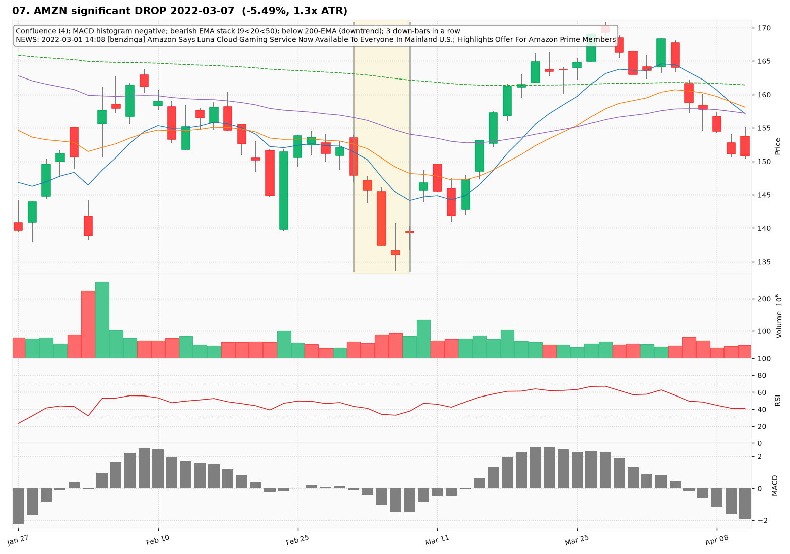
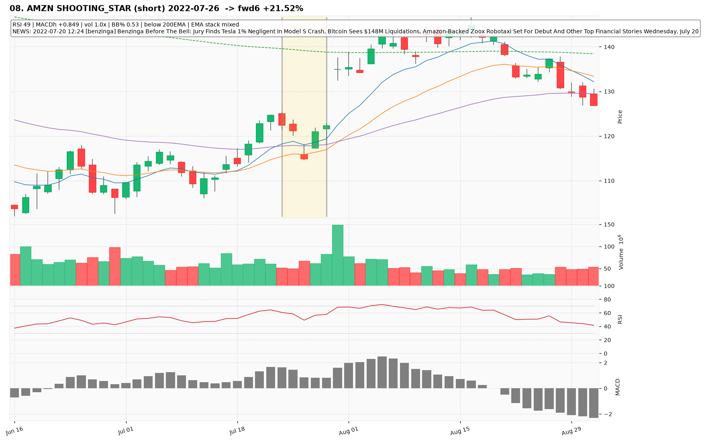
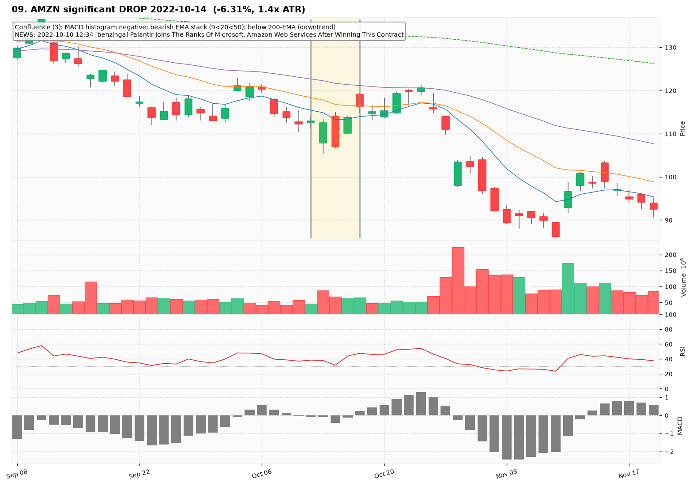
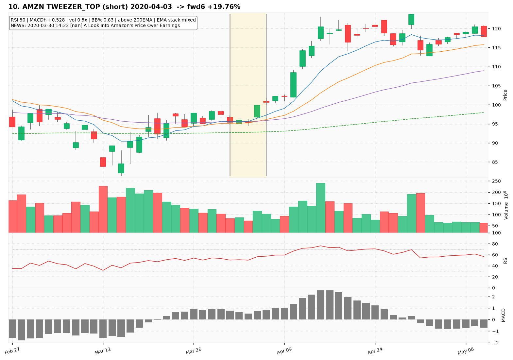

# AMZN — Deep TA Dive (daily candles)

**Bars:** 3,781 (2011-06-13 -> 2026-06-25)  |  **News headlines:** 18,608

TA layered per candle: 44 continuous indicators + 19 candlestick patterns + chart-structure (H&S / double top-bottom / flags).

## What was found

- Significant moves (|1-bar return| in the 0.5% tails): **38**
- Candlestick fulfillments: **1,511**
- Structure fulfillments: **331**

Full records (with t-2..t+2 TA windows): `all_events.parquet`, `significant_moves.csv`, `fulfilled_patterns.csv`.

## The 10 charted examples

### 01. AMZN significant DROP 2022-11-01  (-6.92%, 1.2x ATR)

- **TA read:** Confluence (4): MACD histogram negative; elevated volume (2.0x); bearish EMA stack (9<20<50); below 200-EMA (downtrend)
- **News:** 2022-10-26 12:57 [benzinga] What's Going On With Amazon Shares
- **Outcome (next 6 bars):** -11.00%

### 02. AMZN BULLISH_ENGULFING (long) 2022-10-25  -> fwd6 -23.62%

- **TA read:** RSI 54 | MACDh +1.285 | vol 0.9x | BB% 0.82 | below 200EMA | EMA stack bear
- **News:** 2022-10-19 12:17 [benzinga] SpaceX Starlink's New In-Flight Connectivity Service, Amazon's NY Workers Reject Union, Celsius Network Faces Several Federal Investigations: Top Stories Wednesday, Oct. 19
- **Outcome (next 6 bars):** -23.62%

### 03. AMZN significant DROP 2022-11-02  (-5.34%, 0.9x ATR)

- **TA read:** Confluence (5): MACD histogram negative; elevated volume (1.7x); bearish EMA stack (9<20<50); below 200-EMA (downtrend); 3 down-bars in a row
- **News:** 2022-10-29 19:18 [benzinga] Amazon's AWS Vs. Microsoft Azure Vs. Google Cloud: How The Cloud Race Shaped Up In Q3
- **Outcome (next 6 bars):** +4.90%

### 04. AMZN BEARISH_ENGULFING (short) 2015-01-28  -> fwd6 +23.03%

- **TA read:** RSI 51 | MACDh +0.095 | vol 0.8x | BB% 0.61 | below 200EMA | EMA stack mixed
- **News:** (none in window)
- **Outcome (next 6 bars):** +23.03%

### 05. AMZN significant DROP 2018-12-21  (-5.98%, 1.1x ATR)

- **TA read:** Confluence (5): MACD histogram negative; elevated volume (1.9x); bearish EMA stack (9<20<50); below 200-EMA (downtrend); 3 down-bars in a row
- **News:** (none in window)
- **Outcome (next 6 bars):** +11.74%

### 06. AMZN HAMMER (long) 2012-04-23  -> fwd6 +22.21%

- **TA read:** RSI 46 | MACDh -0.040 | vol 0.7x | BB% 0.27 | below 200EMA | EMA stack mixed
- **News:** (none in window)
- **Outcome (next 6 bars):** +22.21%

### 07. AMZN significant DROP 2022-03-07  (-5.49%, 1.3x ATR)

- **TA read:** Confluence (4): MACD histogram negative; bearish EMA stack (9<20<50); below 200-EMA (downtrend); 3 down-bars in a row
- **News:** 2022-03-01 14:08 [benzinga] Amazon Says Luna Cloud Gaming Service Now Available To Everyone In Mainland U.S.; Highlights Offer For Amazon Prime Members
- **Outcome (next 6 bars):** +7.21%

### 08. AMZN SHOOTING_STAR (short) 2022-07-26  -> fwd6 +21.52%

- **TA read:** RSI 49 | MACDh +0.849 | vol 1.0x | BB% 0.53 | below 200EMA | EMA stack mixed
- **News:** 2022-07-20 12:24 [benzinga] Benzinga Before The Bell: Jury Finds Tesla 1% Negligent In Model S Crash, Bitcoin Sees $148M Liquidations, Amazon-Backed Zoox Robotaxi Set For Debut And Other Top Financial Stories Wednesday, July 20
- **Outcome (next 6 bars):** +21.52%

### 09. AMZN significant DROP 2022-10-14  (-6.31%, 1.4x ATR)

- **TA read:** Confluence (3): MACD histogram negative; bearish EMA stack (9<20<50); below 200-EMA (downtrend)
- **News:** 2022-10-10 12:34 [benzinga] Palantir Joins The Ranks Of Microsoft, Amazon Web Services After Winning This Contract
- **Outcome (next 6 bars):** +12.09%

### 10. AMZN TWEEZER_TOP (short) 2020-04-03  -> fwd6 +19.76%

- **TA read:** RSI 50 | MACDh +0.528 | vol 0.5x | BB% 0.63 | above 200EMA | EMA stack mixed
- **News:** 2020-03-30 14:22 [nan] A Look Into Amazon's Price Over Earnings
- **Outcome (next 6 bars):** +19.76%
