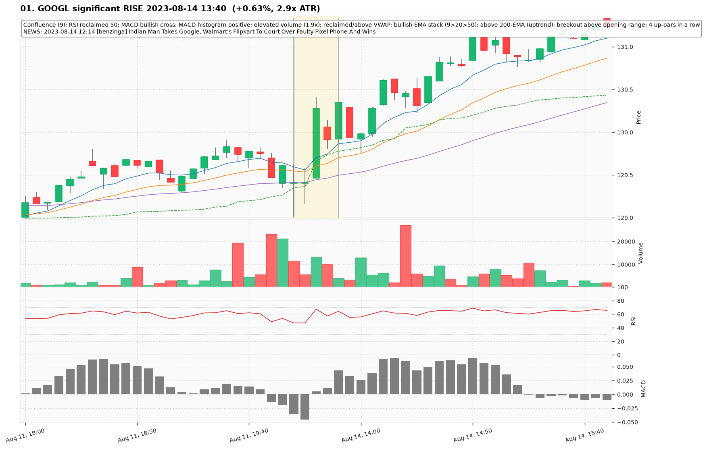
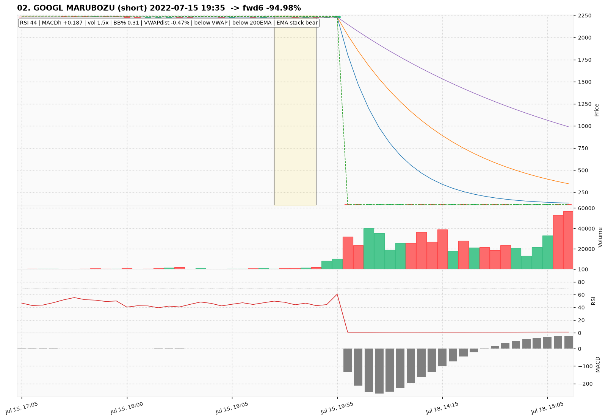
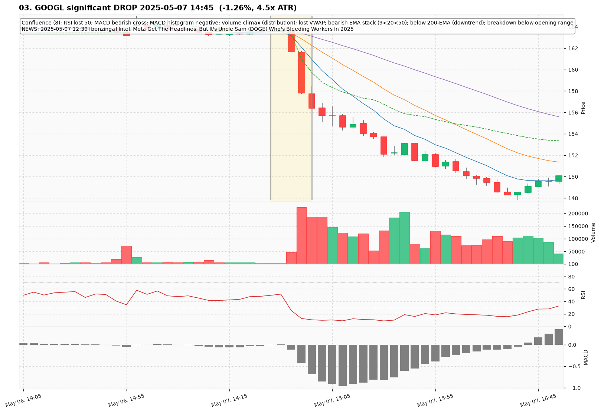
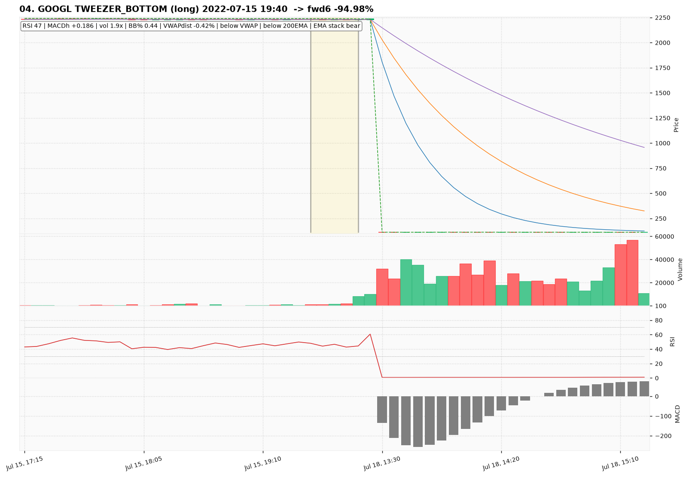
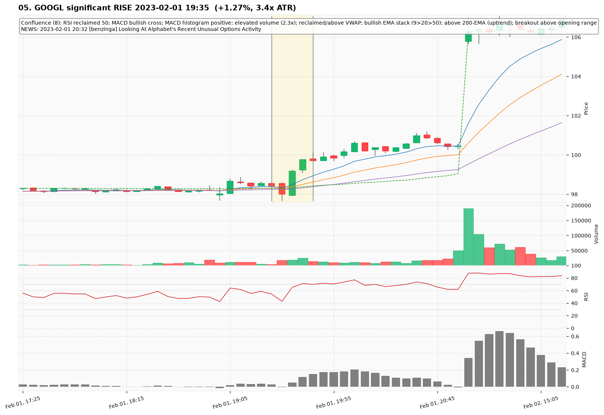
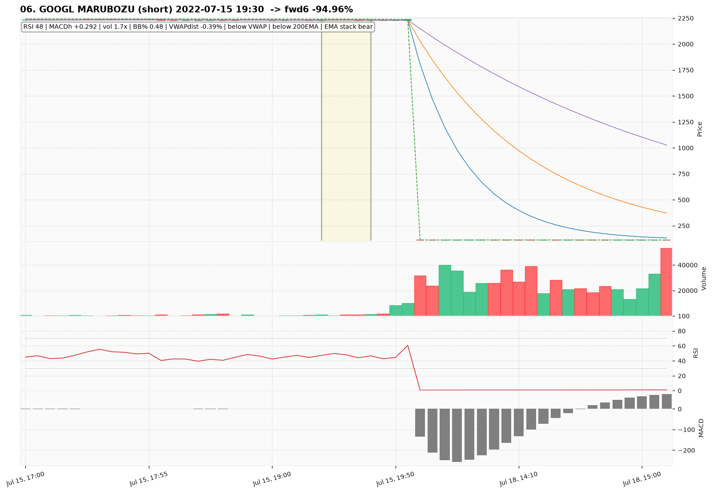
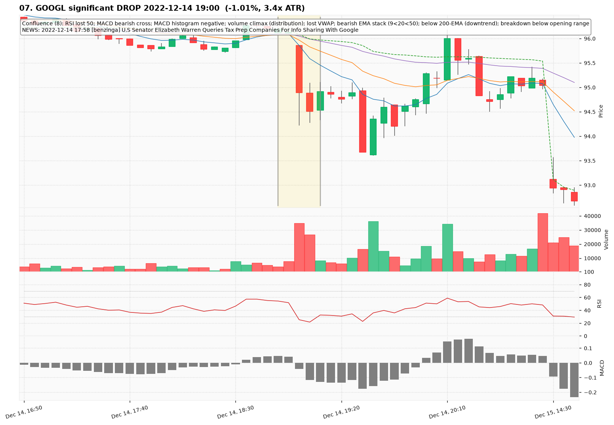
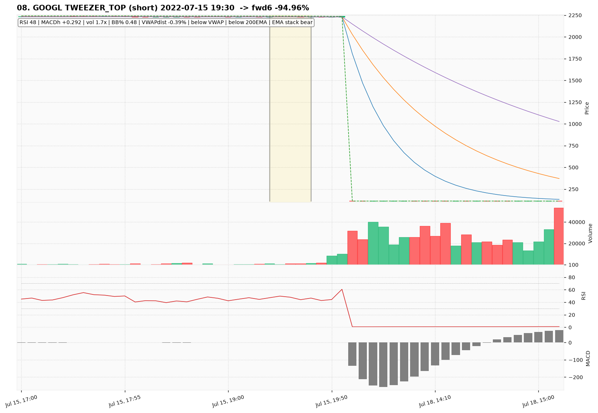
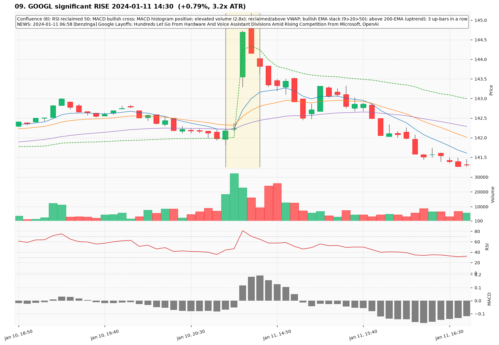
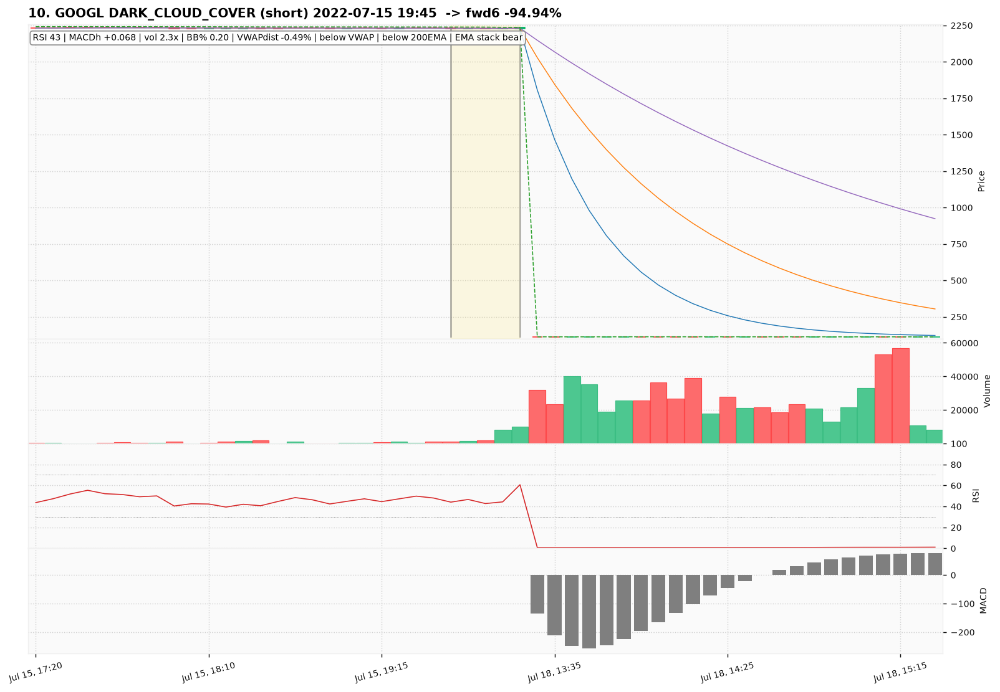

# GOOGL — Deep TA Dive (5-minute candles)

**Bars:** 101,927 (2021-01-04 -> 2026-06-26)  |  **News headlines:** 15,023

TA layered per candle: 48 continuous indicators + 19 candlestick patterns + chart-structure (H&S / double top-bottom / flags).

## What was found

- Significant moves (|1-bar return| in the 0.5% tails): **1,019**
- Candlestick fulfillments: **96,071**
- Structure fulfillments: **10,164**

Full records (with t-2..t+2 TA windows): `all_events.parquet`, `significant_moves.csv`, `fulfilled_patterns.csv`.

## The 10 charted examples

### 01. GOOGL significant RISE 2023-08-14 13:40  (+0.63%, 2.9x ATR)

- **TA read:** Confluence (9): RSI reclaimed 50; MACD bullish cross; MACD histogram positive; elevated volume (1.9x); reclaimed/above VWAP; bullish EMA stack (9>20>50); above 200-EMA (uptrend); breakout above opening range; 4 up-bars in a row
- **News:** 2023-08-14 12:14 [benzinga] Indian Man Takes Google, Walmart's Flipkart To Court Over Faulty Pixel Phone And Wins
- **Outcome (next 6 bars):** +0.25%

### 02. GOOGL MARUBOZU (short) 2022-07-15 19:35  -> fwd6 -94.98%

- **TA read:** RSI 44 | MACDh +0.187 | vol 1.5x | BB% 0.31 | VWAPdist -0.47% | below VWAP | below 200EMA | EMA stack bear
- **News:** (none in window)
- **Outcome (next 6 bars):** -94.98%

### 03. GOOGL significant DROP 2025-05-07 14:45  (-1.26%, 4.5x ATR)

- **TA read:** Confluence (8): RSI lost 50; MACD bearish cross; MACD histogram negative; volume climax (distribution); lost VWAP; bearish EMA stack (9<20<50); below 200-EMA (downtrend); breakdown below opening range
- **News:** 2025-05-07 12:39 [benzinga] Intel, Meta Get The Headlines, But It's Uncle Sam (DOGE) Who's Bleeding Workers In 2025
- **Outcome (next 6 bars):** -4.16%

### 04. GOOGL TWEEZER_BOTTOM (long) 2022-07-15 19:40  -> fwd6 -94.98%

- **TA read:** RSI 47 | MACDh +0.186 | vol 1.9x | BB% 0.44 | VWAPdist -0.42% | below VWAP | below 200EMA | EMA stack bear
- **News:** (none in window)
- **Outcome (next 6 bars):** -94.98%

### 05. GOOGL significant RISE 2023-02-01 19:35  (+1.27%, 3.4x ATR)

- **TA read:** Confluence (8): RSI reclaimed 50; MACD bullish cross; MACD histogram positive; elevated volume (2.3x); reclaimed/above VWAP; bullish EMA stack (9>20>50); above 200-EMA (uptrend); breakout above opening range
- **News:** 2023-02-01 20:32 [benzinga] Looking At Alphabet's Recent Unusual Options Activity
- **Outcome (next 6 bars):** +1.44%

### 06. GOOGL MARUBOZU (short) 2022-07-15 19:30  -> fwd6 -94.96%

- **TA read:** RSI 48 | MACDh +0.292 | vol 1.7x | BB% 0.48 | VWAPdist -0.39% | below VWAP | below 200EMA | EMA stack bear
- **News:** (none in window)
- **Outcome (next 6 bars):** -94.96%

### 07. GOOGL significant DROP 2022-12-14 19:00  (-1.01%, 3.4x ATR)

- **TA read:** Confluence (8): RSI lost 50; MACD bearish cross; MACD histogram negative; volume climax (distribution); lost VWAP; bearish EMA stack (9<20<50); below 200-EMA (downtrend); breakdown below opening range
- **News:** 2022-12-14 17:58 [benzinga] U.S Senator Elizabeth Warren Queries Tax Prep Companies For Info Sharing With Google
- **Outcome (next 6 bars):** -1.29%

### 08. GOOGL TWEEZER_TOP (short) 2022-07-15 19:30  -> fwd6 -94.96%

- **TA read:** RSI 48 | MACDh +0.292 | vol 1.7x | BB% 0.48 | VWAPdist -0.39% | below VWAP | below 200EMA | EMA stack bear
- **News:** (none in window)
- **Outcome (next 6 bars):** -94.96%

### 09. GOOGL significant RISE 2024-01-11 14:30  (+0.79%, 3.2x ATR)

- **TA read:** Confluence (8): RSI reclaimed 50; MACD bullish cross; MACD histogram positive; elevated volume (2.8x); reclaimed/above VWAP; bullish EMA stack (9>20>50); above 200-EMA (uptrend); 3 up-bars in a row
- **News:** 2024-01-11 06:58 [benzinga] Google Layoffs: Hundreds Let Go From Hardware And Voice Assistant Divisions Amid Rising Competition From Microsoft, OpenAI
- **Outcome (next 6 bars):** -1.22%

### 10. GOOGL DARK_CLOUD_COVER (short) 2022-07-15 19:45  -> fwd6 -94.94%

- **TA read:** RSI 43 | MACDh +0.068 | vol 2.3x | BB% 0.20 | VWAPdist -0.49% | below VWAP | below 200EMA | EMA stack bear
- **News:** (none in window)
- **Outcome (next 6 bars):** -94.94%
