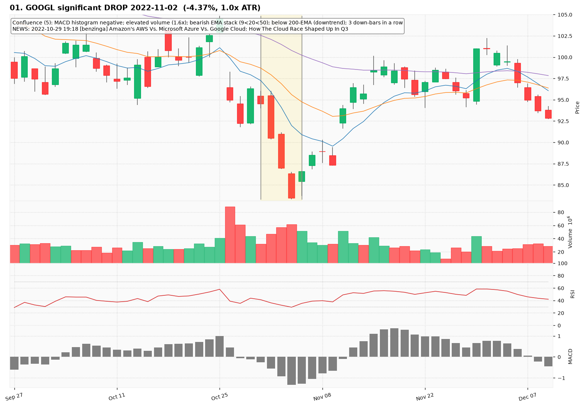
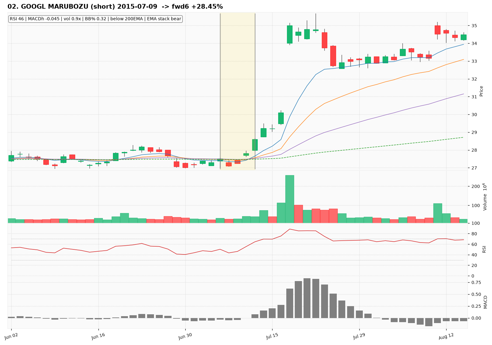
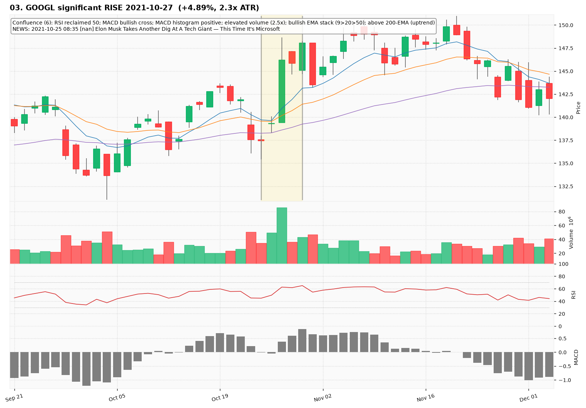
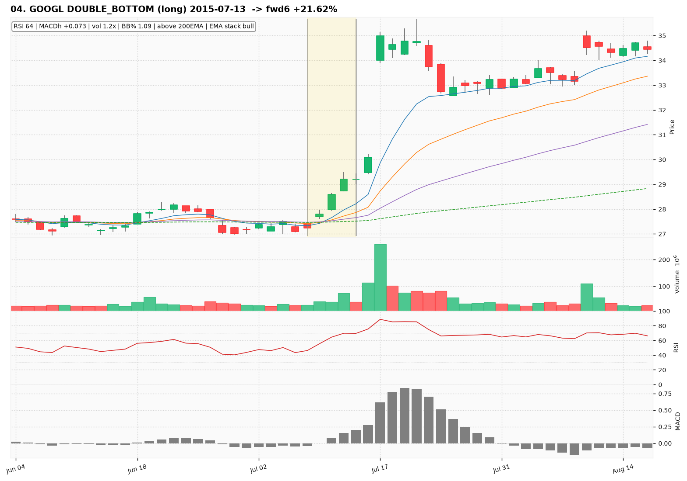
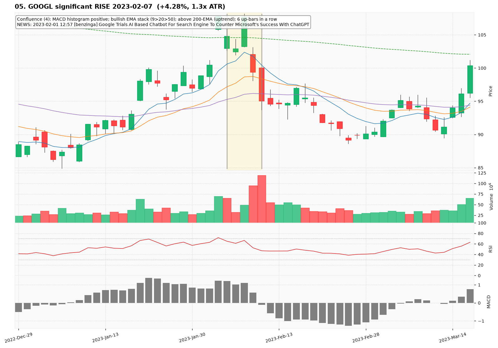
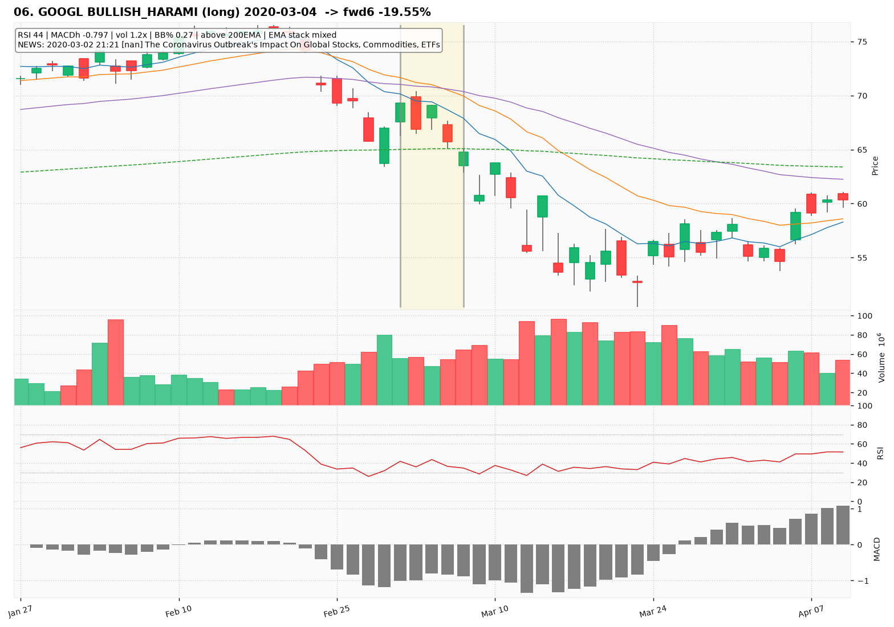
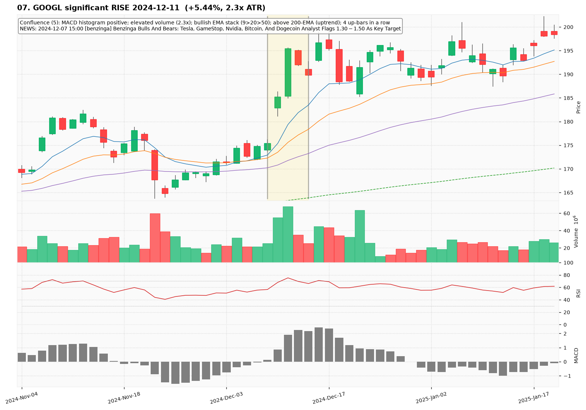
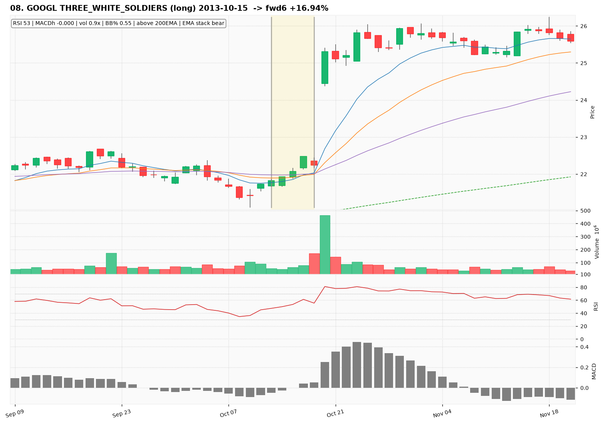
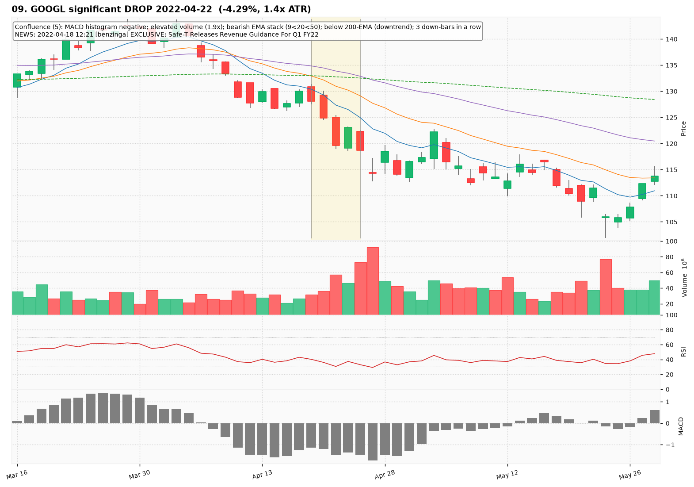
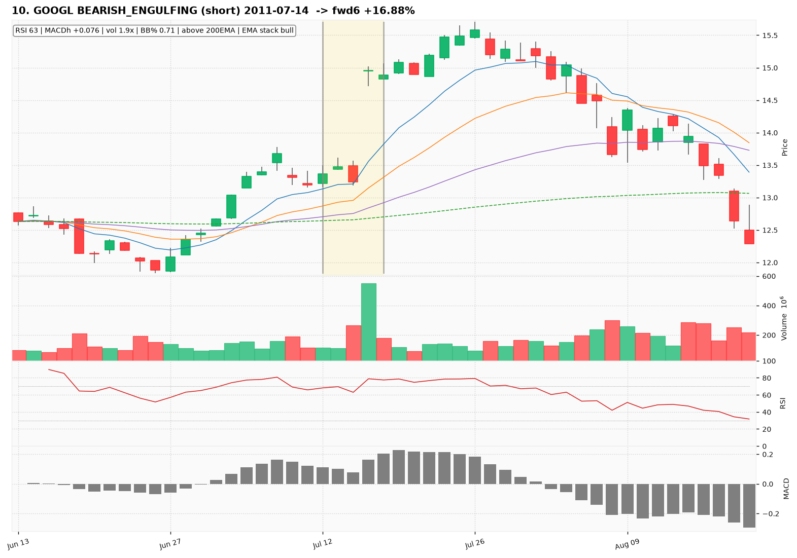

# GOOGL — Deep TA Dive (daily candles)

**Bars:** 3,781 (2011-06-13 -> 2026-06-25)  |  **News headlines:** 15,023

TA layered per candle: 44 continuous indicators + 19 candlestick patterns + chart-structure (H&S / double top-bottom / flags).

## What was found

- Significant moves (|1-bar return| in the 0.5% tails): **38**
- Candlestick fulfillments: **1,646**
- Structure fulfillments: **358**

Full records (with t-2..t+2 TA windows): `all_events.parquet`, `significant_moves.csv`, `fulfilled_patterns.csv`.

## The 10 charted examples

### 01. GOOGL significant DROP 2022-11-02  (-4.37%, 1.0x ATR)

- **TA read:** Confluence (5): MACD histogram negative; elevated volume (1.6x); bearish EMA stack (9<20<50); below 200-EMA (downtrend); 3 down-bars in a row
- **News:** 2022-10-29 19:18 [benzinga] Amazon's AWS Vs. Microsoft Azure Vs. Google Cloud: How The Cloud Race Shaped Up In Q3
- **Outcome (next 6 bars):** +8.01%

### 02. GOOGL MARUBOZU (short) 2015-07-09  -> fwd6 +28.45%

- **TA read:** RSI 46 | MACDh -0.045 | vol 0.9x | BB% 0.32 | below 200EMA | EMA stack bear
- **News:** (none in window)
- **Outcome (next 6 bars):** +28.45%

### 03. GOOGL significant RISE 2021-10-27  (+4.89%, 2.3x ATR)

- **TA read:** Confluence (6): RSI reclaimed 50; MACD bullish cross; MACD histogram positive; elevated volume (2.5x); bullish EMA stack (9>20>50); above 200-EMA (uptrend)
- **News:** 2021-10-25 08:35 [nan] Elon Musk Takes Another Dig At A Tech Giant — This Time It's Microsoft
- **Outcome (next 6 bars):** +1.40%

### 04. GOOGL DOUBLE_BOTTOM (long) 2015-07-13  -> fwd6 +21.62%

- **TA read:** RSI 64 | MACDh +0.073 | vol 1.2x | BB% 1.09 | above 200EMA | EMA stack bull
- **News:** (none in window)
- **Outcome (next 6 bars):** +21.62%

### 05. GOOGL significant RISE 2023-02-07  (+4.28%, 1.3x ATR)

- **TA read:** Confluence (4): MACD histogram positive; bullish EMA stack (9>20>50); above 200-EMA (uptrend); 6 up-bars in a row
- **News:** 2023-02-01 12:57 [benzinga] Google Trials AI Based Chatbot For Search Engine To Counter Microsoft's Success With ChatGPT
- **Outcome (next 6 bars):** -9.94%

### 06. GOOGL BULLISH_HARAMI (long) 2020-03-04  -> fwd6 -19.55%

- **TA read:** RSI 44 | MACDh -0.797 | vol 1.2x | BB% 0.27 | above 200EMA | EMA stack mixed
- **News:** 2020-03-02 21:21 [nan] The Coronavirus Outbreak's Impact On Global Stocks, Commodities, ETFs
- **Outcome (next 6 bars):** -19.55%

### 07. GOOGL significant RISE 2024-12-11  (+5.44%, 2.3x ATR)

- **TA read:** Confluence (5): MACD histogram positive; elevated volume (2.3x); bullish EMA stack (9>20>50); above 200-EMA (uptrend); 4 up-bars in a row
- **News:** 2024-12-07 15:00 [benzinga] Benzinga Bulls And Bears: Tesla, GameStop, Nvidia, Bitcoin, And Dogecoin Analyst Flags $1.30-$1.50 As Key Target
- **Outcome (next 6 bars):** -3.53%

### 08. GOOGL THREE_WHITE_SOLDIERS (long) 2013-10-15  -> fwd6 +16.94%

- **TA read:** RSI 53 | MACDh -0.000 | vol 0.9x | BB% 0.55 | above 200EMA | EMA stack bear
- **News:** (none in window)
- **Outcome (next 6 bars):** +16.94%

### 09. GOOGL significant DROP 2022-04-22  (-4.29%, 1.4x ATR)

- **TA read:** Confluence (5): MACD histogram negative; elevated volume (1.9x); bearish EMA stack (9<20<50); below 200-EMA (downtrend); 3 down-bars in a row
- **News:** 2022-04-18 12:21 [benzinga] EXCLUSIVE: Safe-T Releases Revenue Guidance For Q1 FY22
- **Outcome (next 6 bars):** -2.55%

### 10. GOOGL BEARISH_ENGULFING (short) 2011-07-14  -> fwd6 +16.88%

- **TA read:** RSI 63 | MACDh +0.076 | vol 1.9x | BB% 0.71 | above 200EMA | EMA stack bull
- **News:** (none in window)
- **Outcome (next 6 bars):** +16.88%
