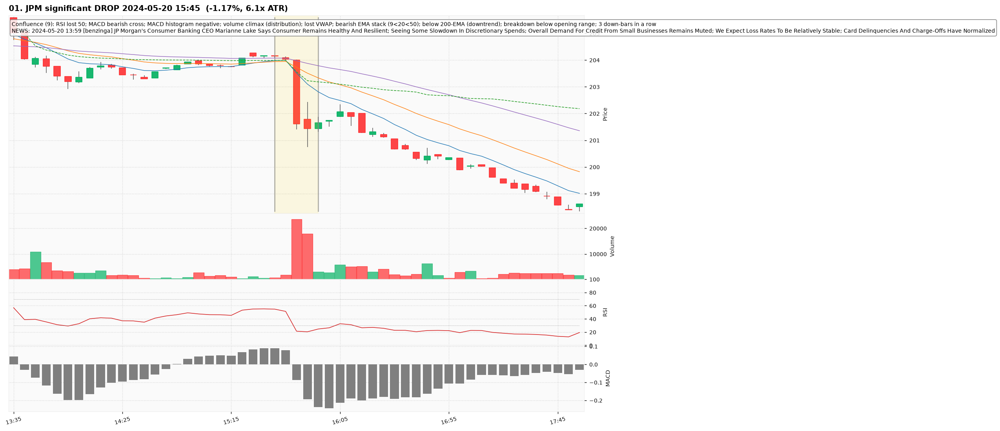
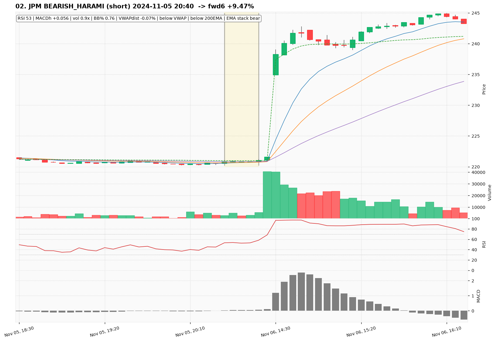
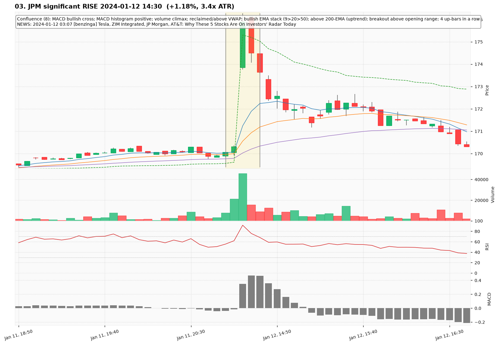
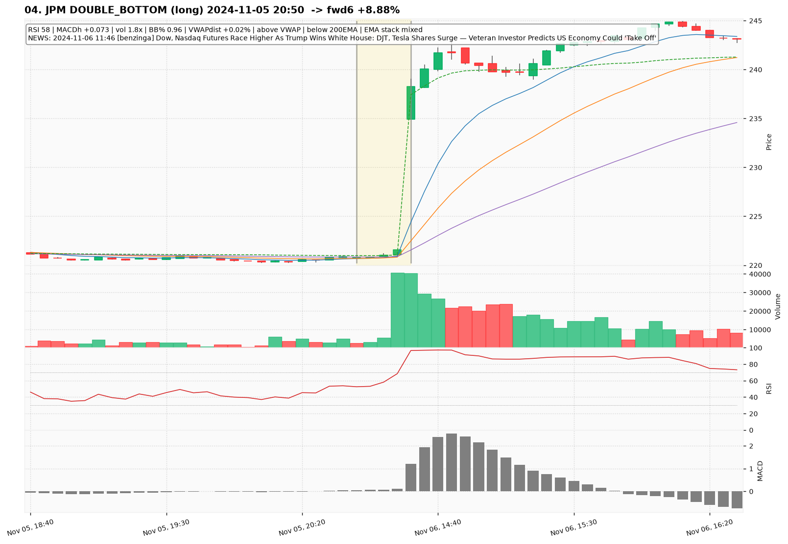
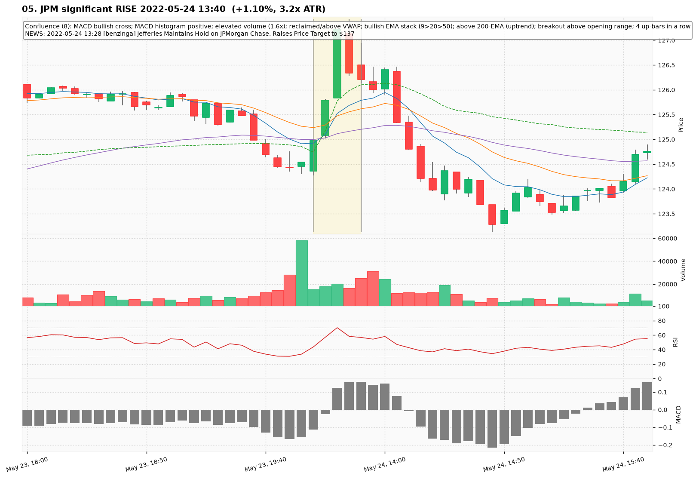
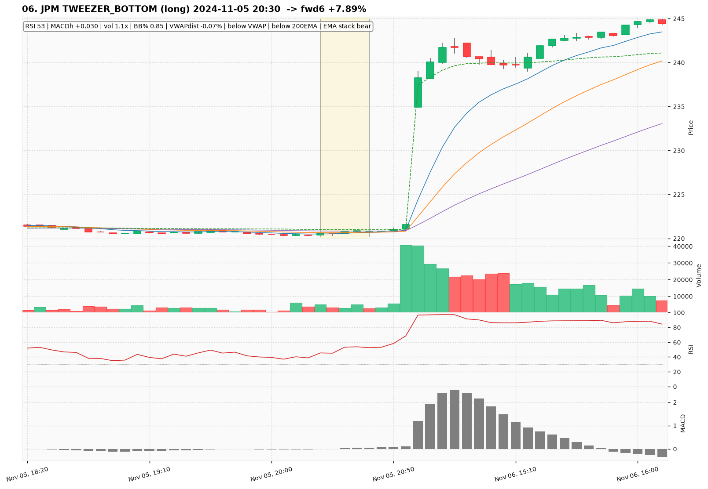
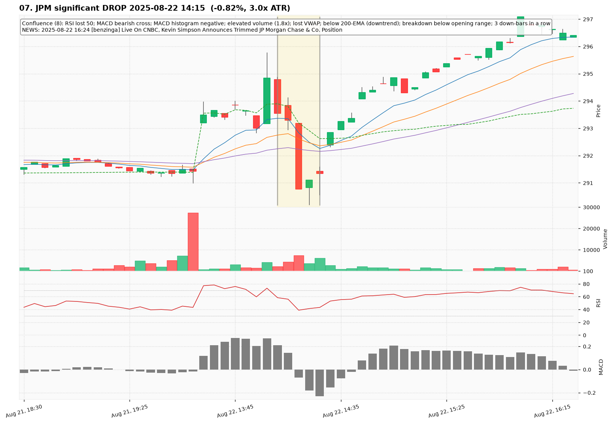
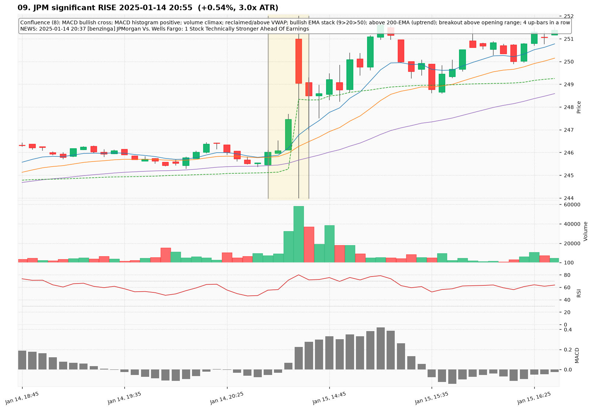
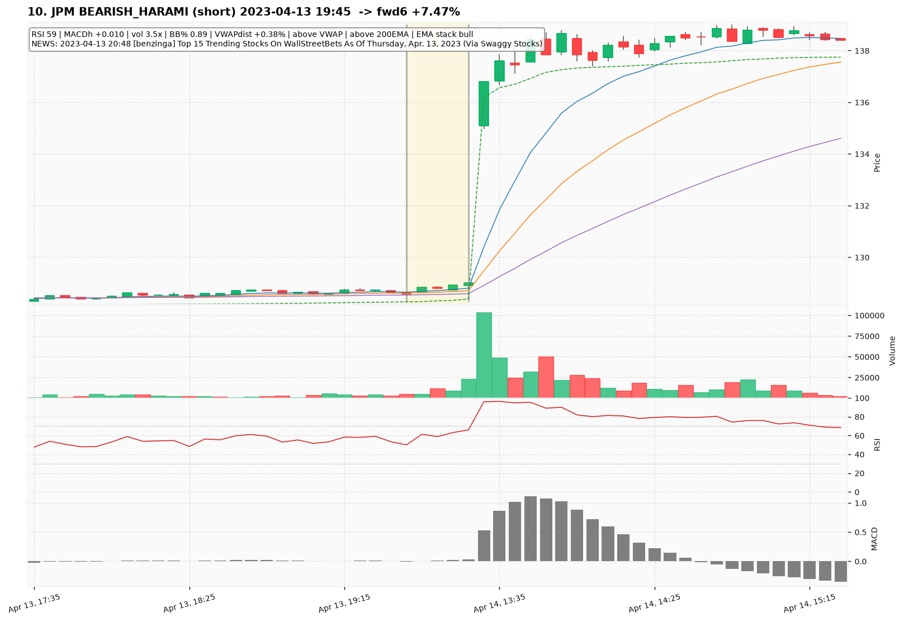

# JPM — Deep TA Dive (5-minute candles)

**Bars:** 105,402 (2021-01-04 -> 2026-06-18)  |  **News headlines:** 4,617

TA layered per candle: 48 continuous indicators + 19 candlestick patterns + chart-structure (H&S / double top-bottom / flags).

## What was found

- Significant moves (|1-bar return| in the 0.5% tails): **1,056**
- Candlestick fulfillments: **106,631**
- Structure fulfillments: **10,751**

Full records (with t-2..t+2 TA windows): `all_events.parquet`, `significant_moves.csv`, `fulfilled_patterns.csv`.

## The 10 charted examples

### 01. JPM significant DROP 2024-05-20 15:45  (-1.17%, 6.1x ATR)

- **TA read:** Confluence (9): RSI lost 50; MACD bearish cross; MACD histogram negative; volume climax (distribution); lost VWAP; bearish EMA stack (9<20<50); below 200-EMA (downtrend); breakdown below opening range; 3 down-bars in a row
- **News:** 2024-05-20 13:59 [benzinga] JP Morgan's Consumer Banking CEO Marianne Lake Says Consumer Remains Healthy And Resilient; Seeing Some Slowdown In Discretionary Spends; Overall Demand For Credit From Small Businesses Remains Muted; We Expect Loss Rates To Be Relatively Stable; Card Delinquencies And Charge-Offs Have Normalized
- **Outcome (next 6 bars):** -0.16%

### 02. JPM BEARISH_HARAMI (short) 2024-11-05 20:40  -> fwd6 +9.47%

- **TA read:** RSI 53 | MACDh +0.056 | vol 0.9x | BB% 0.76 | VWAPdist -0.07% | below VWAP | below 200EMA | EMA stack bear
- **News:** (none in window)
- **Outcome (next 6 bars):** +9.47%

### 03. JPM significant RISE 2024-01-12 14:30  (+1.18%, 3.4x ATR)

- **TA read:** Confluence (8): MACD bullish cross; MACD histogram positive; volume climax; reclaimed/above VWAP; bullish EMA stack (9>20>50); above 200-EMA (uptrend); breakout above opening range; 4 up-bars in a row
- **News:** 2024-01-12 03:07 [benzinga] Tesla, ZIM Integrated, JP Morgan, AT&T: Why These 5 Stocks Are On Investors' Radar Today
- **Outcome (next 6 bars):** -2.22%

### 04. JPM DOUBLE_BOTTOM (long) 2024-11-05 20:50  -> fwd6 +8.88%

- **TA read:** RSI 58 | MACDh +0.073 | vol 1.8x | BB% 0.96 | VWAPdist +0.02% | above VWAP | below 200EMA | EMA stack mixed
- **News:** 2024-11-06 11:46 [benzinga] Dow, Nasdaq Futures Race Higher As Trump Wins White House: DJT, Tesla Shares Surge — Veteran Investor Predicts US Economy Could 'Take Off'
- **Outcome (next 6 bars):** +8.88%

### 05. JPM significant RISE 2022-05-24 13:40  (+1.10%, 3.2x ATR)

- **TA read:** Confluence (8): MACD bullish cross; MACD histogram positive; elevated volume (1.6x); reclaimed/above VWAP; bullish EMA stack (9>20>50); above 200-EMA (uptrend); breakout above opening range; 4 up-bars in a row
- **News:** 2022-05-24 13:28 [benzinga] Jefferies Maintains Hold on JPMorgan Chase, Raises Price Target to $137
- **Outcome (next 6 bars):** -1.90%

### 06. JPM TWEEZER_BOTTOM (long) 2024-11-05 20:30  -> fwd6 +7.89%

- **TA read:** RSI 53 | MACDh +0.030 | vol 1.1x | BB% 0.85 | VWAPdist -0.07% | below VWAP | below 200EMA | EMA stack bear
- **News:** (none in window)
- **Outcome (next 6 bars):** +7.89%

### 07. JPM significant DROP 2025-08-22 14:15  (-0.82%, 3.0x ATR)

- **TA read:** Confluence (8): RSI lost 50; MACD bearish cross; MACD histogram negative; elevated volume (1.8x); lost VWAP; below 200-EMA (downtrend); breakdown below opening range; 3 down-bars in a row
- **News:** 2025-08-22 16:24 [benzinga] Live On CNBC, Kevin Simpson Announces Trimmed JP Morgan Chase & Co. Position
- **Outcome (next 6 bars):** +1.22%

### 08. JPM MARUBOZU (long) 2024-11-05 20:30  -> fwd6 +7.89%

- **TA read:** RSI 53 | MACDh +0.030 | vol 1.1x | BB% 0.85 | VWAPdist -0.07% | below VWAP | below 200EMA | EMA stack bear
- **News:** (none in window)
- **Outcome (next 6 bars):** +7.89%

### 09. JPM significant RISE 2025-01-14 20:55  (+0.54%, 3.0x ATR)

- **TA read:** Confluence (8): MACD bullish cross; MACD histogram positive; volume climax; reclaimed/above VWAP; bullish EMA stack (9>20>50); above 200-EMA (uptrend); breakout above opening range; 4 up-bars in a row
- **News:** 2025-01-14 20:37 [benzinga] JPMorgan Vs. Wells Fargo: 1 Stock Technically Stronger Ahead Of Earnings
- **Outcome (next 6 bars):** +1.06%

### 10. JPM BEARISH_HARAMI (short) 2023-04-13 19:45  -> fwd6 +7.47%

- **TA read:** RSI 59 | MACDh +0.010 | vol 3.5x | BB% 0.89 | VWAPdist +0.38% | above VWAP | above 200EMA | EMA stack bull
- **News:** 2023-04-13 20:48 [benzinga] Top 15 Trending Stocks On WallStreetBets As Of Thursday, Apr. 13, 2023 (Via Swaggy Stocks)
- **Outcome (next 6 bars):** +7.47%
