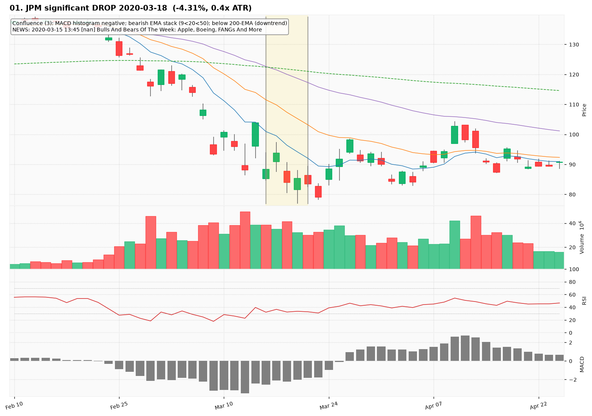
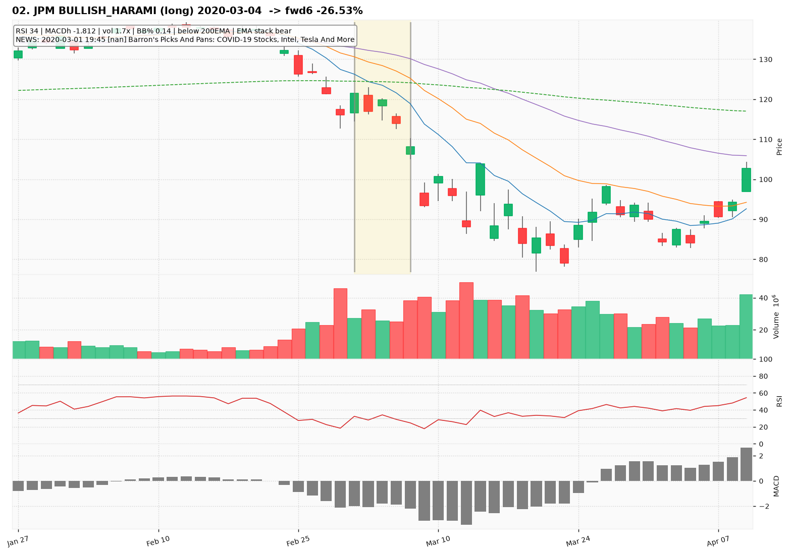
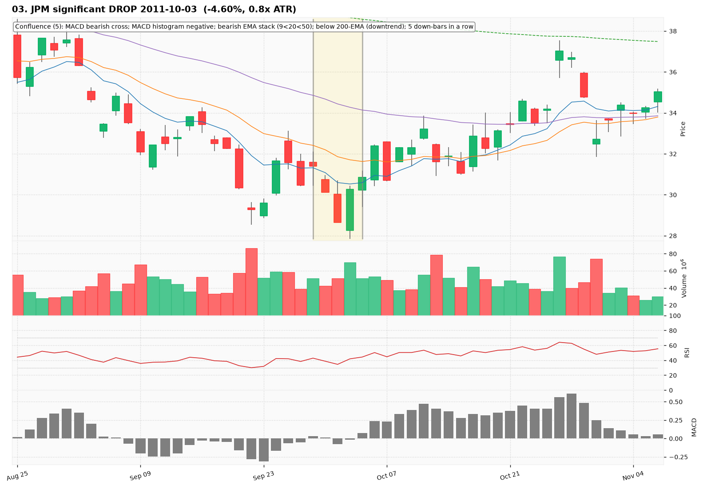
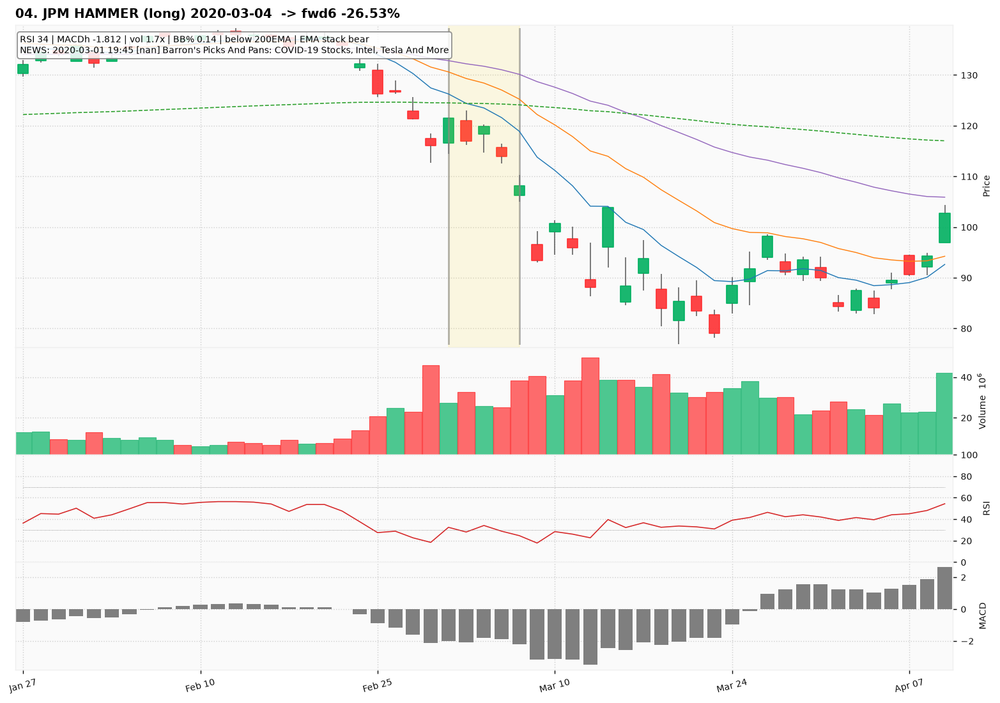
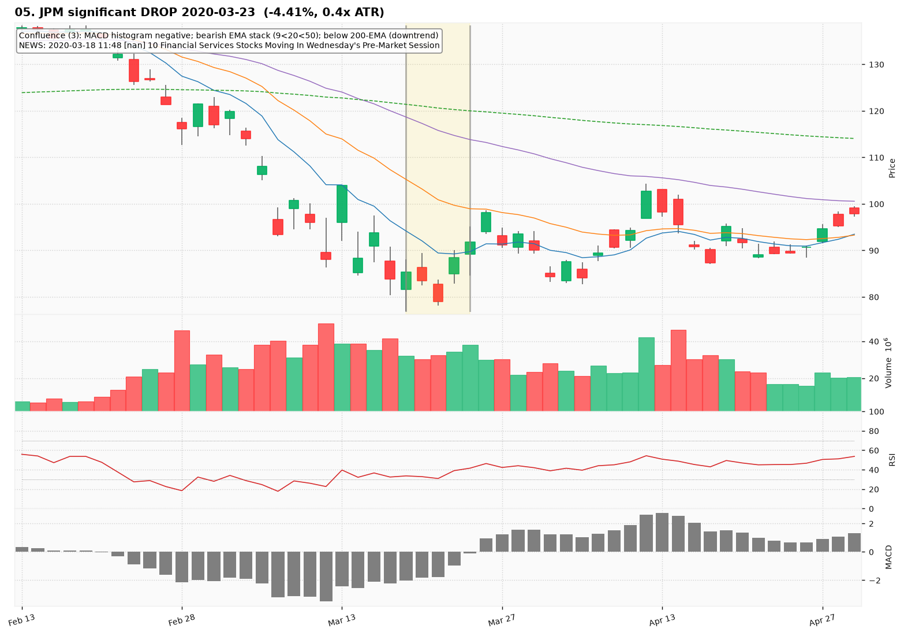
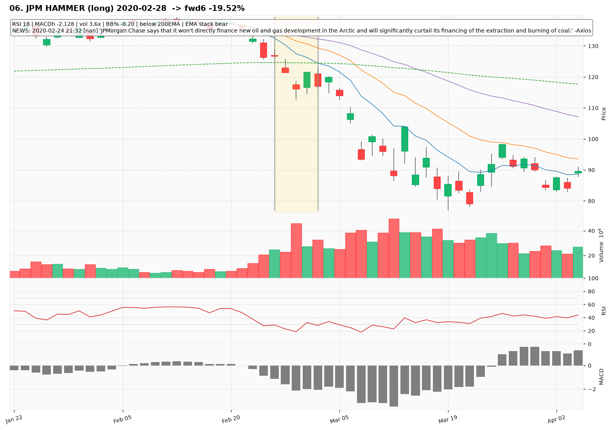
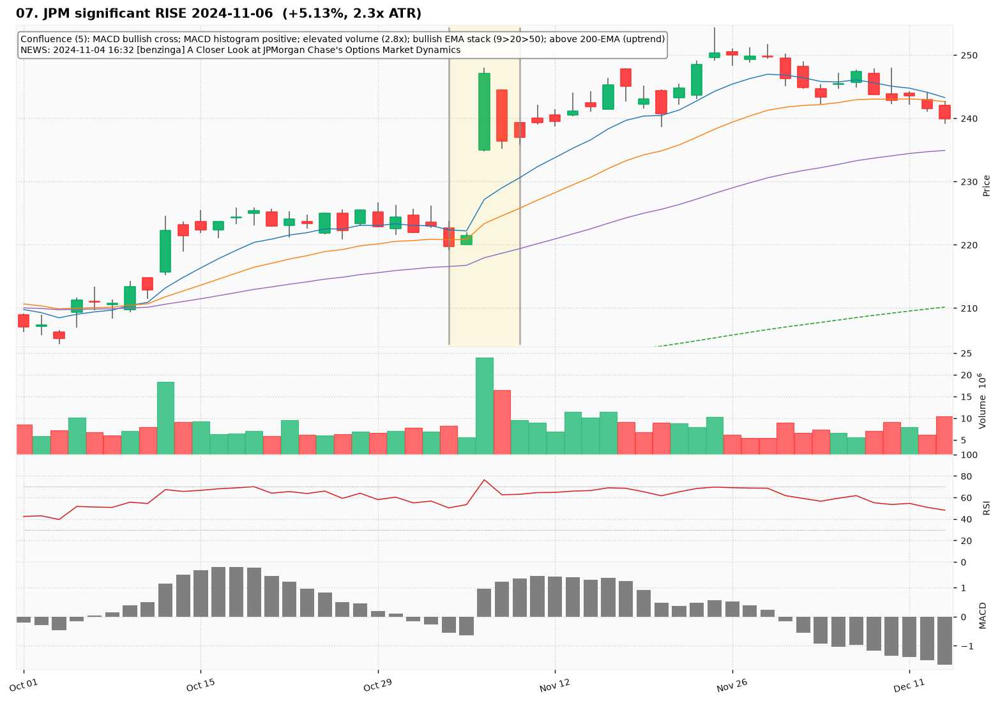
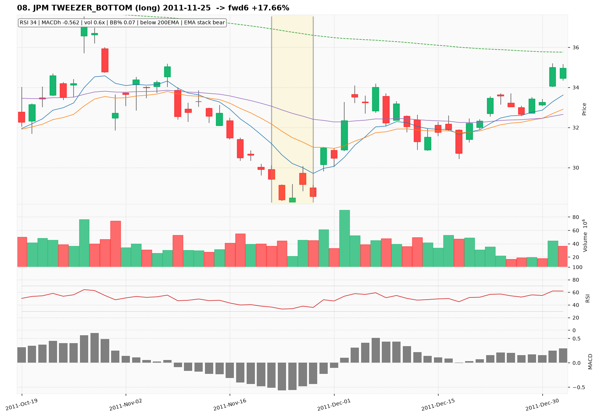
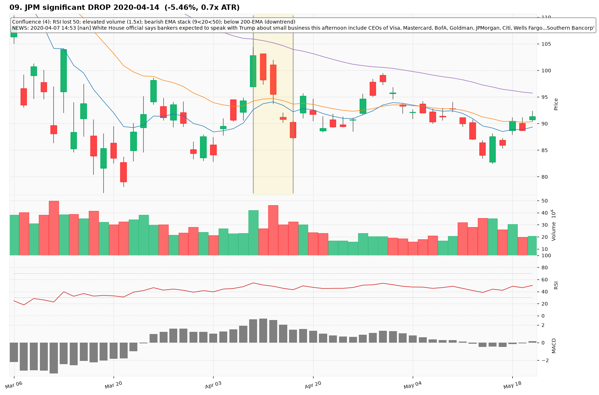

# JPM — Deep TA Dive (daily candles)

**Bars:** 3,781 (2011-06-13 -> 2026-06-25)  |  **News headlines:** 4,617

TA layered per candle: 44 continuous indicators + 19 candlestick patterns + chart-structure (H&S / double top-bottom / flags).

## What was found

- Significant moves (|1-bar return| in the 0.5% tails): **38**
- Candlestick fulfillments: **1,614**
- Structure fulfillments: **342**

Full records (with t-2..t+2 TA windows): `all_events.parquet`, `significant_moves.csv`, `fulfilled_patterns.csv`.

## The 10 charted examples

### 01. JPM significant DROP 2020-03-18  (-4.31%, 0.4x ATR)

- **TA read:** Confluence (3): MACD histogram negative; bearish EMA stack (9<20<50); below 200-EMA (downtrend)
- **News:** 2020-03-15 13:45 [nan] Bulls And Bears Of The Week: Apple, Boeing, FANGs And More
- **Outcome (next 6 bars):** +16.96%

### 02. JPM BULLISH_HARAMI (long) 2020-03-04  -> fwd6 -26.53%

- **TA read:** RSI 34 | MACDh -1.812 | vol 1.7x | BB% 0.14 | below 200EMA | EMA stack bear
- **News:** 2020-03-01 19:45 [nan] Barron's Picks And Pans: COVID-19 Stocks, Intel, Tesla And More
- **Outcome (next 6 bars):** -26.53%

### 03. JPM significant DROP 2011-10-03  (-4.60%, 0.8x ATR)

- **TA read:** Confluence (5): MACD bearish cross; MACD histogram negative; bearish EMA stack (9<20<50); below 200-EMA (downtrend); 5 down-bars in a row
- **News:** (none in window)
- **Outcome (next 6 bars):** +12.74%

### 04. JPM HAMMER (long) 2020-03-04  -> fwd6 -26.53%

- **TA read:** RSI 34 | MACDh -1.812 | vol 1.7x | BB% 0.14 | below 200EMA | EMA stack bear
- **News:** 2020-03-01 19:45 [nan] Barron's Picks And Pans: COVID-19 Stocks, Intel, Tesla And More
- **Outcome (next 6 bars):** -26.53%

### 05. JPM significant DROP 2020-03-23  (-4.41%, 0.4x ATR)

- **TA read:** Confluence (3): MACD histogram negative; bearish EMA stack (9<20<50); below 200-EMA (downtrend)
- **News:** 2020-03-18 11:48 [nan] 10 Financial Services Stocks Moving In Wednesday's Pre-Market Session
- **Outcome (next 6 bars):** +13.92%

### 06. JPM HAMMER (long) 2020-02-28  -> fwd6 -19.52%

- **TA read:** RSI 18 | MACDh -2.128 | vol 3.6x | BB% -0.20 | below 200EMA | EMA stack bear
- **News:** 2020-02-24 21:32 [nan] 'JPMorgan Chase says that it won't directly finance new oil and gas development in the Arctic and will significantly curtail its financing of the extraction and burning of coal.' -Axios
- **Outcome (next 6 bars):** -19.52%

### 07. JPM significant RISE 2024-11-06  (+5.13%, 2.3x ATR)

- **TA read:** Confluence (5): MACD bullish cross; MACD histogram positive; elevated volume (2.8x); bullish EMA stack (9>20>50); above 200-EMA (uptrend)
- **News:** 2024-11-04 16:32 [benzinga] A Closer Look at JPMorgan Chase's Options Market Dynamics
- **Outcome (next 6 bars):** -2.10%

### 08. JPM TWEEZER_BOTTOM (long) 2011-11-25  -> fwd6 +17.66%

- **TA read:** RSI 34 | MACDh -0.562 | vol 0.6x | BB% 0.07 | below 200EMA | EMA stack bear
- **News:** (none in window)
- **Outcome (next 6 bars):** +17.66%

### 09. JPM significant DROP 2020-04-14  (-5.46%, 0.7x ATR)

- **TA read:** Confluence (4): RSI lost 50; elevated volume (1.5x); bearish EMA stack (9<20<50); below 200-EMA (downtrend)
- **News:** 2020-04-07 14:53 [nan] White House official says bankers expected to speak with Trump about small business this afternoon include CEOs of Visa, Mastercard, BofA, Goldman, JPMorgan, Citi, Wells Fargo...Southern Bancorp'
- **Outcome (next 6 bars):** -6.45%

### 10. JPM INVERTED_HAMMER (long) 2011-11-25  -> fwd6 +17.66%

- **TA read:** RSI 34 | MACDh -0.562 | vol 0.6x | BB% 0.07 | below 200EMA | EMA stack bear
- **News:** (none in window)
- **Outcome (next 6 bars):** +17.66%
