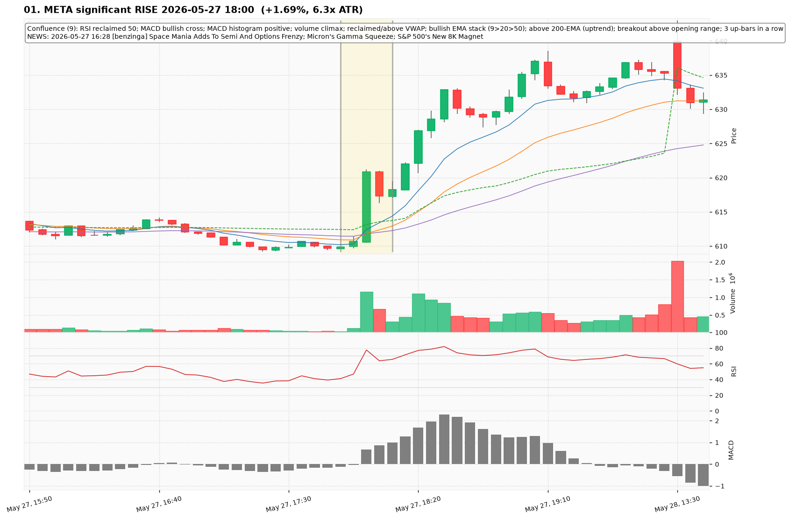
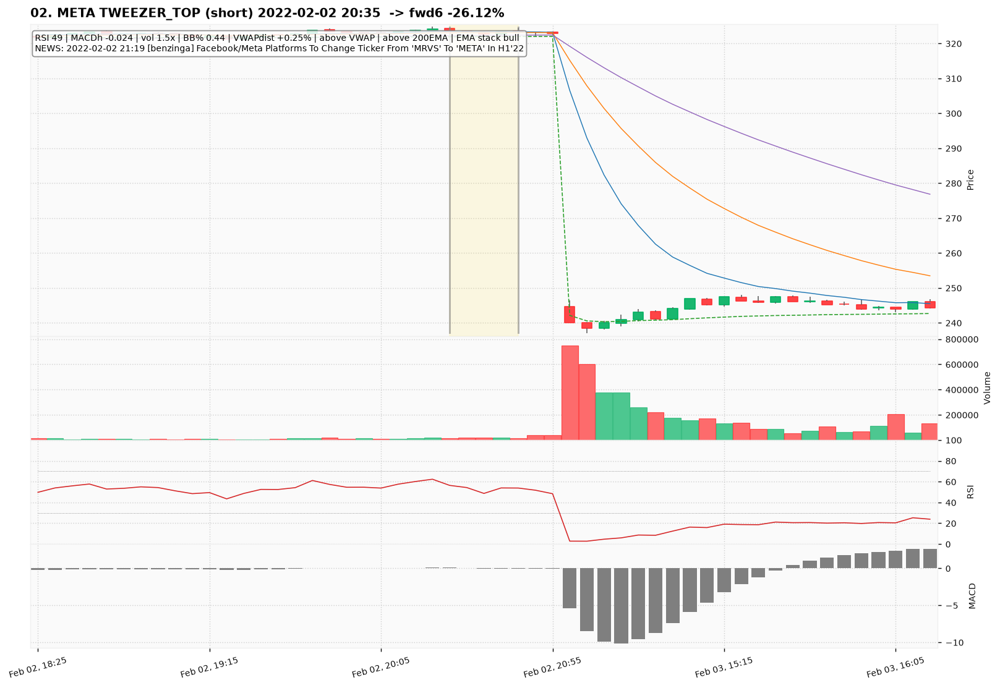
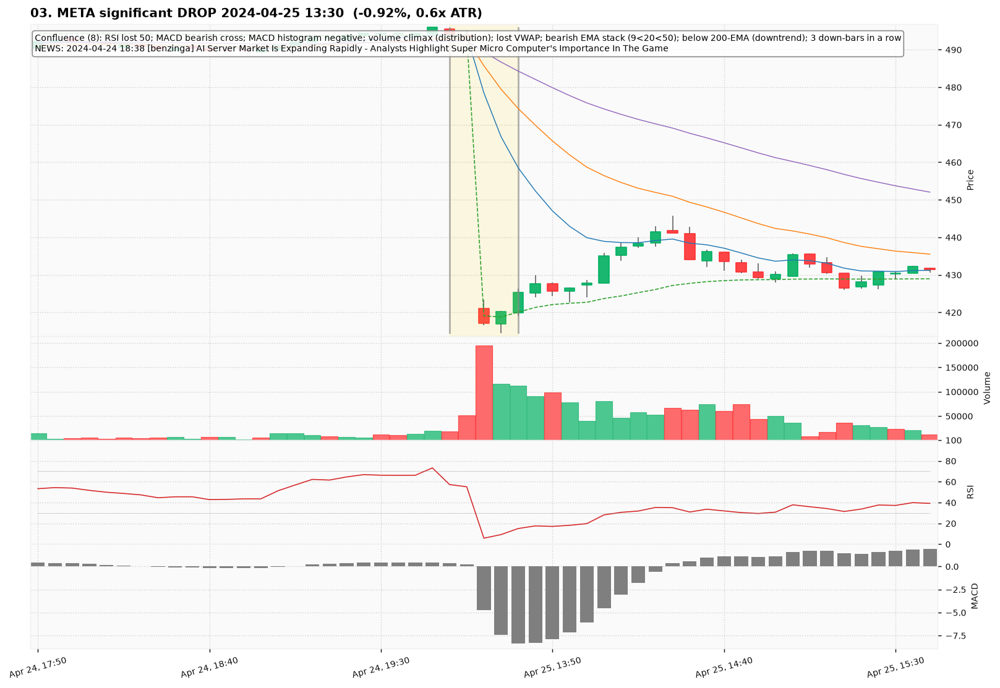
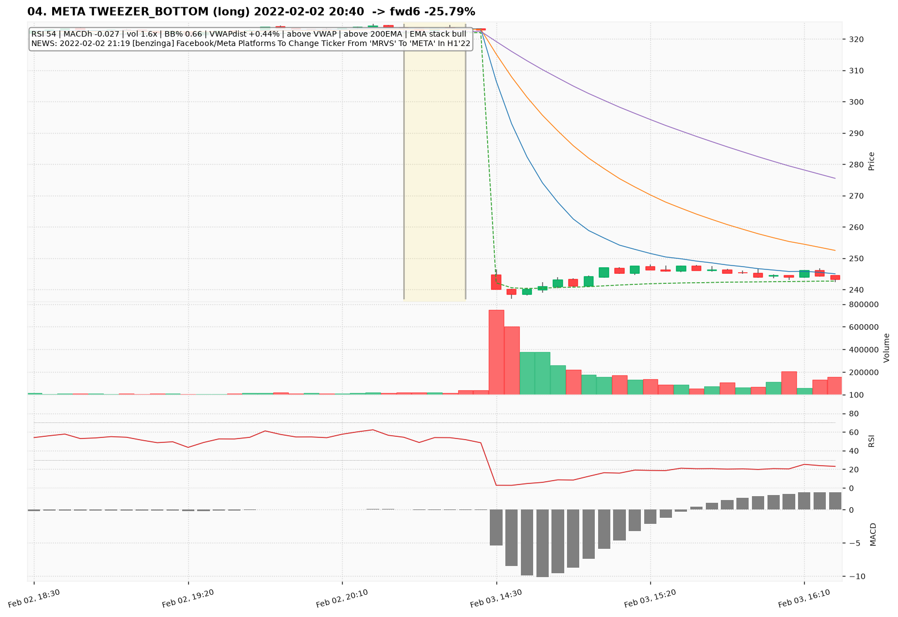
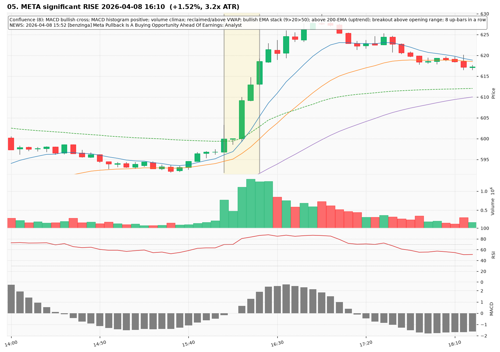
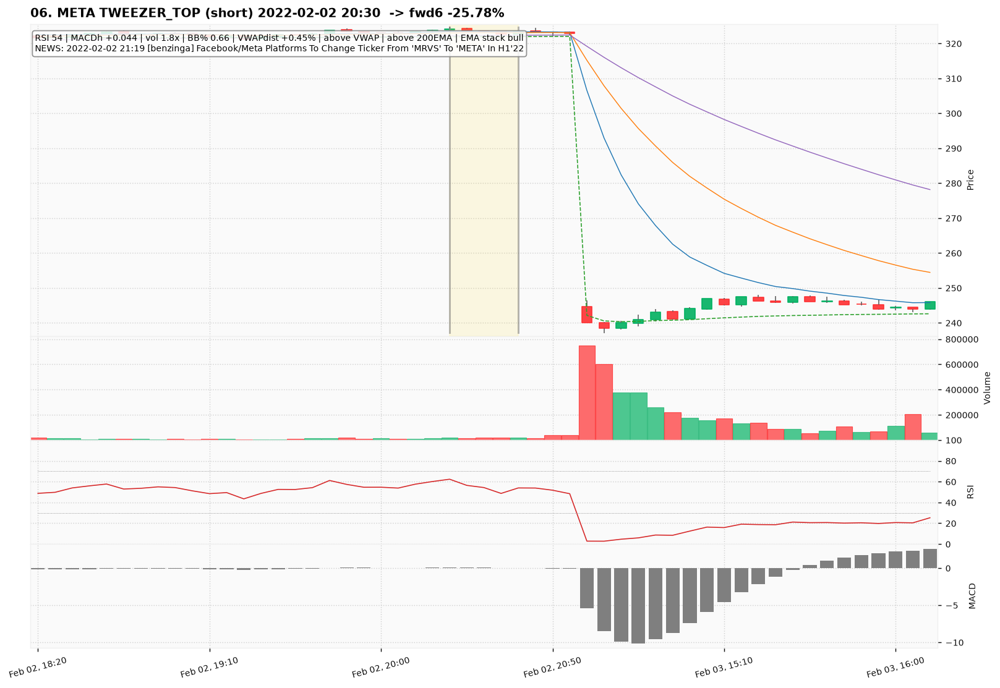
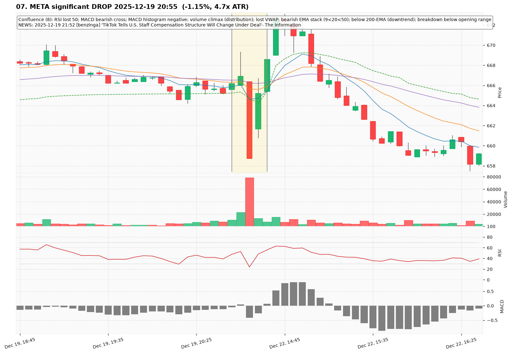
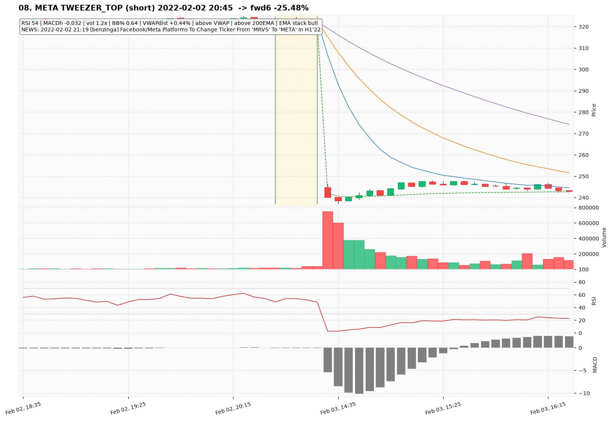
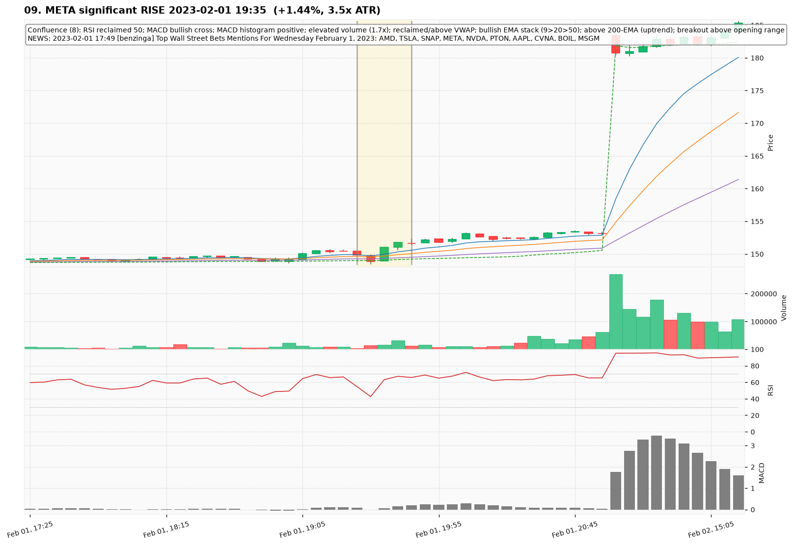
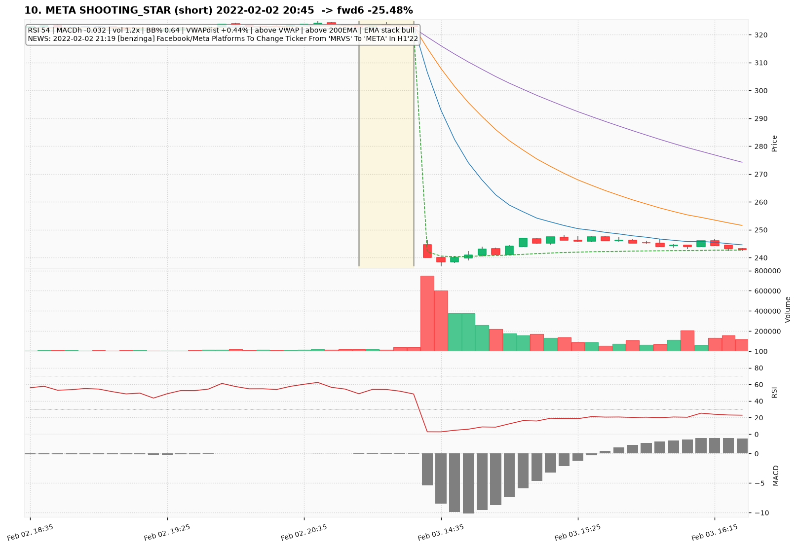

# META — Deep TA Dive (5-minute candles)

**Bars:** 106,573 (2021-01-04 -> 2026-06-26)  |  **News headlines:** 10,731

TA layered per candle: 48 continuous indicators + 19 candlestick patterns + chart-structure (H&S / double top-bottom / flags).

## What was found

- Significant moves (|1-bar return| in the 0.5% tails): **1,065**
- Candlestick fulfillments: **102,641**
- Structure fulfillments: **10,842**

Full records (with t-2..t+2 TA windows): `all_events.parquet`, `significant_moves.csv`, `fulfilled_patterns.csv`.

## The 10 charted examples

### 01. META significant RISE 2026-05-27 18:00  (+1.69%, 6.3x ATR)

- **TA read:** Confluence (9): RSI reclaimed 50; MACD bullish cross; MACD histogram positive; volume climax; reclaimed/above VWAP; bullish EMA stack (9>20>50); above 200-EMA (uptrend); breakout above opening range; 3 up-bars in a row
- **News:** 2026-05-27 16:28 [benzinga] Space Mania Adds To Semi And Options Frenzy; Micron's Gamma Squeeze; S&P 500's New 8K Magnet
- **Outcome (next 6 bars):** +1.93%

### 02. META TWEEZER_TOP (short) 2022-02-02 20:35  -> fwd6 -26.12%

- **TA read:** RSI 49 | MACDh -0.024 | vol 1.5x | BB% 0.44 | VWAPdist +0.25% | above VWAP | above 200EMA | EMA stack bull
- **News:** 2022-02-02 21:19 [benzinga] Facebook/Meta Platforms To Change Ticker From 'MRVS' To 'META' In H1'22
- **Outcome (next 6 bars):** -26.12%

### 03. META significant DROP 2024-04-25 13:30  (-0.92%, 0.6x ATR)

- **TA read:** Confluence (8): RSI lost 50; MACD bearish cross; MACD histogram negative; volume climax (distribution); lost VWAP; bearish EMA stack (9<20<50); below 200-EMA (downtrend); 3 down-bars in a row
- **News:** 2024-04-24 18:38 [benzinga] AI Server Market Is Expanding Rapidly - Analysts Highlight Super Micro Computer's Importance In The Game
- **Outcome (next 6 bars):** +2.56%

### 04. META TWEEZER_BOTTOM (long) 2022-02-02 20:40  -> fwd6 -25.79%

- **TA read:** RSI 54 | MACDh -0.027 | vol 1.6x | BB% 0.66 | VWAPdist +0.44% | above VWAP | above 200EMA | EMA stack bull
- **News:** 2022-02-02 21:19 [benzinga] Facebook/Meta Platforms To Change Ticker From 'MRVS' To 'META' In H1'22
- **Outcome (next 6 bars):** -25.79%

### 05. META significant RISE 2026-04-08 16:10  (+1.52%, 3.2x ATR)

- **TA read:** Confluence (8): MACD bullish cross; MACD histogram positive; volume climax; reclaimed/above VWAP; bullish EMA stack (9>20>50); above 200-EMA (uptrend); breakout above opening range; 8 up-bars in a row
- **News:** 2026-04-08 15:52 [benzinga] Meta Pullback Is A Buying Opportunity Ahead Of Earnings: Analyst
- **Outcome (next 6 bars):** +2.41%

### 06. META TWEEZER_TOP (short) 2022-02-02 20:30  -> fwd6 -25.78%

- **TA read:** RSI 54 | MACDh +0.044 | vol 1.8x | BB% 0.66 | VWAPdist +0.45% | above VWAP | above 200EMA | EMA stack bull
- **News:** 2022-02-02 21:19 [benzinga] Facebook/Meta Platforms To Change Ticker From 'MRVS' To 'META' In H1'22
- **Outcome (next 6 bars):** -25.78%

### 07. META significant DROP 2025-12-19 20:55  (-1.15%, 4.7x ATR)

- **TA read:** Confluence (8): RSI lost 50; MACD bearish cross; MACD histogram negative; volume climax (distribution); lost VWAP; bearish EMA stack (9<20<50); below 200-EMA (downtrend); breakdown below opening range
- **News:** 2025-12-19 21:52 [benzinga] 'TikTok Tells U.S. Staff Compensation Structure Will Change Under Deal'- The Information
- **Outcome (next 6 bars):** +1.91%

### 08. META TWEEZER_TOP (short) 2022-02-02 20:45  -> fwd6 -25.48%

- **TA read:** RSI 54 | MACDh -0.032 | vol 1.2x | BB% 0.64 | VWAPdist +0.44% | above VWAP | above 200EMA | EMA stack bull
- **News:** 2022-02-02 21:19 [benzinga] Facebook/Meta Platforms To Change Ticker From 'MRVS' To 'META' In H1'22
- **Outcome (next 6 bars):** -25.48%

### 09. META significant RISE 2023-02-01 19:35  (+1.44%, 3.5x ATR)

- **TA read:** Confluence (8): RSI reclaimed 50; MACD bullish cross; MACD histogram positive; elevated volume (1.7x); reclaimed/above VWAP; bullish EMA stack (9>20>50); above 200-EMA (uptrend); breakout above opening range
- **News:** 2023-02-01 17:49 [benzinga] Top Wall Street Bets Mentions For Wednesday February 1, 2023: AMD, TSLA, SNAP, META, NVDA, PTON, AAPL, CVNA, BOIL, MSGM
- **Outcome (next 6 bars):** +1.38%

### 10. META SHOOTING_STAR (short) 2022-02-02 20:45  -> fwd6 -25.48%

- **TA read:** RSI 54 | MACDh -0.032 | vol 1.2x | BB% 0.64 | VWAPdist +0.44% | above VWAP | above 200EMA | EMA stack bull
- **News:** 2022-02-02 21:19 [benzinga] Facebook/Meta Platforms To Change Ticker From 'MRVS' To 'META' In H1'22
- **Outcome (next 6 bars):** -25.48%
