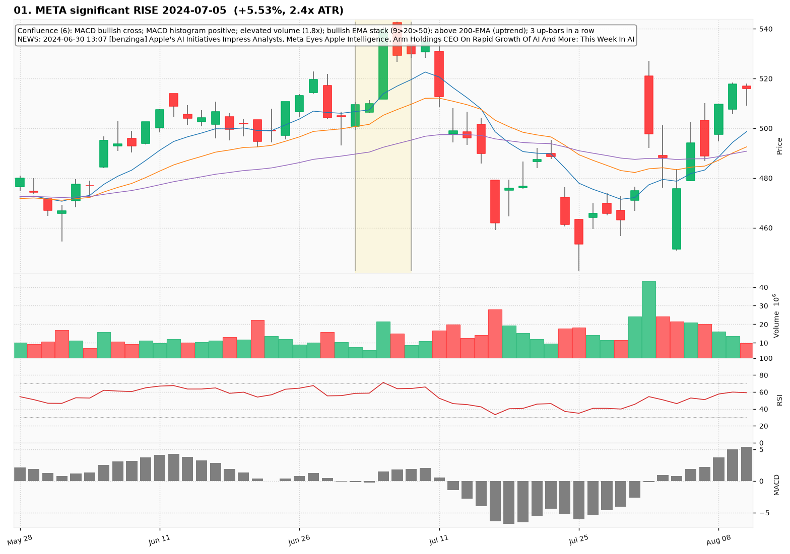
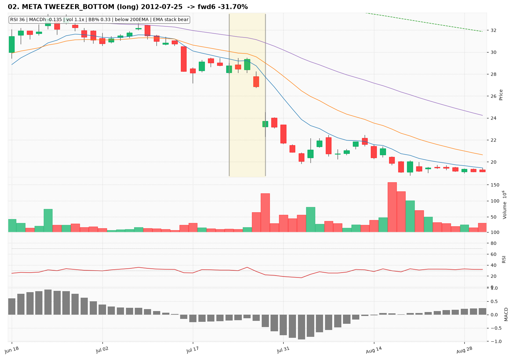
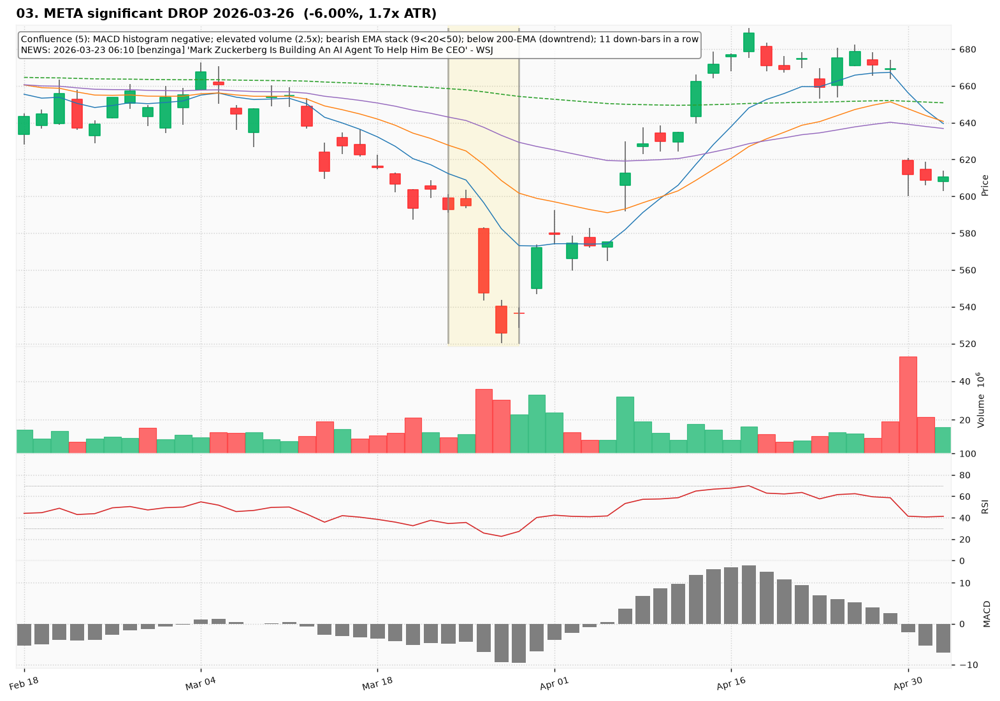
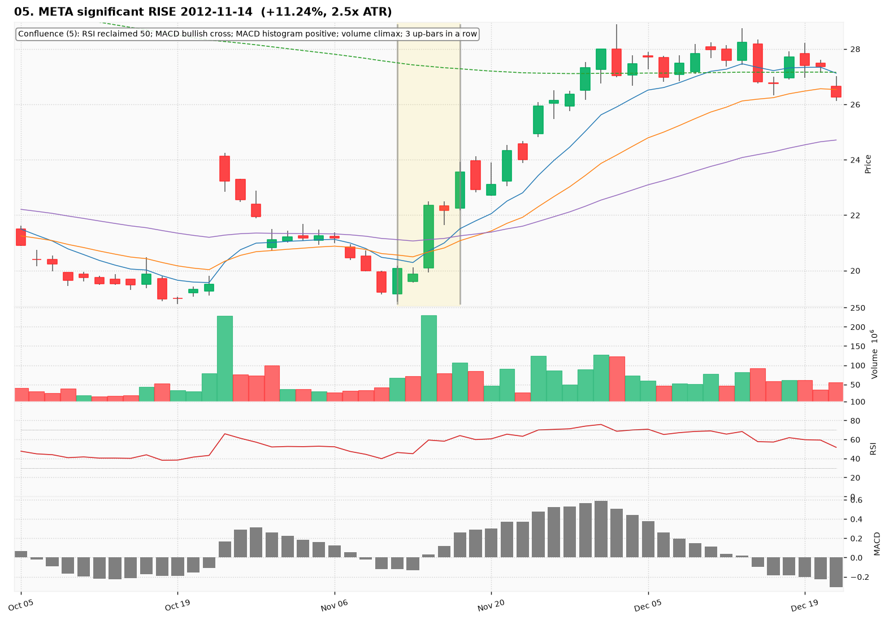
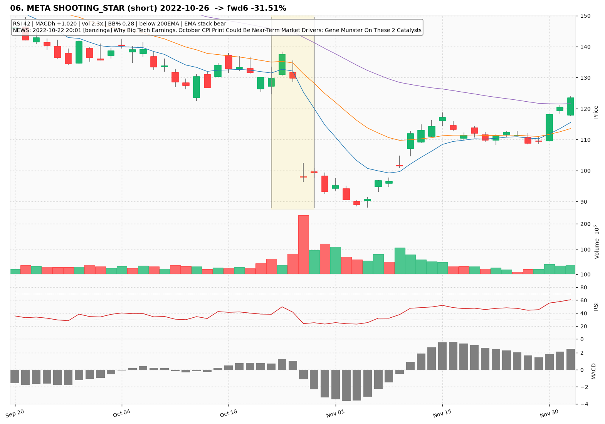
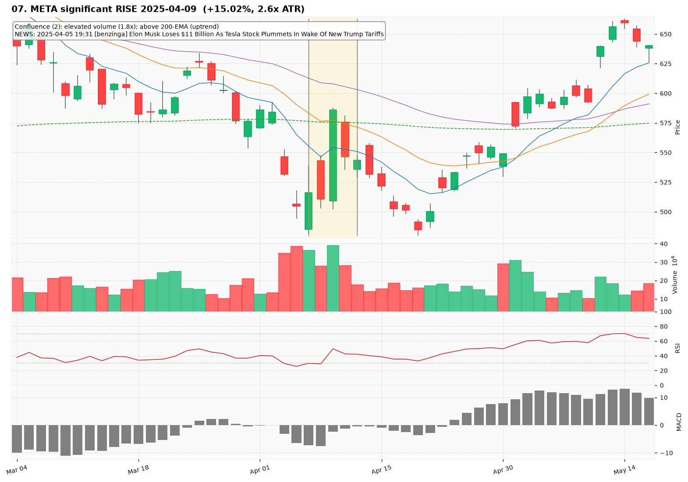
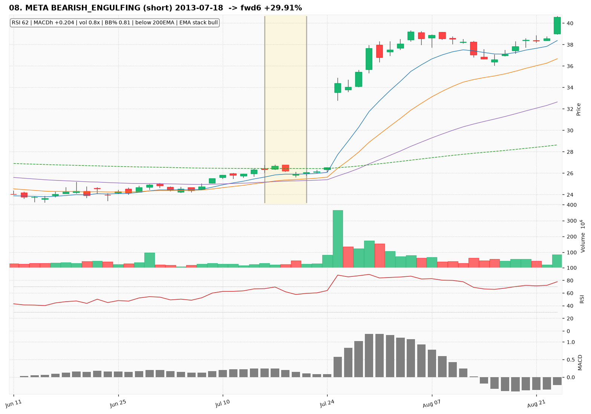
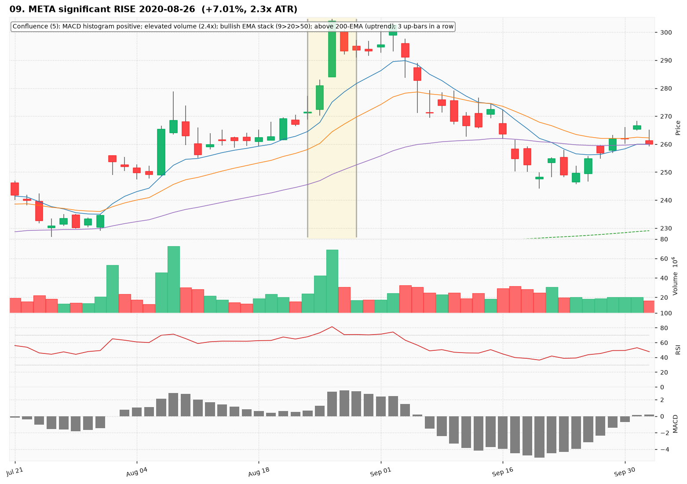
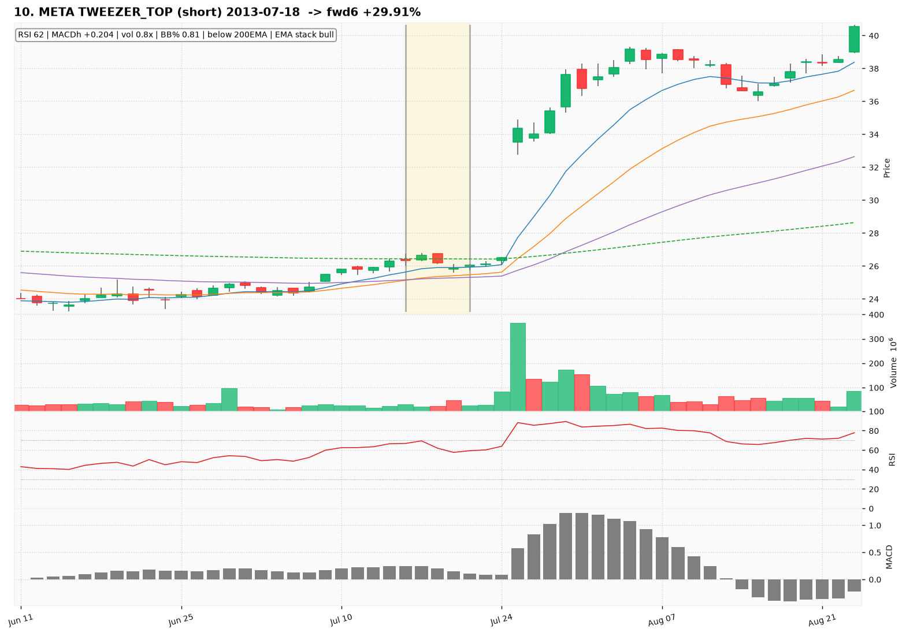

# META — Deep TA Dive (daily candles)

**Bars:** 3,545 (2012-05-18 -> 2026-06-25)  |  **News headlines:** 10,731

TA layered per candle: 44 continuous indicators + 19 candlestick patterns + chart-structure (H&S / double top-bottom / flags).

## What was found

- Significant moves (|1-bar return| in the 0.5% tails): **34**
- Candlestick fulfillments: **1,500**
- Structure fulfillments: **298**

Full records (with t-2..t+2 TA windows): `all_events.parquet`, `significant_moves.csv`, `fulfilled_patterns.csv`.

## The 10 charted examples

### 01. META significant RISE 2024-07-05  (+5.53%, 2.4x ATR)

- **TA read:** Confluence (6): MACD bullish cross; MACD histogram positive; elevated volume (1.8x); bullish EMA stack (9>20>50); above 200-EMA (uptrend); 3 up-bars in a row
- **News:** 2024-06-30 13:07 [benzinga] Apple's AI Initiatives Impress Analysts, Meta Eyes Apple Intelligence, Arm Holdings CEO On Rapid Growth Of AI And More: This Week In AI
- **Outcome (next 6 bars):** -8.10%

### 02. META TWEEZER_BOTTOM (long) 2012-07-25  -> fwd6 -31.70%

- **TA read:** RSI 36 | MACDh -0.135 | vol 1.1x | BB% 0.33 | below 200EMA | EMA stack bear
- **News:** (none in window)
- **Outcome (next 6 bars):** -31.70%

### 03. META significant DROP 2026-03-26  (-6.00%, 1.7x ATR)

- **TA read:** Confluence (5): MACD histogram negative; elevated volume (2.5x); bearish EMA stack (9<20<50); below 200-EMA (downtrend); 11 down-bars in a row
- **News:** 2026-03-23 06:10 [benzinga] 'Mark Zuckerberg Is Building An AI Agent To Help Him Be CEO' - WSJ
- **Outcome (next 6 bars):** +4.65%

### 04. META BULLISH_ENGULFING (long) 2012-07-25  -> fwd6 -31.70%

- **TA read:** RSI 36 | MACDh -0.135 | vol 1.1x | BB% 0.33 | below 200EMA | EMA stack bear
- **News:** (none in window)
- **Outcome (next 6 bars):** -31.70%

### 05. META significant RISE 2012-11-14  (+11.24%, 2.5x ATR)

- **TA read:** Confluence (5): RSI reclaimed 50; MACD bullish cross; MACD histogram positive; volume climax; 3 up-bars in a row
- **News:** (none in window)
- **Outcome (next 6 bars):** +7.33%

### 06. META SHOOTING_STAR (short) 2022-10-26  -> fwd6 -31.51%

- **TA read:** RSI 42 | MACDh +1.020 | vol 2.3x | BB% 0.28 | below 200EMA | EMA stack bear
- **News:** 2022-10-22 20:01 [benzinga] Why Big Tech Earnings, October CPI Print Could Be Near-Term Market Drivers: Gene Munster On These 2 Catalysts
- **Outcome (next 6 bars):** -31.51%

### 07. META significant RISE 2025-04-09  (+15.02%, 2.6x ATR)

- **TA read:** Confluence (2): elevated volume (1.8x); above 200-EMA (uptrend)
- **News:** 2025-04-05 19:31 [benzinga] Elon Musk Loses $11 Billion As Tesla Stock Plummets In Wake Of New Trump Tariffs
- **Outcome (next 6 bars):** -14.39%

### 08. META BEARISH_ENGULFING (short) 2013-07-18  -> fwd6 +29.91%

- **TA read:** RSI 62 | MACDh +0.204 | vol 0.8x | BB% 0.81 | below 200EMA | EMA stack bull
- **News:** (none in window)
- **Outcome (next 6 bars):** +29.91%

### 09. META significant RISE 2020-08-26  (+7.01%, 2.3x ATR)

- **TA read:** Confluence (5): MACD histogram positive; elevated volume (2.4x); bullish EMA stack (9>20>50); above 200-EMA (uptrend); 3 up-bars in a row
- **News:** (none in window)
- **Outcome (next 6 bars):** -4.21%

### 10. META TWEEZER_TOP (short) 2013-07-18  -> fwd6 +29.91%

- **TA read:** RSI 62 | MACDh +0.204 | vol 0.8x | BB% 0.81 | below 200EMA | EMA stack bull
- **News:** (none in window)
- **Outcome (next 6 bars):** +29.91%
