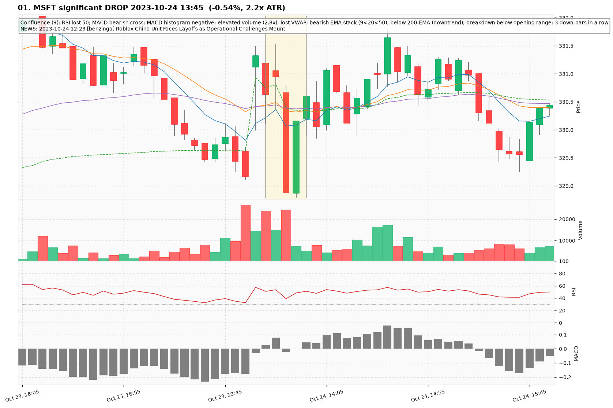
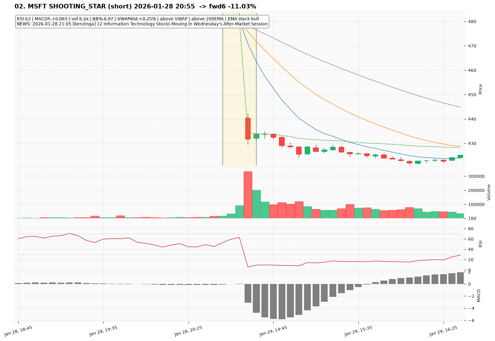
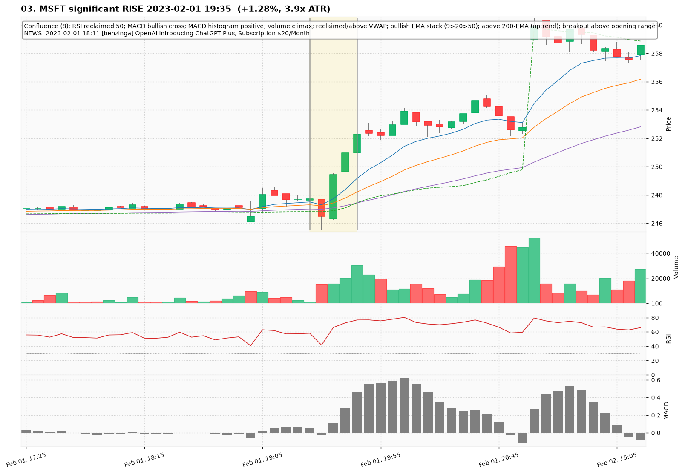
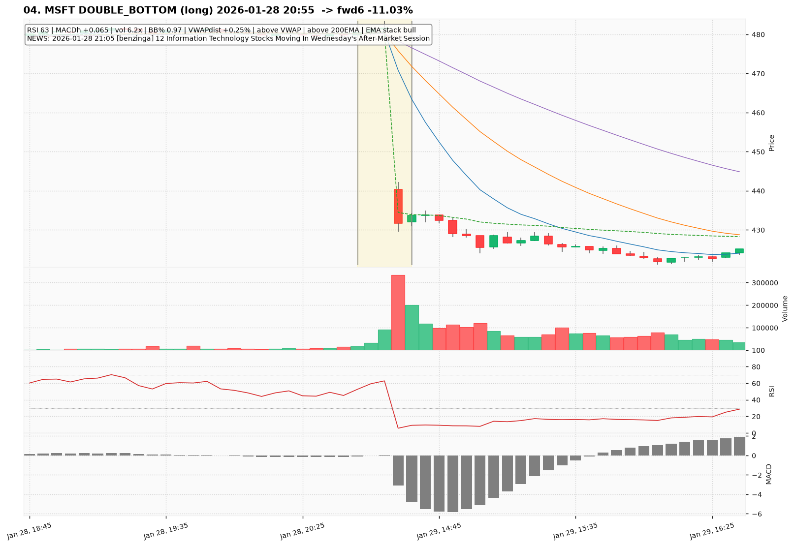
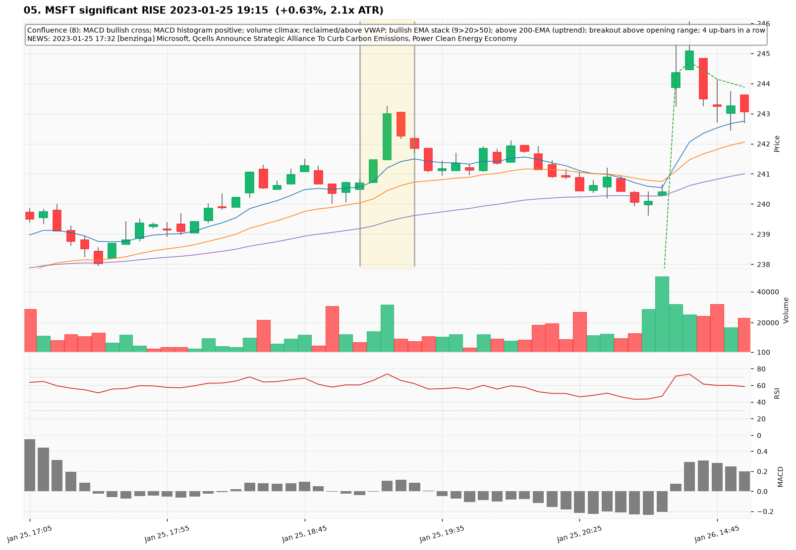
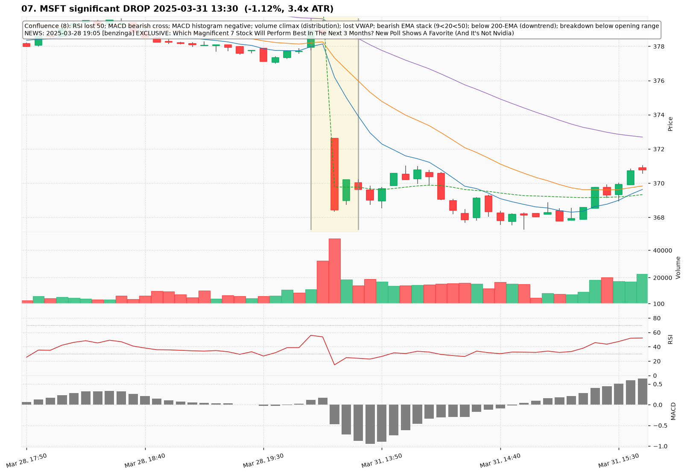
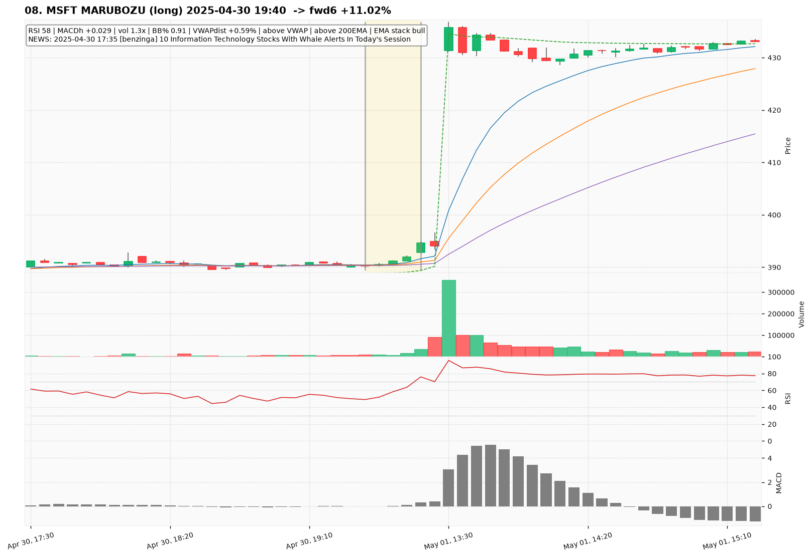
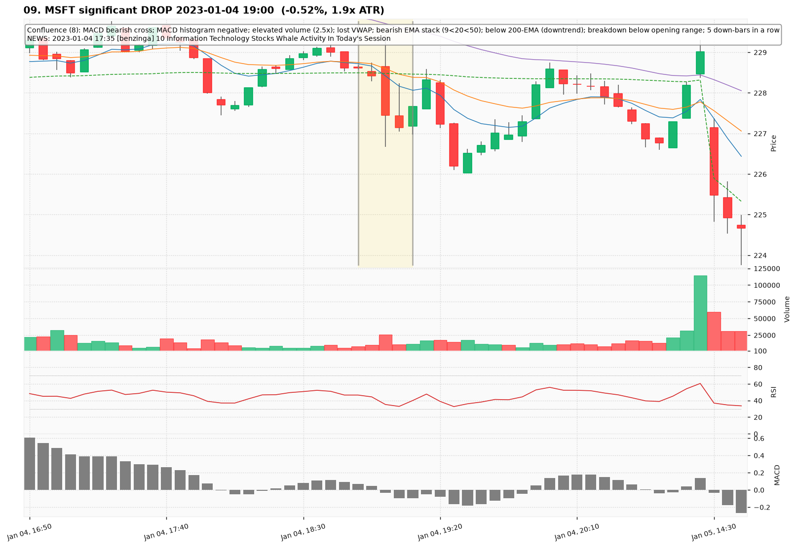
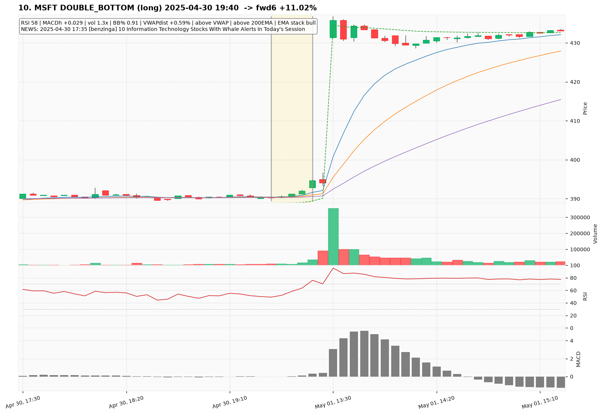

# MSFT — Deep TA Dive (5-minute candles)

**Bars:** 67,609 (2023-01-03 -> 2026-06-26)  |  **News headlines:** 16,166

TA layered per candle: 48 continuous indicators + 19 candlestick patterns + chart-structure (H&S / double top-bottom / flags).

## What was found

- Significant moves (|1-bar return| in the 0.5% tails): **675**
- Candlestick fulfillments: **65,689**
- Structure fulfillments: **6,719**

Full records (with t-2..t+2 TA windows): `all_events.parquet`, `significant_moves.csv`, `fulfilled_patterns.csv`.

## The 10 charted examples

### 01. MSFT significant DROP 2023-10-24 13:45  (-0.54%, 2.2x ATR)

- **TA read:** Confluence (9): RSI lost 50; MACD bearish cross; MACD histogram negative; elevated volume (2.8x); lost VWAP; bearish EMA stack (9<20<50); below 200-EMA (downtrend); breakdown below opening range; 3 down-bars in a row
- **News:** 2023-10-24 12:23 [benzinga] Roblox China Unit Faces Layoffs as Operational Challenges Mount
- **Outcome (next 6 bars):** +0.38%

### 02. MSFT SHOOTING_STAR (short) 2026-01-28 20:55  -> fwd6 -11.03%

- **TA read:** RSI 63 | MACDh +0.065 | vol 6.2x | BB% 0.97 | VWAPdist +0.25% | above VWAP | above 200EMA | EMA stack bull
- **News:** 2026-01-28 21:05 [benzinga] 12 Information Technology Stocks Moving In Wednesday's After-Market Session
- **Outcome (next 6 bars):** -11.03%

### 03. MSFT significant RISE 2023-02-01 19:35  (+1.28%, 3.9x ATR)

- **TA read:** Confluence (8): RSI reclaimed 50; MACD bullish cross; MACD histogram positive; volume climax; reclaimed/above VWAP; bullish EMA stack (9>20>50); above 200-EMA (uptrend); breakout above opening range
- **News:** 2023-02-01 18:11 [benzinga] OpenAI Introducing ChatGPT Plus, Subscription $20/Month
- **Outcome (next 6 bars):** +1.79%

### 04. MSFT DOUBLE_BOTTOM (long) 2026-01-28 20:55  -> fwd6 -11.03%

- **TA read:** RSI 63 | MACDh +0.065 | vol 6.2x | BB% 0.97 | VWAPdist +0.25% | above VWAP | above 200EMA | EMA stack bull
- **News:** 2026-01-28 21:05 [benzinga] 12 Information Technology Stocks Moving In Wednesday's After-Market Session
- **Outcome (next 6 bars):** -11.03%

### 05. MSFT significant RISE 2023-01-25 19:15  (+0.63%, 2.1x ATR)

- **TA read:** Confluence (8): MACD bullish cross; MACD histogram positive; volume climax; reclaimed/above VWAP; bullish EMA stack (9>20>50); above 200-EMA (uptrend); breakout above opening range; 4 up-bars in a row
- **News:** 2023-01-25 17:32 [benzinga] Microsoft, Qcells Announce Strategic Alliance To Curb Carbon Emissions, Power Clean Energy Economy
- **Outcome (next 6 bars):** -0.77%

### 06. MSFT DOUBLE_BOTTOM (long) 2026-01-28 20:55  -> fwd6 -11.03%

- **TA read:** RSI 63 | MACDh +0.065 | vol 6.2x | BB% 0.97 | VWAPdist +0.25% | above VWAP | above 200EMA | EMA stack bull
- **News:** 2026-01-28 21:05 [benzinga] 12 Information Technology Stocks Moving In Wednesday's After-Market Session
- **Outcome (next 6 bars):** -11.03%

### 07. MSFT significant DROP 2025-03-31 13:30  (-1.12%, 3.4x ATR)

- **TA read:** Confluence (8): RSI lost 50; MACD bearish cross; MACD histogram negative; volume climax (distribution); lost VWAP; bearish EMA stack (9<20<50); below 200-EMA (downtrend); breakdown below opening range
- **News:** 2025-03-28 19:05 [benzinga] EXCLUSIVE: Which Magnificent 7 Stock Will Perform Best In The Next 3 Months? New Poll Shows A Favorite (And It's Not Nvidia)
- **Outcome (next 6 bars):** +0.48%

### 08. MSFT MARUBOZU (long) 2025-04-30 19:40  -> fwd6 +11.02%

- **TA read:** RSI 58 | MACDh +0.029 | vol 1.3x | BB% 0.91 | VWAPdist +0.59% | above VWAP | above 200EMA | EMA stack bull
- **News:** 2025-04-30 17:35 [benzinga] 10 Information Technology Stocks With Whale Alerts In Today's Session
- **Outcome (next 6 bars):** +11.02%

### 09. MSFT significant DROP 2023-01-04 19:00  (-0.52%, 1.9x ATR)

- **TA read:** Confluence (8): MACD bearish cross; MACD histogram negative; elevated volume (2.5x); lost VWAP; bearish EMA stack (9<20<50); below 200-EMA (downtrend); breakdown below opening range; 5 down-bars in a row
- **News:** 2023-01-04 17:35 [benzinga] 10 Information Technology Stocks Whale Activity In Today's Session
- **Outcome (next 6 bars):** -0.41%

### 10. MSFT DOUBLE_BOTTOM (long) 2025-04-30 19:40  -> fwd6 +11.02%

- **TA read:** RSI 58 | MACDh +0.029 | vol 1.3x | BB% 0.91 | VWAPdist +0.59% | above VWAP | above 200EMA | EMA stack bull
- **News:** 2025-04-30 17:35 [benzinga] 10 Information Technology Stocks With Whale Alerts In Today's Session
- **Outcome (next 6 bars):** +11.02%
