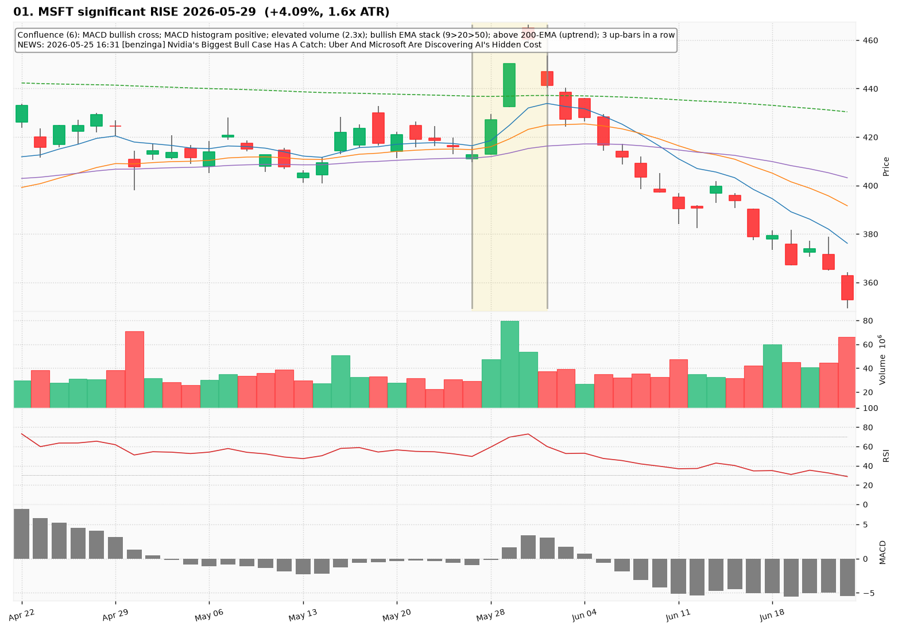
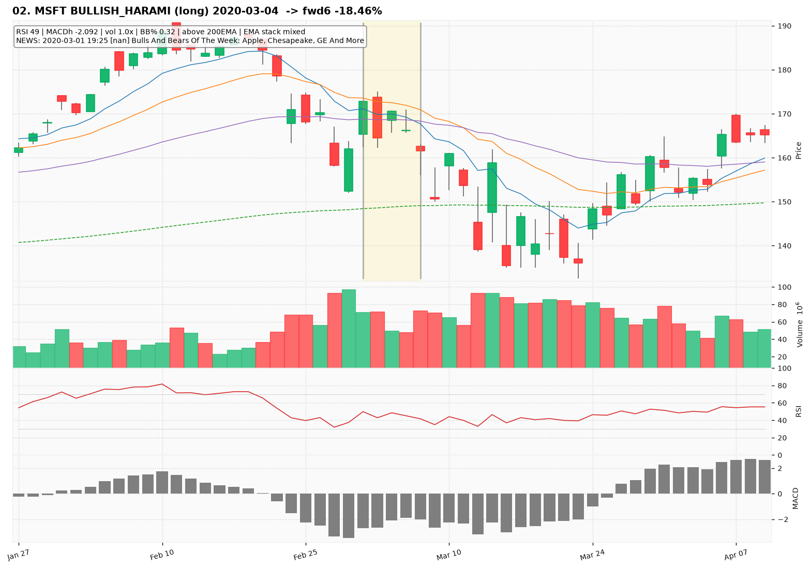
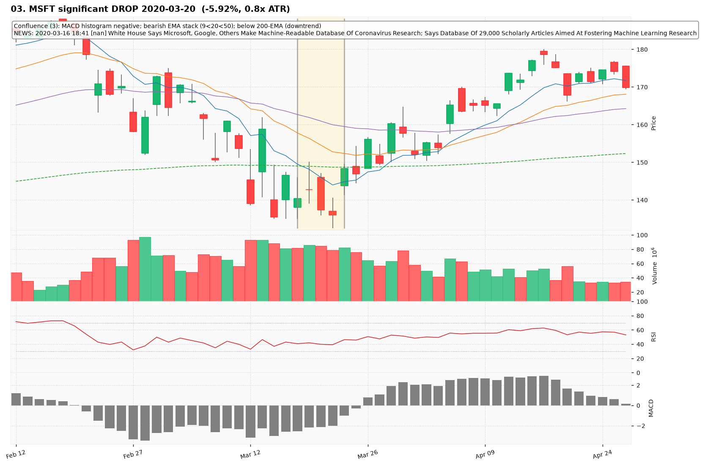
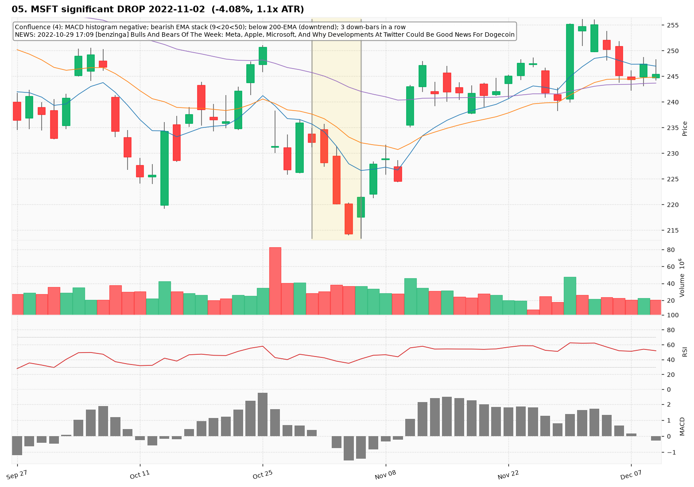
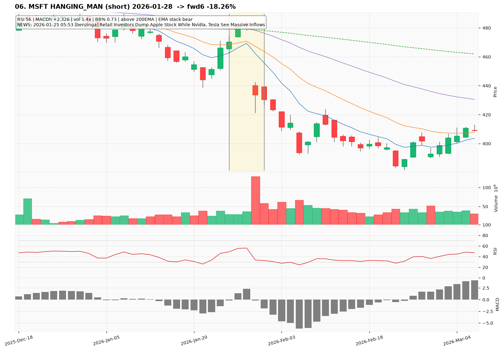
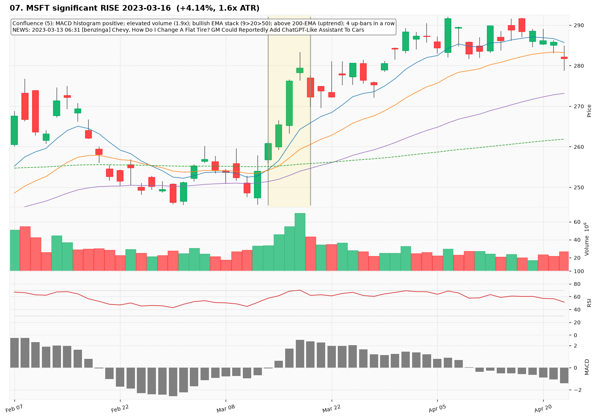
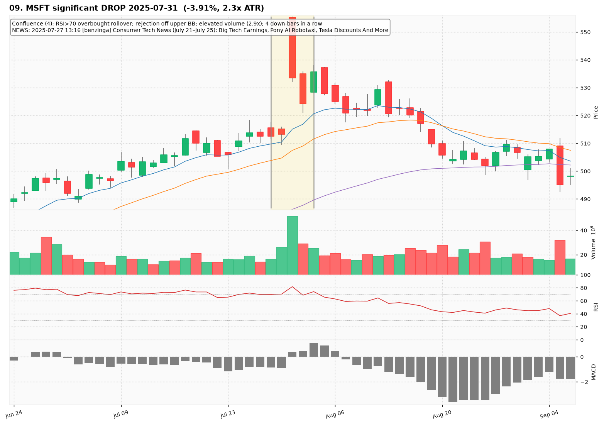
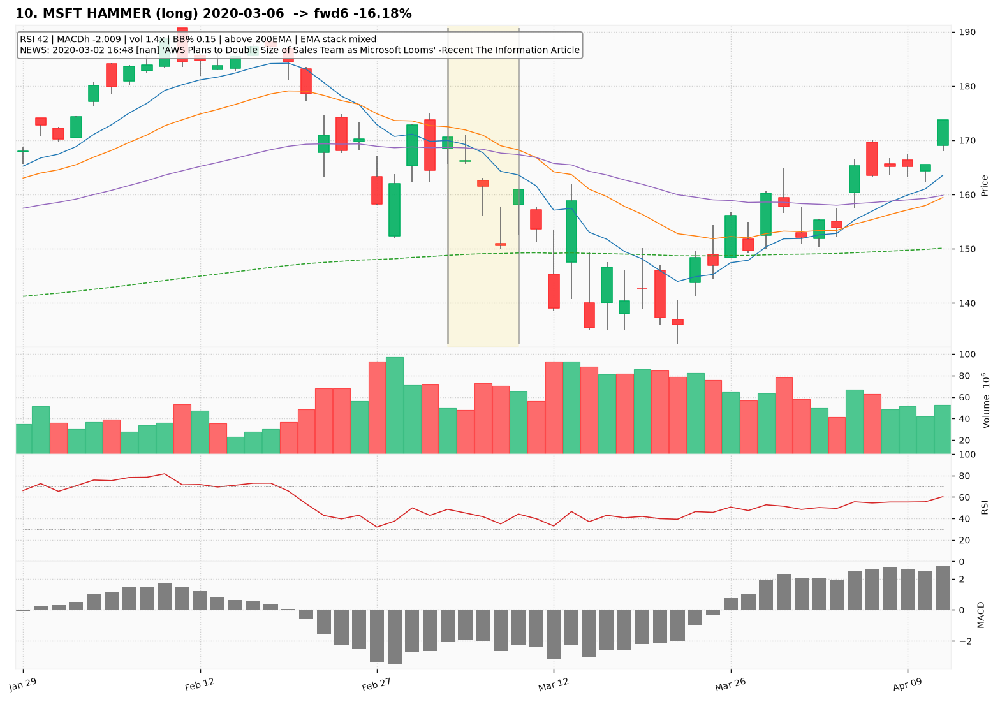

# MSFT — Deep TA Dive (daily candles)

**Bars:** 3,781 (2011-06-13 -> 2026-06-25)  |  **News headlines:** 16,166

TA layered per candle: 44 continuous indicators + 19 candlestick patterns + chart-structure (H&S / double top-bottom / flags).

## What was found

- Significant moves (|1-bar return| in the 0.5% tails): **38**
- Candlestick fulfillments: **1,764**
- Structure fulfillments: **315**

Full records (with t-2..t+2 TA windows): `all_events.parquet`, `significant_moves.csv`, `fulfilled_patterns.csv`.

## The 10 charted examples

### 01. MSFT significant RISE 2026-05-29  (+4.09%, 1.6x ATR)

- **TA read:** Confluence (6): MACD bullish cross; MACD histogram positive; elevated volume (2.3x); bullish EMA stack (9>20>50); above 200-EMA (uptrend); 3 up-bars in a row
- **News:** 2026-05-25 16:31 [benzinga] Nvidia's Biggest Bull Case Has A Catch: Uber And Microsoft Are Discovering AI's Hidden Cost
- **Outcome (next 6 bars):** -8.55%

### 02. MSFT BULLISH_HARAMI (long) 2020-03-04  -> fwd6 -18.46%

- **TA read:** RSI 49 | MACDh -2.092 | vol 1.0x | BB% 0.32 | above 200EMA | EMA stack mixed
- **News:** 2020-03-01 19:25 [nan] Bulls And Bears Of The Week: Apple, Chesapeake, GE And More
- **Outcome (next 6 bars):** -18.46%

### 03. MSFT significant DROP 2020-03-20  (-5.92%, 0.8x ATR)

- **TA read:** Confluence (3): MACD histogram negative; bearish EMA stack (9<20<50); below 200-EMA (downtrend)
- **News:** 2020-03-16 18:41 [nan] White House Says Microsoft, Google, Others Make Machine-Readable Database Of Coronavirus Research; Says Database Of 29,000 Scholarly Articles Aimed At Fostering Machine Learning Research
- **Outcome (next 6 bars):** +16.66%

### 04. MSFT TWEEZER_TOP (short) 2026-01-28  -> fwd6 -18.26%

- **TA read:** RSI 56 | MACDh +2.326 | vol 1.4x | BB% 0.73 | above 200EMA | EMA stack bear
- **News:** 2026-01-25 05:53 [benzinga] Retail Investors Dump Apple Stock While Nvidia, Tesla See Massive Inflows
- **Outcome (next 6 bars):** -18.26%

### 05. MSFT significant DROP 2022-11-02  (-4.08%, 1.1x ATR)

- **TA read:** Confluence (4): MACD histogram negative; bearish EMA stack (9<20<50); below 200-EMA (downtrend); 3 down-bars in a row
- **News:** 2022-10-29 17:09 [benzinga] Bulls And Bears Of The Week: Meta, Apple, Microsoft, And Why Developments At Twitter Could Be Good News For Dogecoin
- **Outcome (next 6 bars):** +10.40%

### 06. MSFT HANGING_MAN (short) 2026-01-28  -> fwd6 -18.26%

- **TA read:** RSI 56 | MACDh +2.326 | vol 1.4x | BB% 0.73 | above 200EMA | EMA stack bear
- **News:** 2026-01-25 05:53 [benzinga] Retail Investors Dump Apple Stock While Nvidia, Tesla See Massive Inflows
- **Outcome (next 6 bars):** -18.26%

### 07. MSFT significant RISE 2023-03-16  (+4.14%, 1.6x ATR)

- **TA read:** Confluence (5): MACD histogram positive; elevated volume (1.9x); bullish EMA stack (9>20>50); above 200-EMA (uptrend); 4 up-bars in a row
- **News:** 2023-03-13 06:31 [benzinga] Chevy, How Do I Change A Flat Tire? GM Could Reportedly Add ChatGPT-Like Assistant To Cars
- **Outcome (next 6 bars):** +1.58%

### 08. MSFT EVENING_STAR (short) 2020-03-20  -> fwd6 +16.66%

- **TA read:** RSI 40 | MACDh -2.140 | vol 1.1x | BB% 0.11 | below 200EMA | EMA stack bear
- **News:** 2020-03-16 18:41 [nan] White House Says Microsoft, Google, Others Make Machine-Readable Database Of Coronavirus Research; Says Database Of 29,000 Scholarly Articles Aimed At Fostering Machine Learning Research
- **Outcome (next 6 bars):** +16.66%

### 09. MSFT significant DROP 2025-07-31  (-3.91%, 2.3x ATR)

- **TA read:** Confluence (4): RSI>70 overbought rollover; rejection off upper BB; elevated volume (2.9x); 4 down-bars in a row
- **News:** 2025-07-27 13:16 [benzinga] Consumer Tech News (July 21–July 25): Big Tech Earnings, Pony AI Robotaxi, Tesla Discounts And More
- **Outcome (next 6 bars):** -2.15%

### 10. MSFT HAMMER (long) 2020-03-06  -> fwd6 -16.18%

- **TA read:** RSI 42 | MACDh -2.009 | vol 1.4x | BB% 0.15 | above 200EMA | EMA stack mixed
- **News:** 2020-03-02 16:48 [nan] 'AWS Plans to Double Size of Sales Team as Microsoft Looms' -Recent The Information Article
- **Outcome (next 6 bars):** -16.18%
