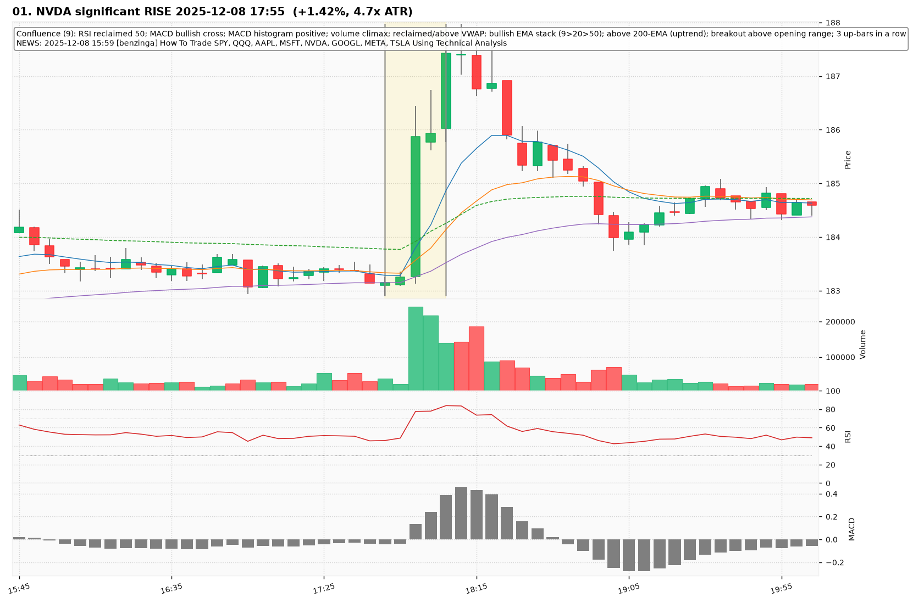
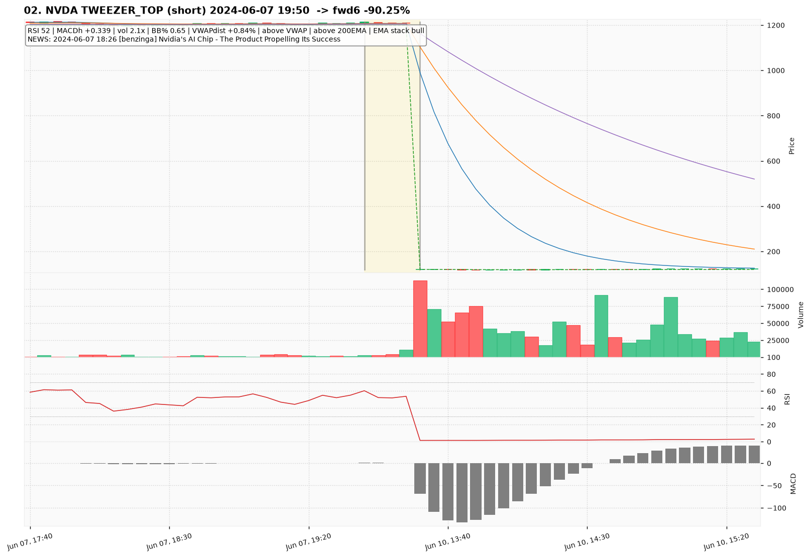
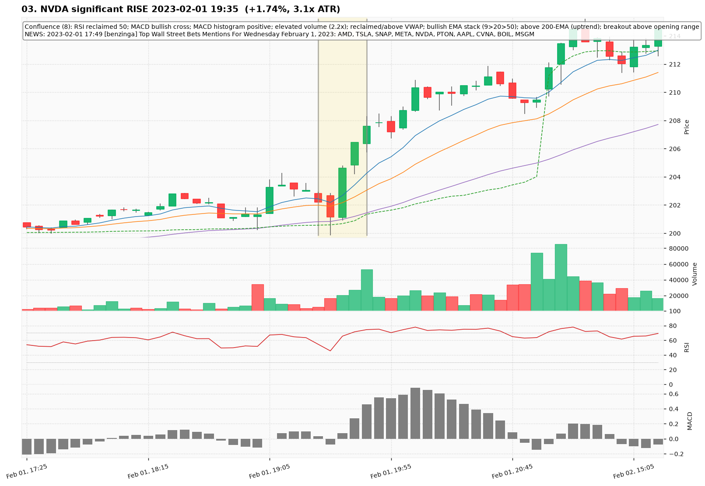
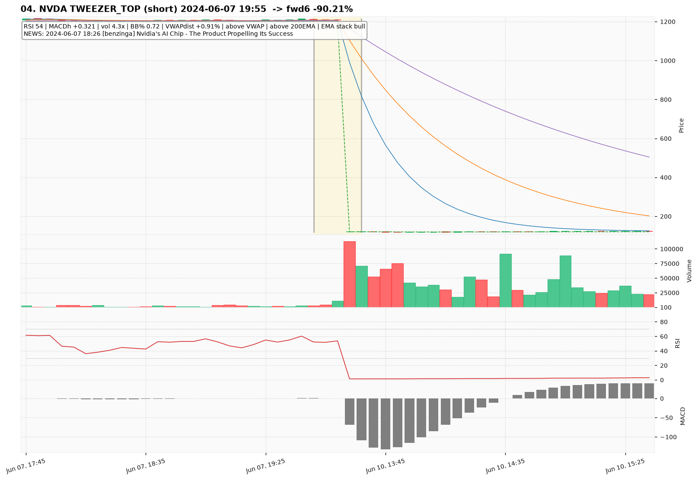
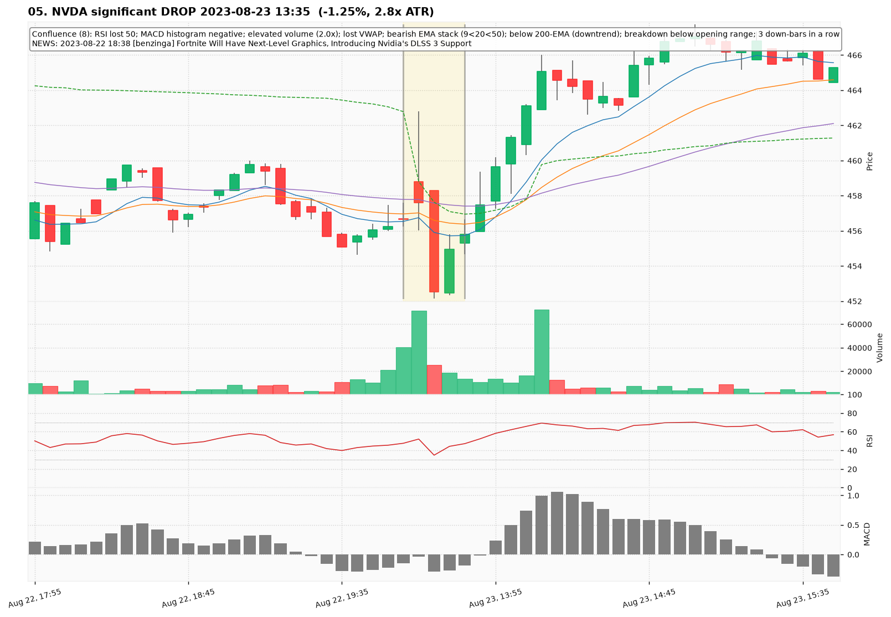
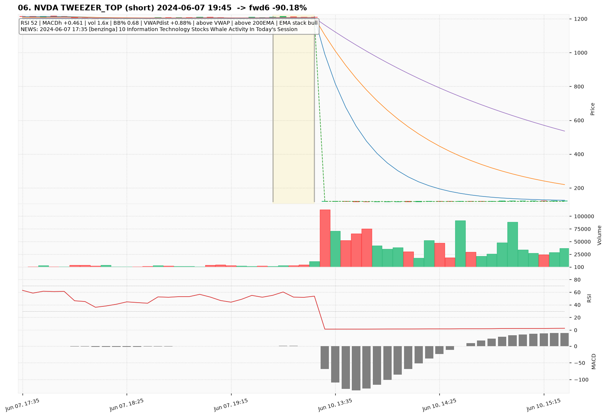
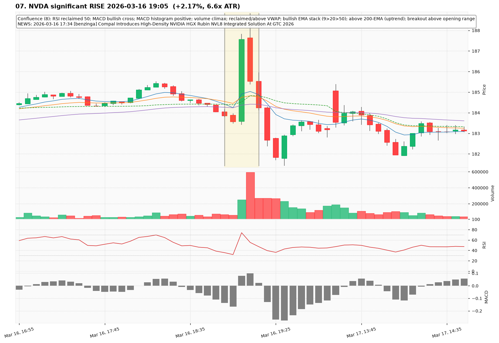
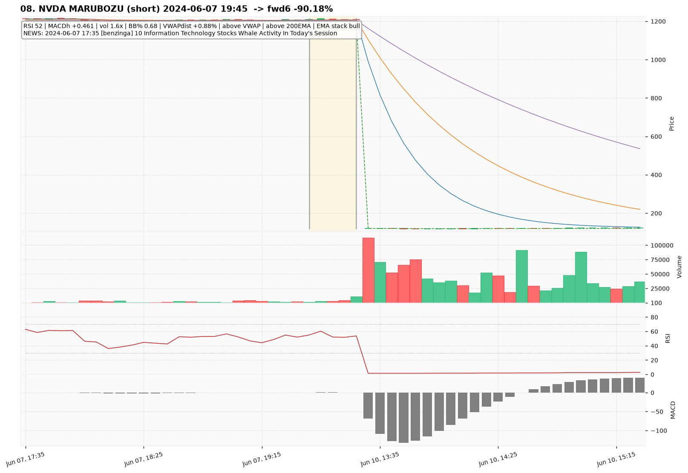
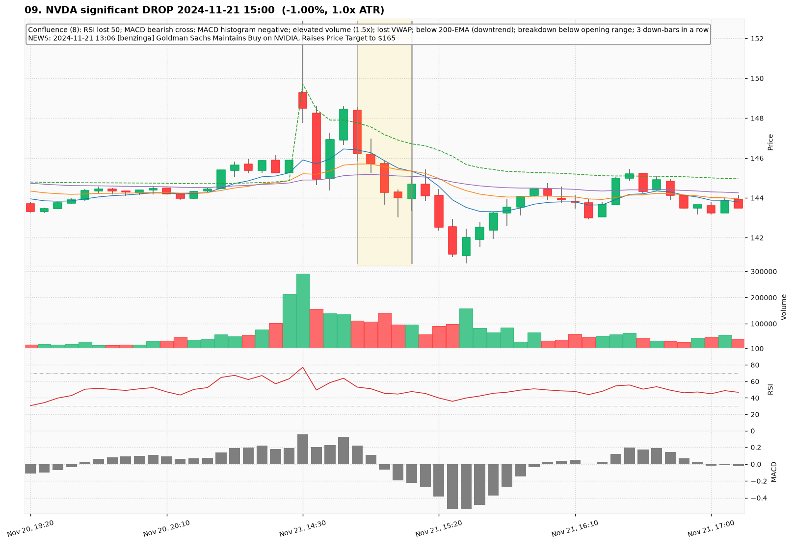
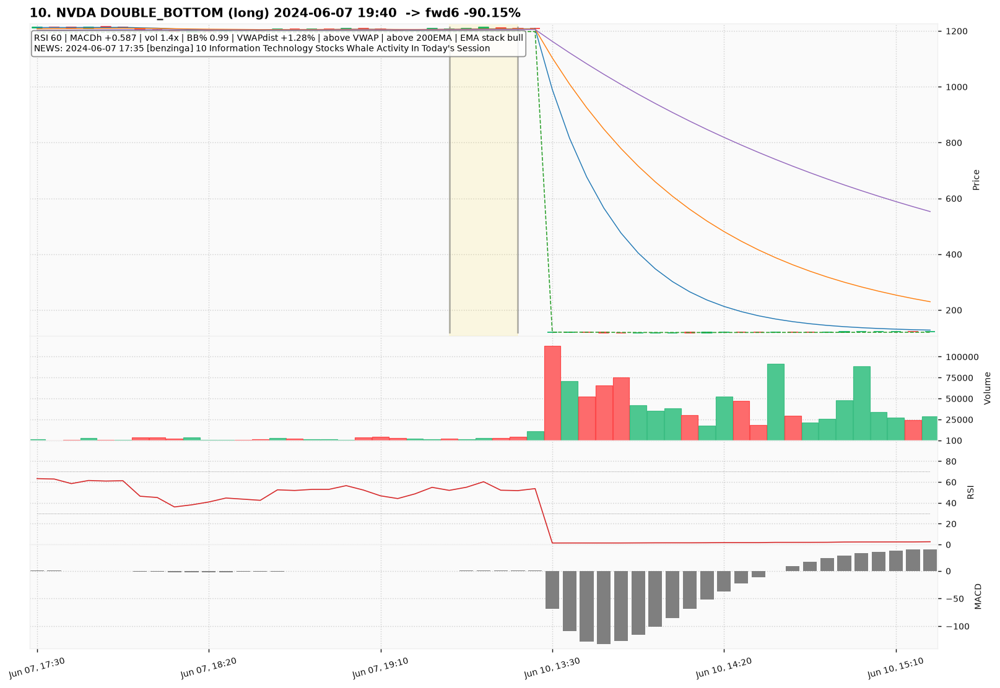

# NVDA — Deep TA Dive (5-minute candles)

**Bars:** 67,665 (2023-01-03 -> 2026-06-26)  |  **News headlines:** 17,903

TA layered per candle: 48 continuous indicators + 19 candlestick patterns + chart-structure (H&S / double top-bottom / flags).

## What was found

- Significant moves (|1-bar return| in the 0.5% tails): **677**
- Candlestick fulfillments: **59,988**
- Structure fulfillments: **6,704**

Full records (with t-2..t+2 TA windows): `all_events.parquet`, `significant_moves.csv`, `fulfilled_patterns.csv`.

## The 10 charted examples

### 01. NVDA significant RISE 2025-12-08 17:55  (+1.42%, 4.7x ATR)

- **TA read:** Confluence (9): RSI reclaimed 50; MACD bullish cross; MACD histogram positive; volume climax; reclaimed/above VWAP; bullish EMA stack (9>20>50); above 200-EMA (uptrend); breakout above opening range; 3 up-bars in a row
- **News:** 2025-12-08 15:59 [benzinga] How To Trade SPY, QQQ, AAPL, MSFT, NVDA, GOOGL, META, TSLA Using Technical Analysis
- **Outcome (next 6 bars):** +0.02%

### 02. NVDA TWEEZER_TOP (short) 2024-06-07 19:50  -> fwd6 -90.25%

- **TA read:** RSI 52 | MACDh +0.339 | vol 2.1x | BB% 0.65 | VWAPdist +0.84% | above VWAP | above 200EMA | EMA stack bull
- **News:** 2024-06-07 18:26 [benzinga] Nvidia's AI Chip - The Product Propelling Its Success
- **Outcome (next 6 bars):** -90.25%

### 03. NVDA significant RISE 2023-02-01 19:35  (+1.74%, 3.1x ATR)

- **TA read:** Confluence (8): RSI reclaimed 50; MACD bullish cross; MACD histogram positive; elevated volume (2.2x); reclaimed/above VWAP; bullish EMA stack (9>20>50); above 200-EMA (uptrend); breakout above opening range
- **News:** 2023-02-01 17:49 [benzinga] Top Wall Street Bets Mentions For Wednesday February 1, 2023: AMD, TSLA, SNAP, META, NVDA, PTON, AAPL, CVNA, BOIL, MSGM
- **Outcome (next 6 bars):** +2.78%

### 04. NVDA TWEEZER_TOP (short) 2024-06-07 19:55  -> fwd6 -90.21%

- **TA read:** RSI 54 | MACDh +0.321 | vol 4.3x | BB% 0.72 | VWAPdist +0.91% | above VWAP | above 200EMA | EMA stack bull
- **News:** 2024-06-07 18:26 [benzinga] Nvidia's AI Chip - The Product Propelling Its Success
- **Outcome (next 6 bars):** -90.21%

### 05. NVDA significant DROP 2023-08-23 13:35  (-1.25%, 2.8x ATR)

- **TA read:** Confluence (8): RSI lost 50; MACD histogram negative; elevated volume (2.0x); lost VWAP; bearish EMA stack (9<20<50); below 200-EMA (downtrend); breakdown below opening range; 3 down-bars in a row
- **News:** 2023-08-22 18:38 [benzinga] Fortnite Will Have Next-Level Graphics, Introducing Nvidia's DLSS 3 Support
- **Outcome (next 6 bars):** +2.33%

### 06. NVDA TWEEZER_TOP (short) 2024-06-07 19:45  -> fwd6 -90.18%

- **TA read:** RSI 52 | MACDh +0.461 | vol 1.6x | BB% 0.68 | VWAPdist +0.88% | above VWAP | above 200EMA | EMA stack bull
- **News:** 2024-06-07 17:35 [benzinga] 10 Information Technology Stocks Whale Activity In Today's Session
- **Outcome (next 6 bars):** -90.18%

### 07. NVDA significant RISE 2026-03-16 19:05  (+2.17%, 6.6x ATR)

- **TA read:** Confluence (8): RSI reclaimed 50; MACD bullish cross; MACD histogram positive; volume climax; reclaimed/above VWAP; bullish EMA stack (9>20>50); above 200-EMA (uptrend); breakout above opening range
- **News:** 2026-03-16 17:34 [benzinga] Compal Introduces High-Density NVIDIA HGX Rubin NVL8 Integrated Solution At GTC 2026
- **Outcome (next 6 bars):** -2.23%

### 08. NVDA MARUBOZU (short) 2024-06-07 19:45  -> fwd6 -90.18%

- **TA read:** RSI 52 | MACDh +0.461 | vol 1.6x | BB% 0.68 | VWAPdist +0.88% | above VWAP | above 200EMA | EMA stack bull
- **News:** 2024-06-07 17:35 [benzinga] 10 Information Technology Stocks Whale Activity In Today's Session
- **Outcome (next 6 bars):** -90.18%

### 09. NVDA significant DROP 2024-11-21 15:00  (-1.00%, 1.0x ATR)

- **TA read:** Confluence (8): RSI lost 50; MACD bearish cross; MACD histogram negative; elevated volume (1.5x); lost VWAP; below 200-EMA (downtrend); breakdown below opening range; 3 down-bars in a row
- **News:** 2024-11-21 13:06 [benzinga] Goldman Sachs Maintains Buy on NVIDIA, Raises Price Target to $165
- **Outcome (next 6 bars):** -1.57%

### 10. NVDA DOUBLE_BOTTOM (long) 2024-06-07 19:40  -> fwd6 -90.15%

- **TA read:** RSI 60 | MACDh +0.587 | vol 1.4x | BB% 0.99 | VWAPdist +1.28% | above VWAP | above 200EMA | EMA stack bull
- **News:** 2024-06-07 17:35 [benzinga] 10 Information Technology Stocks Whale Activity In Today's Session
- **Outcome (next 6 bars):** -90.15%
