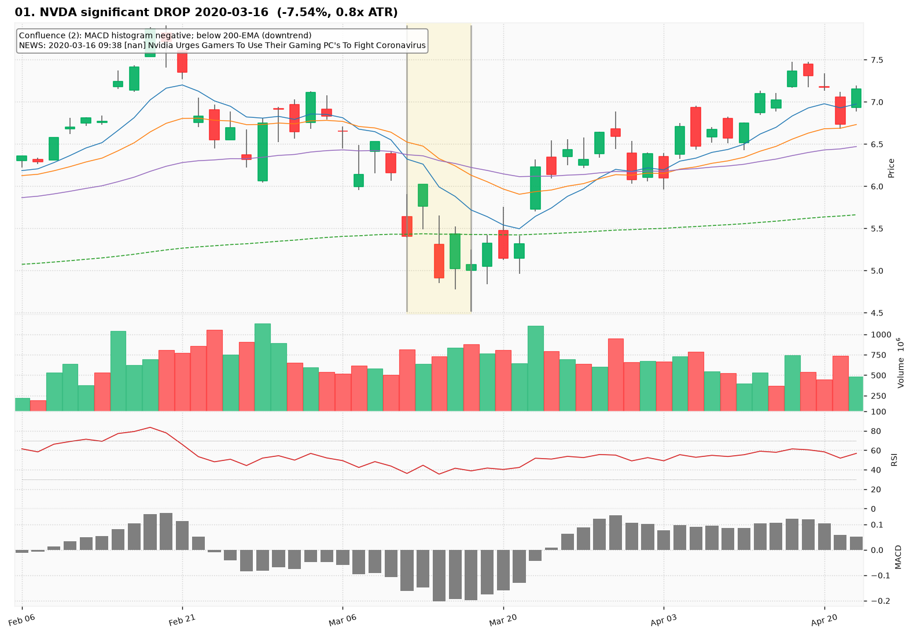
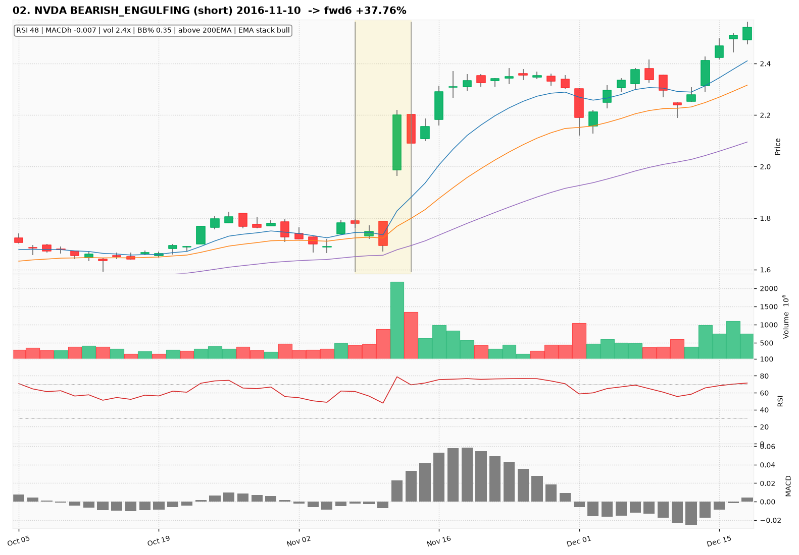
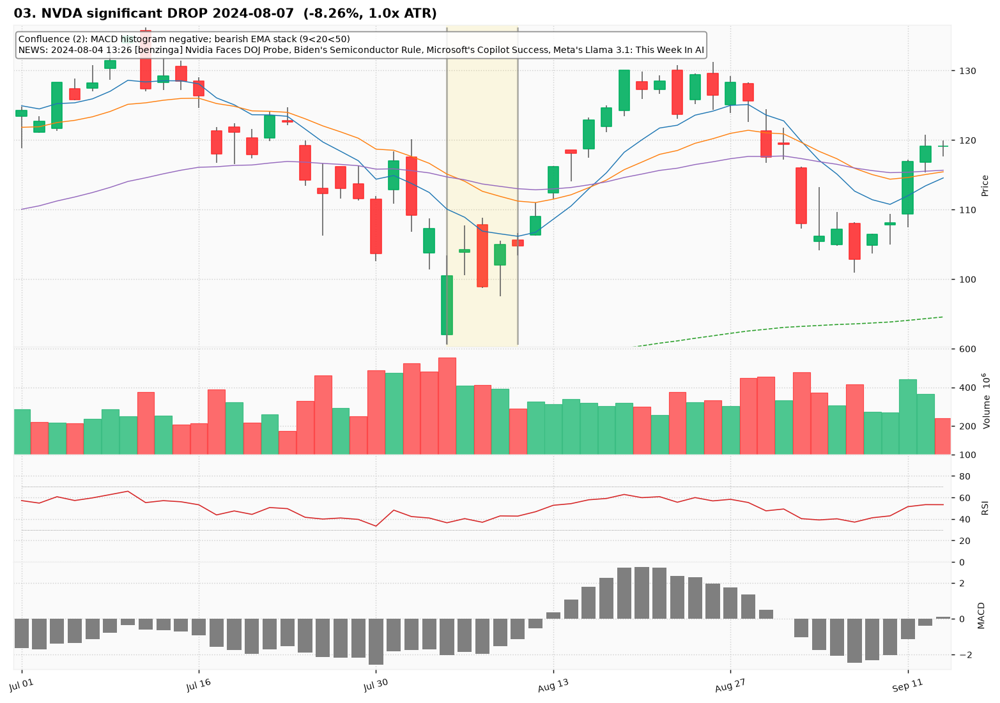
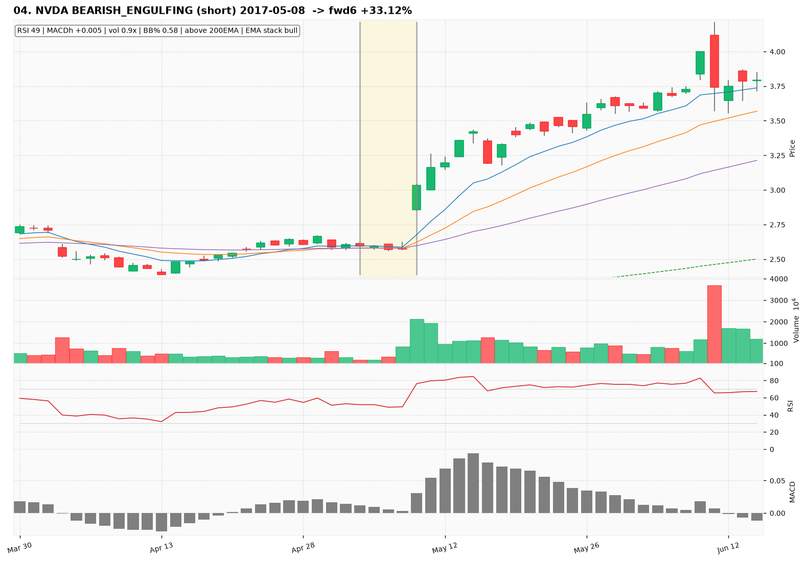
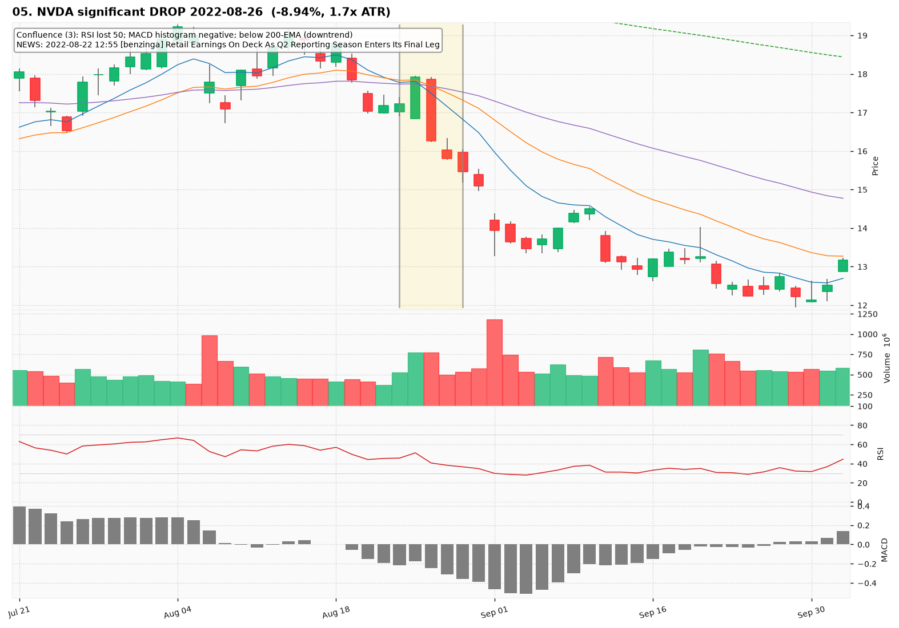
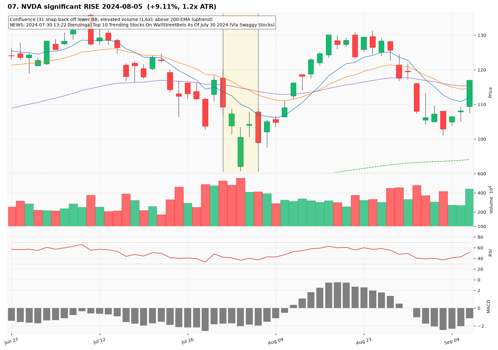
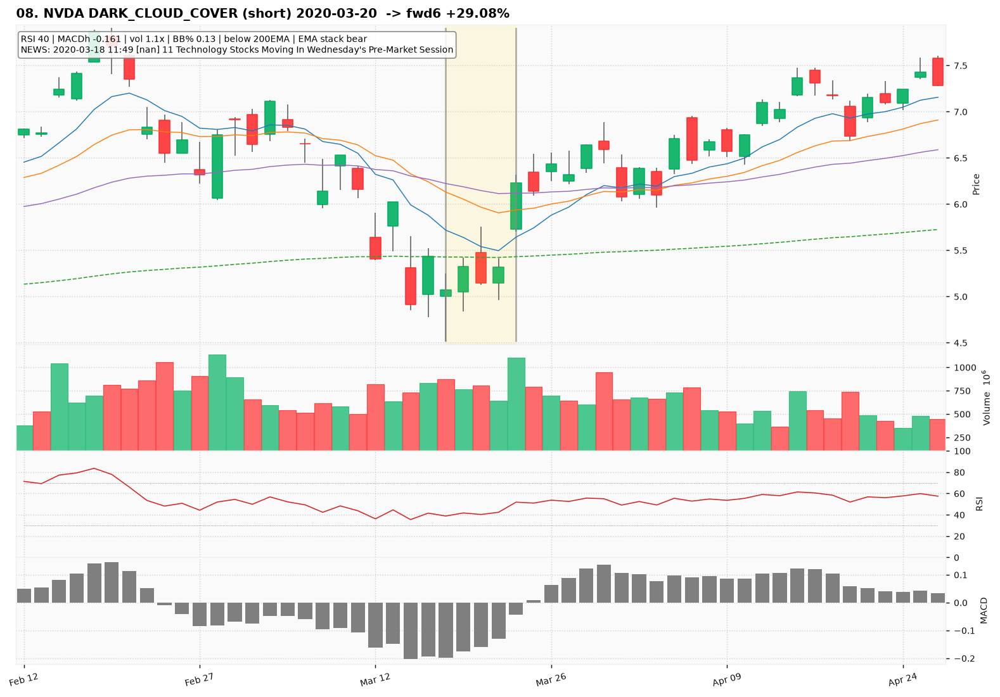
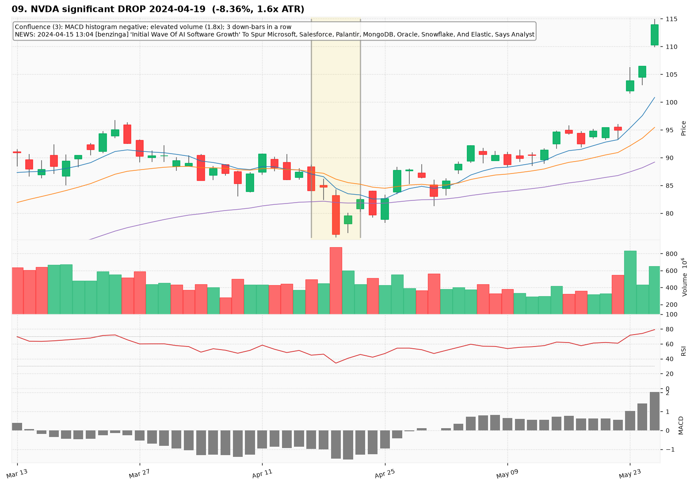
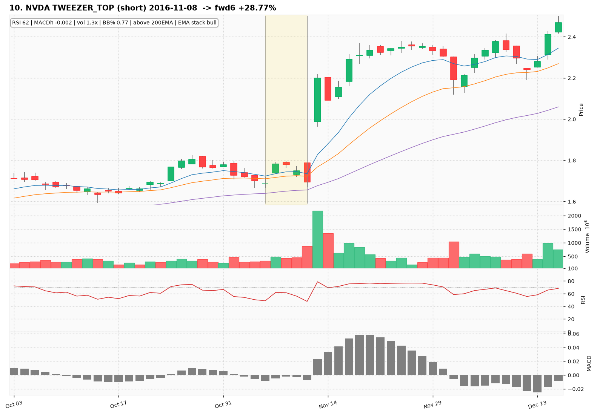

# NVDA — Deep TA Dive (daily candles)

**Bars:** 3,781 (2011-06-13 -> 2026-06-25)  |  **News headlines:** 17,903

TA layered per candle: 44 continuous indicators + 19 candlestick patterns + chart-structure (H&S / double top-bottom / flags).

## What was found

- Significant moves (|1-bar return| in the 0.5% tails): **38**
- Candlestick fulfillments: **1,569**
- Structure fulfillments: **291**

Full records (with t-2..t+2 TA windows): `all_events.parquet`, `significant_moves.csv`, `fulfilled_patterns.csv`.

## The 10 charted examples

### 01. NVDA significant DROP 2020-03-16  (-7.54%, 0.8x ATR)

- **TA read:** Confluence (2): MACD histogram negative; below 200-EMA (downtrend)
- **News:** 2020-03-16 09:38 [nan] Nvidia Urges Gamers To Use Their Gaming PC's To Fight Coronavirus
- **Outcome (next 6 bars):** +26.87%

### 02. NVDA BEARISH_ENGULFING (short) 2016-11-10  -> fwd6 +37.76%

- **TA read:** RSI 48 | MACDh -0.007 | vol 2.4x | BB% 0.35 | above 200EMA | EMA stack bull
- **News:** (none in window)
- **Outcome (next 6 bars):** +37.76%

### 03. NVDA significant DROP 2024-08-07  (-8.26%, 1.0x ATR)

- **TA read:** Confluence (2): MACD histogram negative; bearish EMA stack (9<20<50)
- **News:** 2024-08-04 13:26 [benzinga] Nvidia Faces DOJ Probe, Biden's Semiconductor Rule, Microsoft's Copilot Success, Meta's Llama 3.1: This Week In AI
- **Outcome (next 6 bars):** +24.21%

### 04. NVDA BEARISH_ENGULFING (short) 2017-05-08  -> fwd6 +33.12%

- **TA read:** RSI 49 | MACDh +0.005 | vol 0.9x | BB% 0.58 | above 200EMA | EMA stack bull
- **News:** (none in window)
- **Outcome (next 6 bars):** +33.12%

### 05. NVDA significant DROP 2022-08-26  (-8.94%, 1.7x ATR)

- **TA read:** Confluence (3): RSI lost 50; MACD histogram negative; below 200-EMA (downtrend)
- **News:** 2022-08-22 12:55 [benzinga] Retail Earnings On Deck As Q2 Reporting Season Enters Its Final Leg
- **Outcome (next 6 bars):** -17.19%

### 06. NVDA TWEEZER_TOP (short) 2017-05-08  -> fwd6 +33.12%

- **TA read:** RSI 49 | MACDh +0.005 | vol 0.9x | BB% 0.58 | above 200EMA | EMA stack bull
- **News:** (none in window)
- **Outcome (next 6 bars):** +33.12%

### 07. NVDA significant RISE 2024-08-05  (+9.11%, 1.2x ATR)

- **TA read:** Confluence (3): snap-back off lower BB; elevated volume (1.6x); above 200-EMA (uptrend)
- **News:** 2024-07-30 13:22 [benzinga] Top 10 Trending Stocks On WallStreetBets As Of July 30 2024 (Via Swaggy Stocks)
- **Outcome (next 6 bars):** +15.62%

### 08. NVDA DARK_CLOUD_COVER (short) 2020-03-20  -> fwd6 +29.08%

- **TA read:** RSI 40 | MACDh -0.161 | vol 1.1x | BB% 0.13 | below 200EMA | EMA stack bear
- **News:** 2020-03-18 11:49 [nan] 11 Technology Stocks Moving In Wednesday's Pre-Market Session
- **Outcome (next 6 bars):** +29.08%

### 09. NVDA significant DROP 2024-04-19  (-8.36%, 1.6x ATR)

- **TA read:** Confluence (3): MACD histogram negative; elevated volume (1.8x); 3 down-bars in a row
- **News:** 2024-04-15 13:04 [benzinga] 'Initial Wave Of AI Software Growth' To Spur Microsoft, Salesforce, Palantir, MongoDB, Oracle, Snowflake, And Elastic, Says Analyst
- **Outcome (next 6 bars):** +15.17%

### 10. NVDA TWEEZER_TOP (short) 2016-11-08  -> fwd6 +28.77%

- **TA read:** RSI 62 | MACDh -0.002 | vol 1.3x | BB% 0.77 | above 200EMA | EMA stack bull
- **News:** (none in window)
- **Outcome (next 6 bars):** +28.77%
