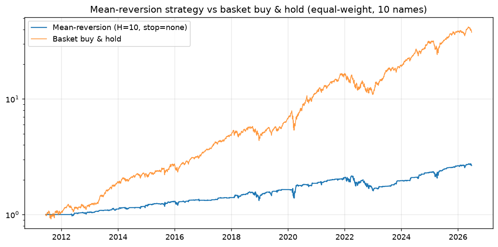

# Mean-reversion strategy — equity curve, stops & sizing

Equal-weight 10-slot portfolio (10% each, rest cash). Entry: expanding-z reversion score >= 1.0; exit on stop or after H days. Look-ahead-free; cost 5bps RT.

## Grid (horizon x stop)

|   H | stop   |   cagr |   vol |   sharpe |   maxdd |   exposure |   final |
|----:|:-------|-------:|------:|---------:|--------:|-----------:|--------:|
|   5 | none   |  0.057 | 0.112 |    0.554 |  -0.176 |      0.632 |   2.305 |
|   5 | 5.0%   |  0.033 | 0.091 |    0.406 |  -0.175 |      0.63  |   1.637 |
|   5 | 3.5%   |  0.024 | 0.086 |    0.321 |  -0.147 |      0.622 |   1.432 |
|  10 | none   |  0.067 | 0.123 |    0.589 |  -0.257 |      0.732 |   2.654 |
|  10 | 5.0%   |  0.043 | 0.105 |    0.45  |  -0.232 |      0.74  |   1.873 |
|  10 | 3.5%   |  0.038 | 0.098 |    0.429 |  -0.244 |      0.729 |   1.754 |

## Benchmark — basket buy & hold

CAGR 27.3% | Sharpe 1.22 | maxDD -34.5%

_Strategy is in cash when no signal (see `exposure`), so lower vol/DD is expected; compare Sharpe and drawdown, not just CAGR._