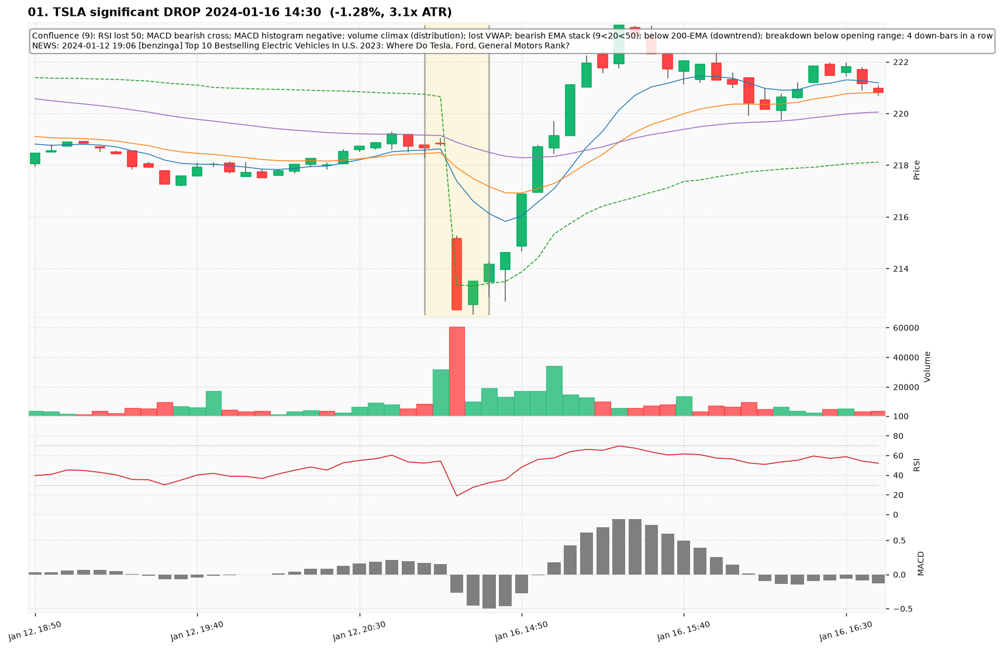
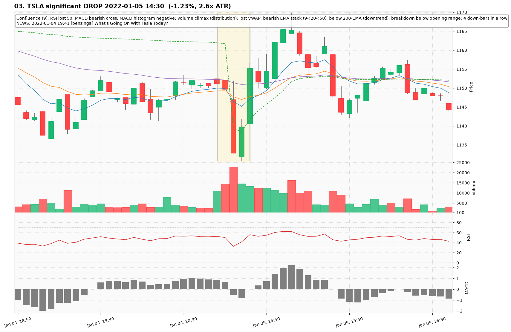
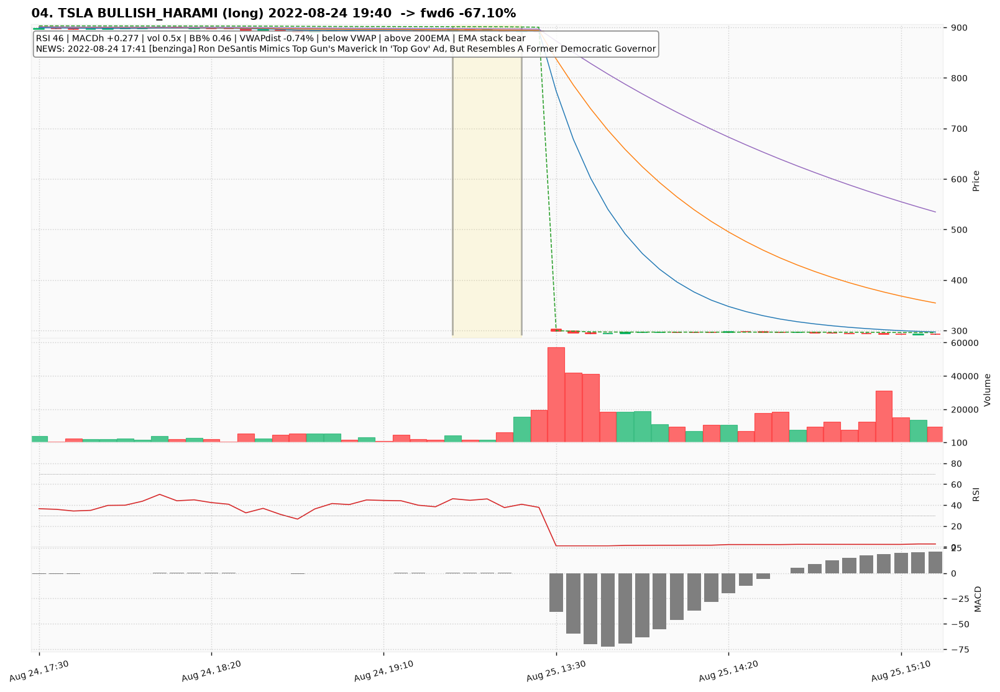
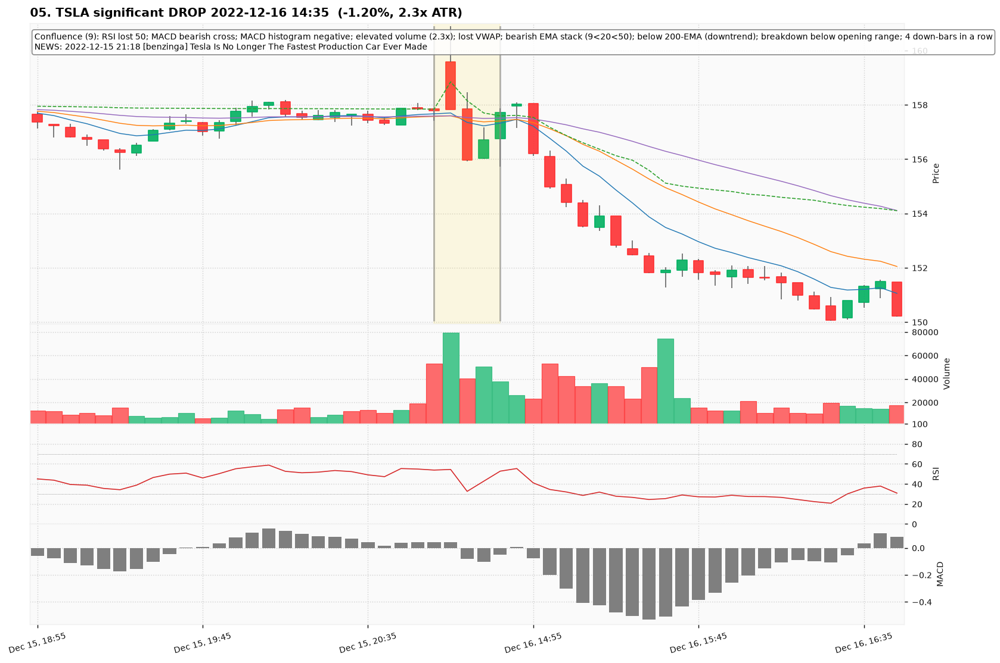
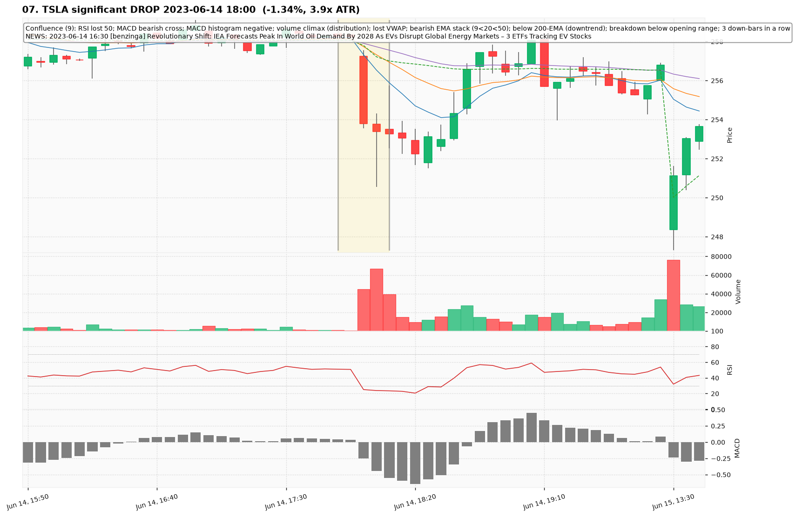
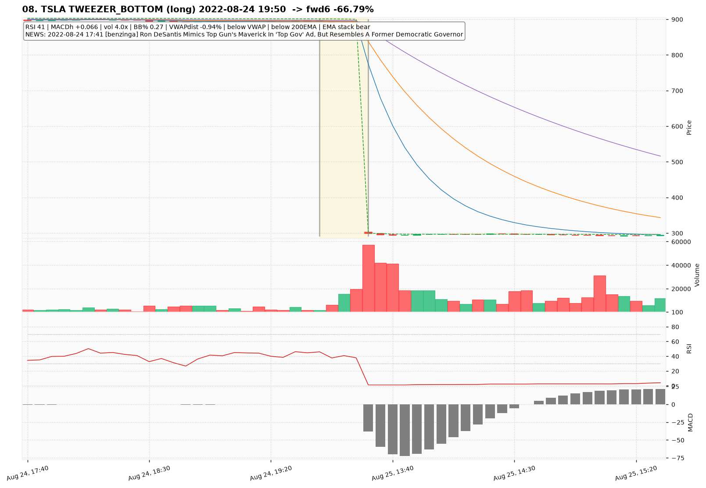
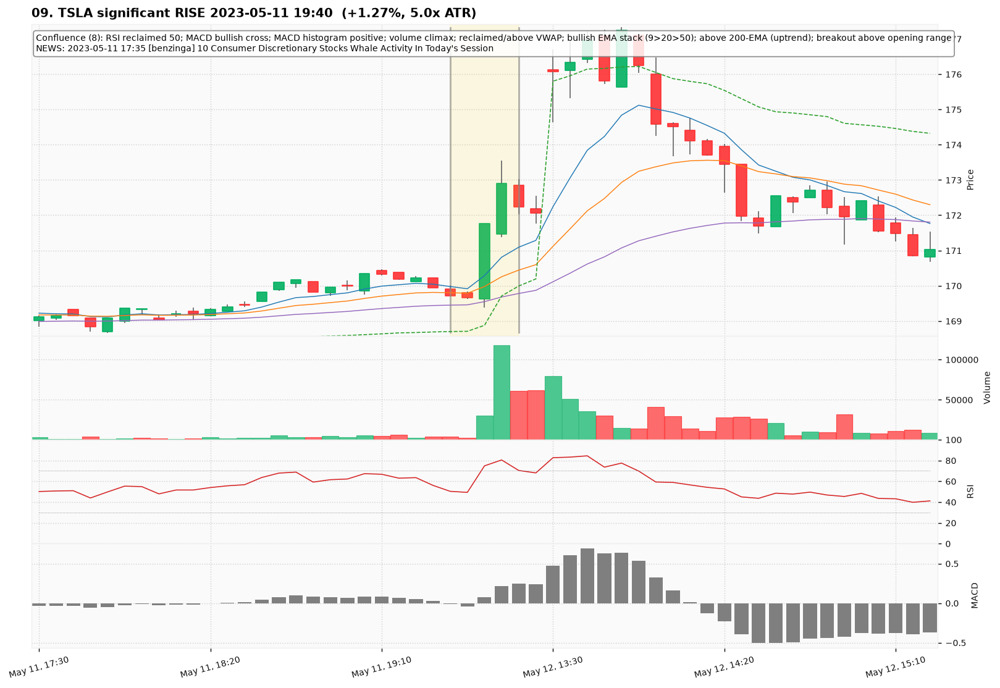
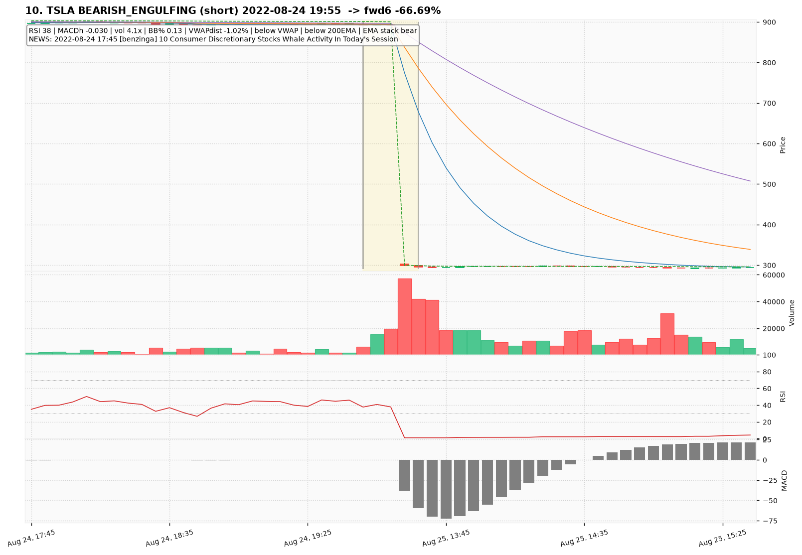

# TSLA — Deep TA Dive (5-minute candles)

**Bars:** 106,799 (2021-01-04 -> 2026-06-26)  |  **News headlines:** 31,534

TA layered per candle: 48 continuous indicators + 19 candlestick patterns + chart-structure (H&S / double top-bottom / flags).

## What was found

- Significant moves (|1-bar return| in the 0.5% tails): **1,067**
- Candlestick fulfillments: **94,495**
- Structure fulfillments: **10,471**

Full records (with t-2..t+2 TA windows): `all_events.parquet`, `significant_moves.csv`, `fulfilled_patterns.csv`.

## The 10 charted examples

### 01. TSLA significant DROP 2024-01-16 14:30  (-1.28%, 3.1x ATR)

- **TA read:** Confluence (9): RSI lost 50; MACD bearish cross; MACD histogram negative; volume climax (distribution); lost VWAP; bearish EMA stack (9<20<50); below 200-EMA (downtrend); breakdown below opening range; 4 down-bars in a row
- **News:** 2024-01-12 19:06 [benzinga] Top 10 Bestselling Electric Vehicles In U.S. 2023: Where Do Tesla, Ford, General Motors Rank?
- **Outcome (next 6 bars):** +3.17%

### 02. TSLA TWEEZER_BOTTOM (long) 2022-08-24 19:40  -> fwd6 -67.10%

- **TA read:** RSI 46 | MACDh +0.277 | vol 0.5x | BB% 0.46 | VWAPdist -0.74% | below VWAP | above 200EMA | EMA stack bear
- **News:** 2022-08-24 17:41 [benzinga] Ron DeSantis Mimics Top Gun's Maverick In 'Top Gov' Ad, But Resembles A Former Democratic Governor
- **Outcome (next 6 bars):** -67.10%

### 03. TSLA significant DROP 2022-01-05 14:30  (-1.23%, 2.6x ATR)

- **TA read:** Confluence (9): RSI lost 50; MACD bearish cross; MACD histogram negative; volume climax (distribution); lost VWAP; bearish EMA stack (9<20<50); below 200-EMA (downtrend); breakdown below opening range; 4 down-bars in a row
- **News:** 2022-01-04 19:41 [benzinga] What's Going On With Tesla Today?
- **Outcome (next 6 bars):** +2.88%

### 04. TSLA BULLISH_HARAMI (long) 2022-08-24 19:40  -> fwd6 -67.10%

- **TA read:** RSI 46 | MACDh +0.277 | vol 0.5x | BB% 0.46 | VWAPdist -0.74% | below VWAP | above 200EMA | EMA stack bear
- **News:** 2022-08-24 17:41 [benzinga] Ron DeSantis Mimics Top Gun's Maverick In 'Top Gov' Ad, But Resembles A Former Democratic Governor
- **Outcome (next 6 bars):** -67.10%

### 05. TSLA significant DROP 2022-12-16 14:35  (-1.20%, 2.3x ATR)

- **TA read:** Confluence (9): RSI lost 50; MACD bearish cross; MACD histogram negative; elevated volume (2.3x); lost VWAP; bearish EMA stack (9<20<50); below 200-EMA (downtrend); breakdown below opening range; 4 down-bars in a row
- **News:** 2022-12-15 21:18 [benzinga] Tesla Is No Longer The Fastest Production Car Ever Made
- **Outcome (next 6 bars):** -0.99%

### 06. TSLA DOUBLE_TOP (short) 2022-08-24 19:45  -> fwd6 -67.00%

- **TA read:** RSI 38 | MACDh +0.108 | vol 1.9x | BB% 0.15 | VWAPdist -1.08% | below VWAP | below 200EMA | EMA stack bear
- **News:** 2022-08-24 17:41 [benzinga] Ron DeSantis Mimics Top Gun's Maverick In 'Top Gov' Ad, But Resembles A Former Democratic Governor
- **Outcome (next 6 bars):** -67.00%

### 07. TSLA significant DROP 2023-06-14 18:00  (-1.34%, 3.9x ATR)

- **TA read:** Confluence (9): RSI lost 50; MACD bearish cross; MACD histogram negative; volume climax (distribution); lost VWAP; bearish EMA stack (9<20<50); below 200-EMA (downtrend); breakdown below opening range; 3 down-bars in a row
- **News:** 2023-06-14 16:30 [benzinga] Revolutionary Shift: IEA Forecasts Peak In World Oil Demand By 2028 As EVs Disrupt Global Energy Markets – 3 ETFs Tracking EV Stocks
- **Outcome (next 6 bars):** -0.32%

### 08. TSLA TWEEZER_BOTTOM (long) 2022-08-24 19:50  -> fwd6 -66.79%

- **TA read:** RSI 41 | MACDh +0.066 | vol 4.0x | BB% 0.27 | VWAPdist -0.94% | below VWAP | below 200EMA | EMA stack bear
- **News:** 2022-08-24 17:41 [benzinga] Ron DeSantis Mimics Top Gun's Maverick In 'Top Gov' Ad, But Resembles A Former Democratic Governor
- **Outcome (next 6 bars):** -66.79%

### 09. TSLA significant RISE 2023-05-11 19:40  (+1.27%, 5.0x ATR)

- **TA read:** Confluence (8): RSI reclaimed 50; MACD bullish cross; MACD histogram positive; volume climax; reclaimed/above VWAP; bullish EMA stack (9>20>50); above 200-EMA (uptrend); breakout above opening range
- **News:** 2023-05-11 17:35 [benzinga] 10 Consumer Discretionary Stocks Whale Activity In Today's Session
- **Outcome (next 6 bars):** +3.02%

### 10. TSLA BEARISH_ENGULFING (short) 2022-08-24 19:55  -> fwd6 -66.69%

- **TA read:** RSI 38 | MACDh -0.030 | vol 4.1x | BB% 0.13 | VWAPdist -1.02% | below VWAP | below 200EMA | EMA stack bear
- **News:** 2022-08-24 17:45 [benzinga] 10 Consumer Discretionary Stocks Whale Activity In Today's Session
- **Outcome (next 6 bars):** -66.69%
