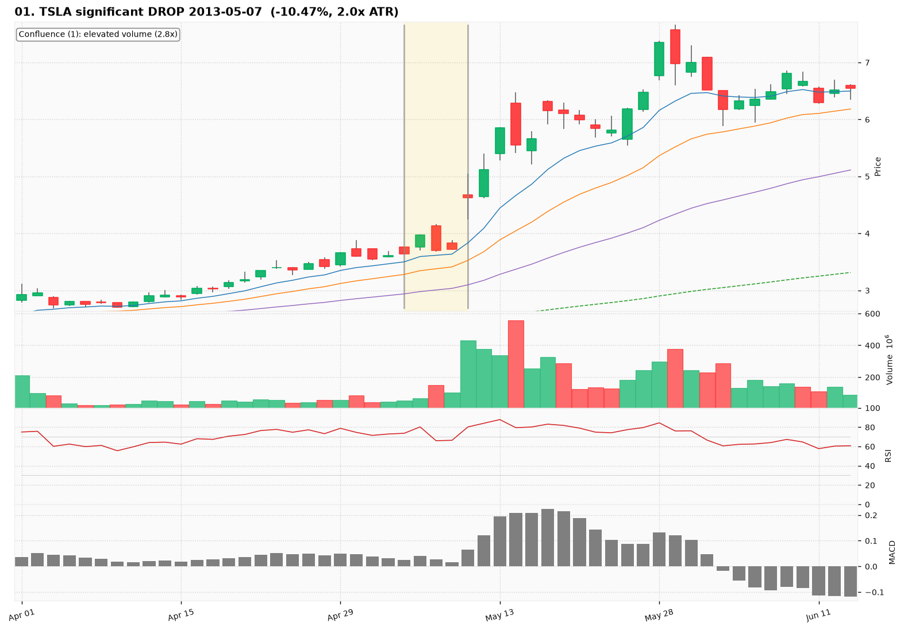
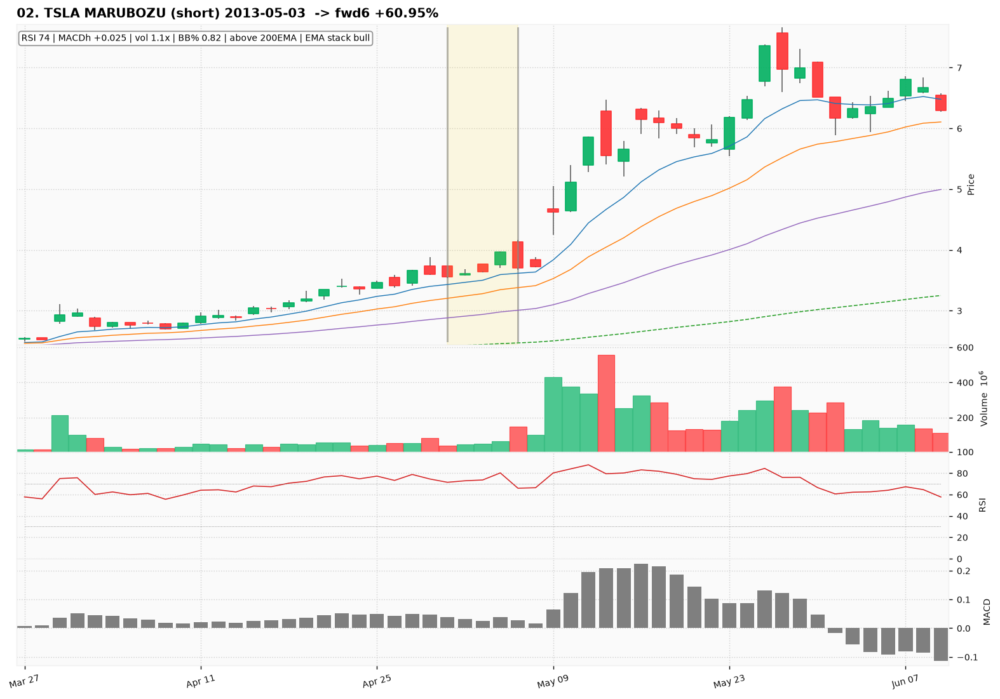
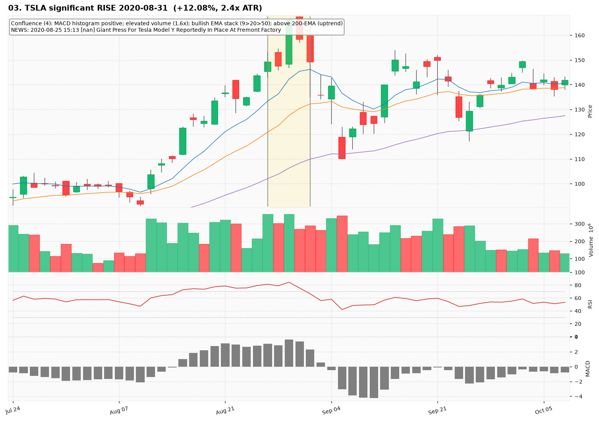
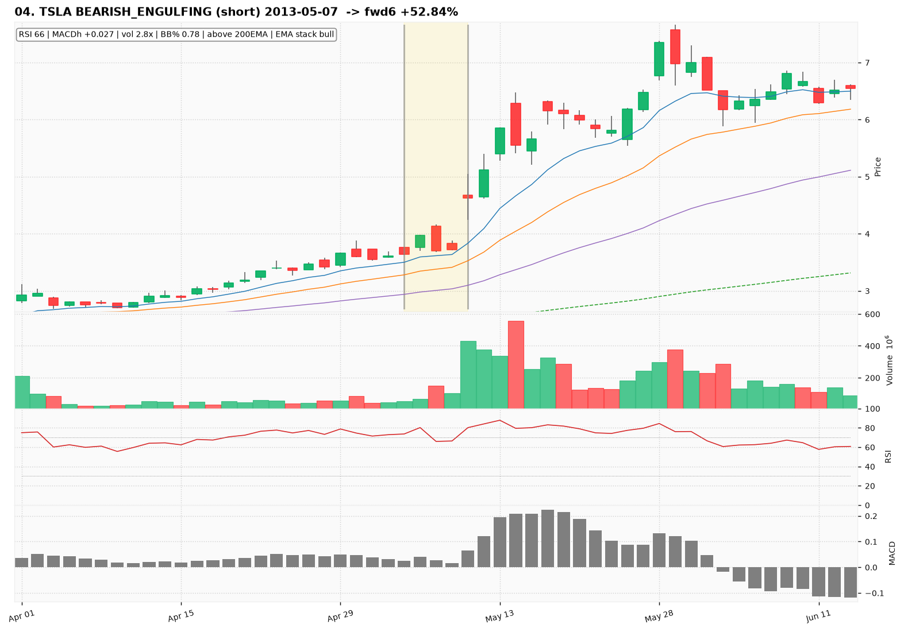
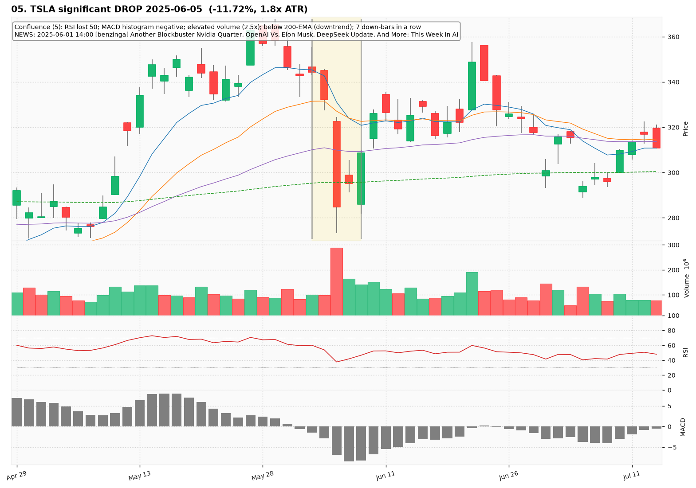
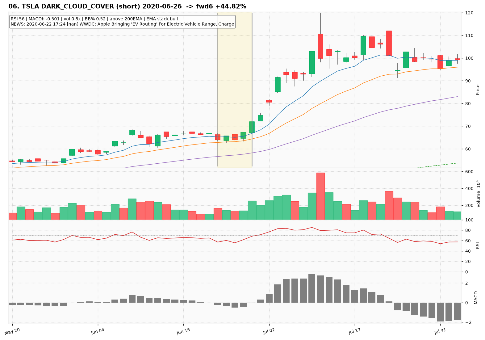
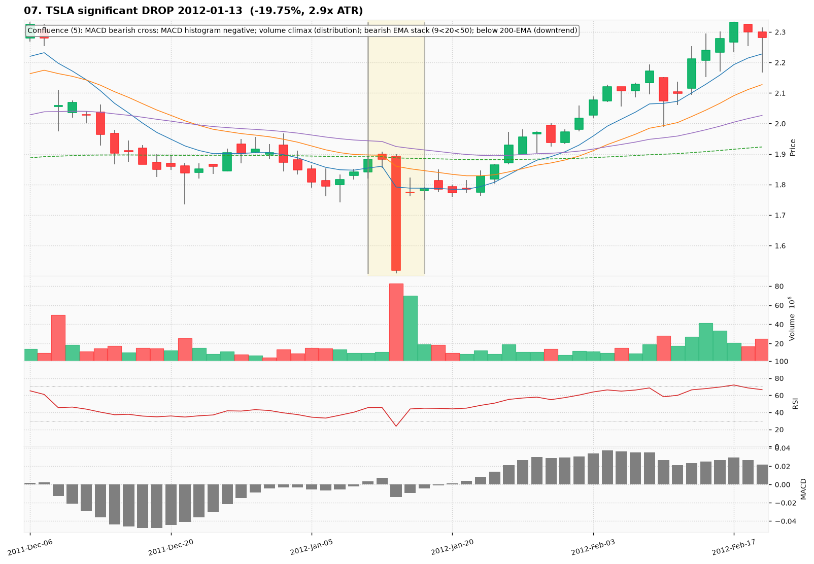
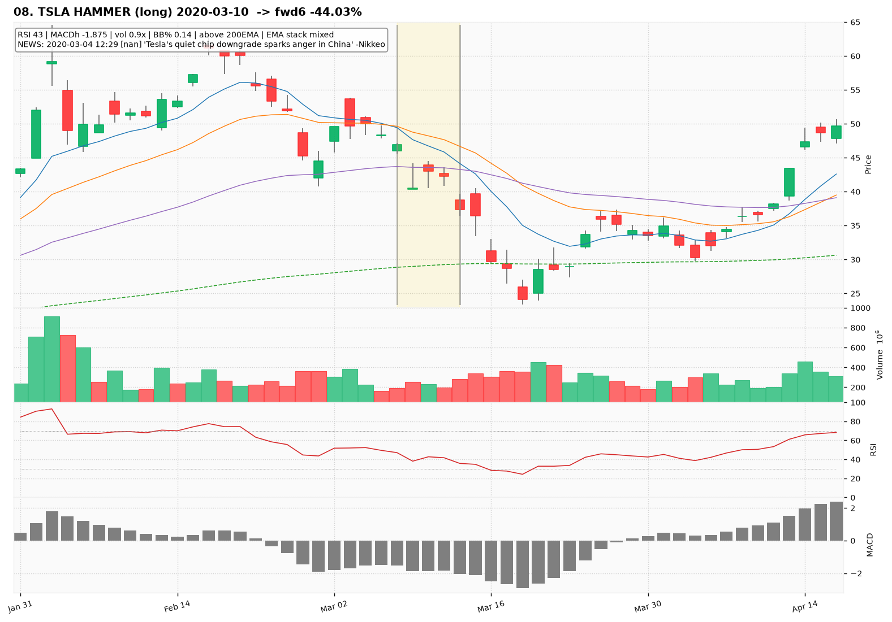
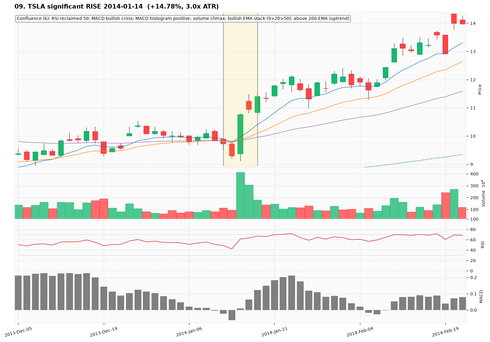
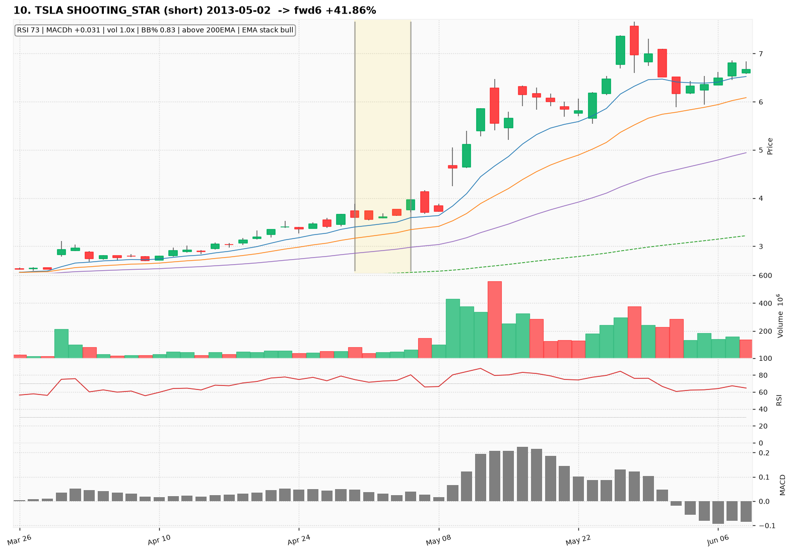

# TSLA — Deep TA Dive (daily candles)

**Bars:** 3,781 (2011-06-13 -> 2026-06-25)  |  **News headlines:** 31,534

TA layered per candle: 44 continuous indicators + 19 candlestick patterns + chart-structure (H&S / double top-bottom / flags).

## What was found

- Significant moves (|1-bar return| in the 0.5% tails): **38**
- Candlestick fulfillments: **1,408**
- Structure fulfillments: **232**

Full records (with t-2..t+2 TA windows): `all_events.parquet`, `significant_moves.csv`, `fulfilled_patterns.csv`.

## The 10 charted examples

### 01. TSLA significant DROP 2013-05-07  (-10.47%, 2.0x ATR)

- **TA read:** Confluence (1): elevated volume (2.8x)
- **News:** (none in window)
- **Outcome (next 6 bars):** +52.84%

### 02. TSLA MARUBOZU (short) 2013-05-03  -> fwd6 +60.95%

- **TA read:** RSI 74 | MACDh +0.025 | vol 1.1x | BB% 0.82 | above 200EMA | EMA stack bull
- **News:** (none in window)
- **Outcome (next 6 bars):** +60.95%

### 03. TSLA significant RISE 2020-08-31  (+12.08%, 2.4x ATR)

- **TA read:** Confluence (4): MACD histogram positive; elevated volume (1.6x); bullish EMA stack (9>20>50); above 200-EMA (uptrend)
- **News:** 2020-08-25 15:13 [nan] Giant Press For Tesla Model Y Reportedly In Place At Fremont Factory
- **Outcome (next 6 bars):** -26.50%

### 04. TSLA BEARISH_ENGULFING (short) 2013-05-07  -> fwd6 +52.84%

- **TA read:** RSI 66 | MACDh +0.027 | vol 2.8x | BB% 0.78 | above 200EMA | EMA stack bull
- **News:** (none in window)
- **Outcome (next 6 bars):** +52.84%

### 05. TSLA significant DROP 2025-06-05  (-11.72%, 1.8x ATR)

- **TA read:** Confluence (5): RSI lost 50; MACD histogram negative; elevated volume (2.5x); below 200-EMA (downtrend); 7 down-bars in a row
- **News:** 2025-06-01 14:00 [benzinga] Another Blockbuster Nvidia Quarter, OpenAI Vs. Elon Musk, DeepSeek Update, And More: This Week In AI
- **Outcome (next 6 bars):** +14.26%

### 06. TSLA DARK_CLOUD_COVER (short) 2020-06-26  -> fwd6 +44.82%

- **TA read:** RSI 56 | MACDh -0.501 | vol 0.8x | BB% 0.52 | above 200EMA | EMA stack bull
- **News:** 2020-06-22 17:24 [nan] WWDC: Apple Bringing 'EV Routing' For Electric Vehicle Range, Charge
- **Outcome (next 6 bars):** +44.82%

### 07. TSLA significant DROP 2012-01-13  (-19.75%, 2.9x ATR)

- **TA read:** Confluence (5): MACD bearish cross; MACD histogram negative; volume climax (distribution); bearish EMA stack (9<20<50); below 200-EMA (downtrend)
- **News:** (none in window)
- **Outcome (next 6 bars):** +20.32%

### 08. TSLA HAMMER (long) 2020-03-10  -> fwd6 -44.03%

- **TA read:** RSI 43 | MACDh -1.875 | vol 0.9x | BB% 0.14 | above 200EMA | EMA stack mixed
- **News:** 2020-03-04 12:29 [nan] 'Tesla's quiet chip downgrade sparks anger in China' -Nikkeo
- **Outcome (next 6 bars):** -44.03%

### 09. TSLA significant RISE 2014-01-14  (+14.78%, 3.0x ATR)

- **TA read:** Confluence (6): RSI reclaimed 50; MACD bullish cross; MACD histogram positive; volume climax; bullish EMA stack (9>20>50); above 200-EMA (uptrend)
- **News:** (none in window)
- **Outcome (next 6 bars):** +12.54%

### 10. TSLA SHOOTING_STAR (short) 2013-05-02  -> fwd6 +41.86%

- **TA read:** RSI 73 | MACDh +0.031 | vol 1.0x | BB% 0.83 | above 200EMA | EMA stack bull
- **News:** (none in window)
- **Outcome (next 6 bars):** +41.86%
