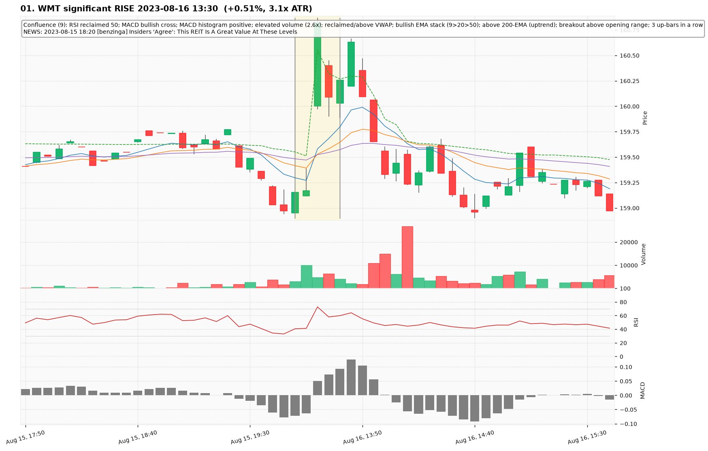
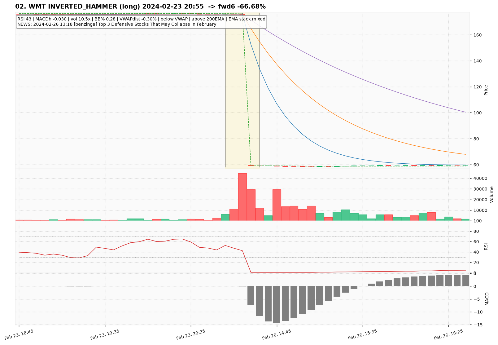
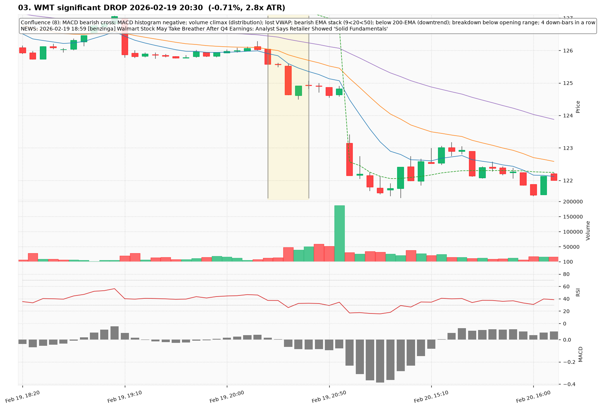
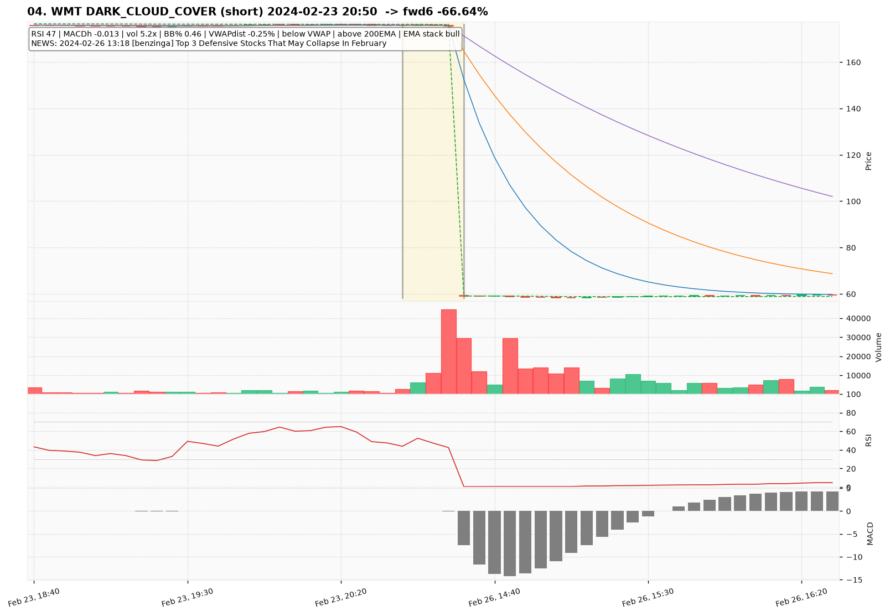
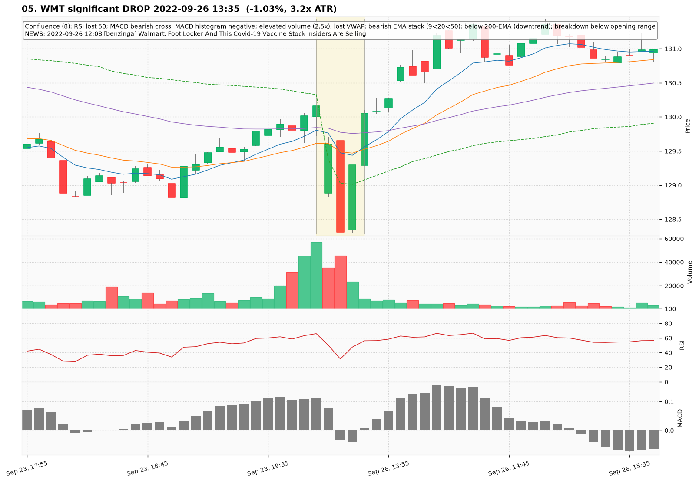
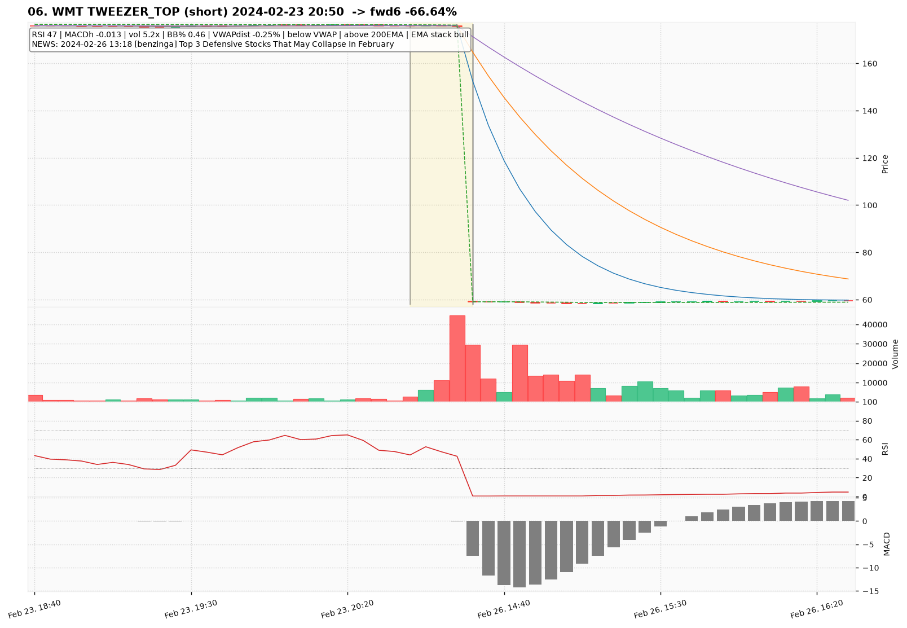
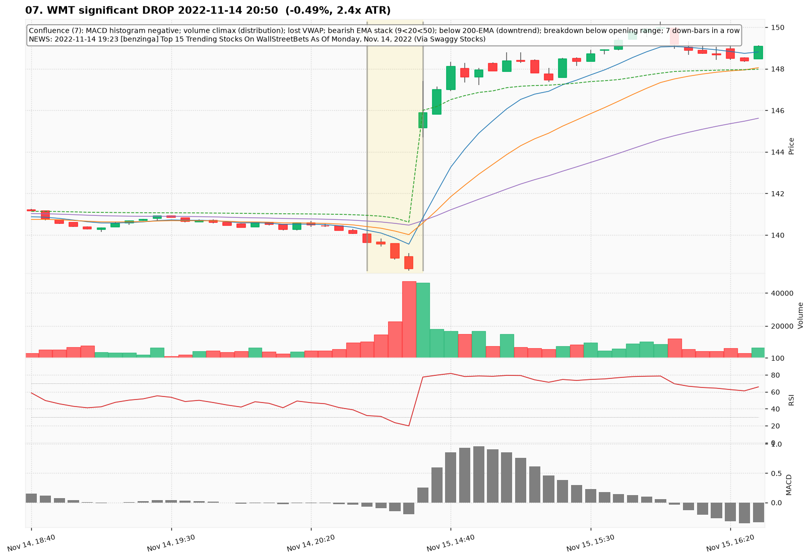
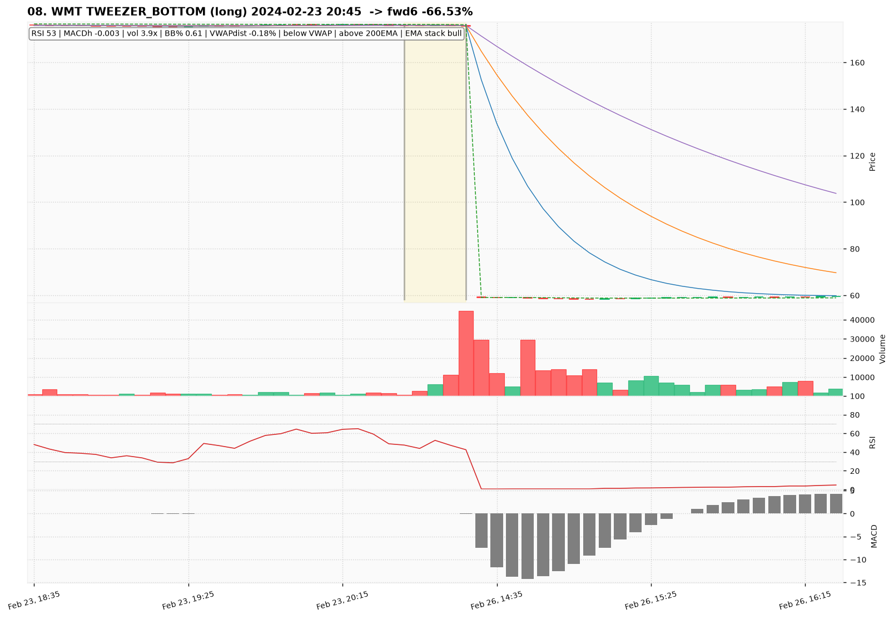
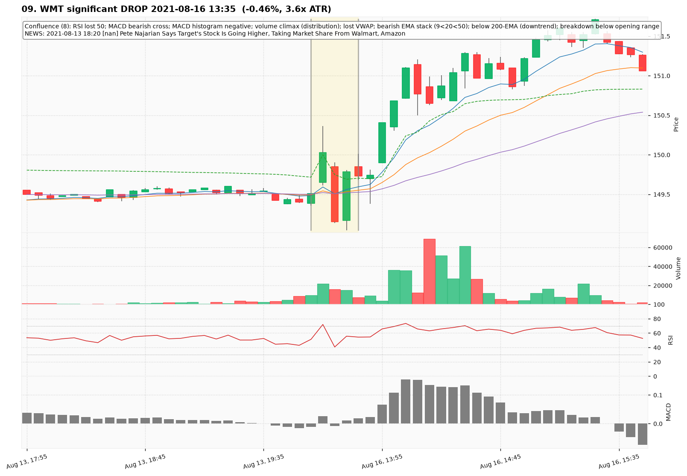
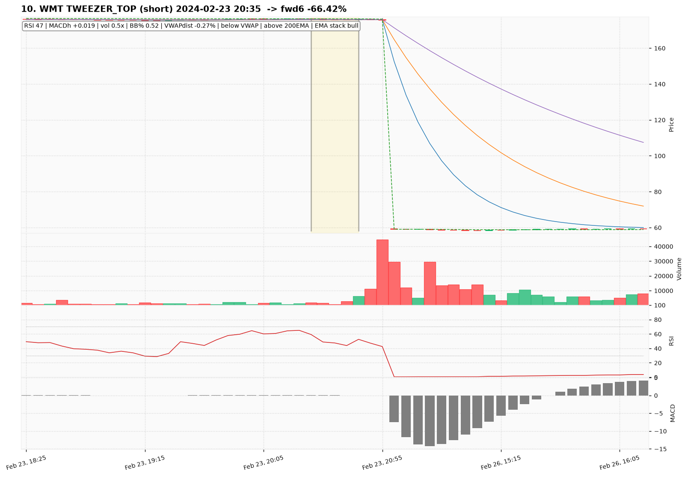

# WMT — Deep TA Dive (5-minute candles)

**Bars:** 105,574 (2021-01-04 -> 2026-06-18)  |  **News headlines:** 4,717

TA layered per candle: 48 continuous indicators + 19 candlestick patterns + chart-structure (H&S / double top-bottom / flags).

## What was found

- Significant moves (|1-bar return| in the 0.5% tails): **1,056**
- Candlestick fulfillments: **106,462**
- Structure fulfillments: **10,771**

Full records (with t-2..t+2 TA windows): `all_events.parquet`, `significant_moves.csv`, `fulfilled_patterns.csv`.

## The 10 charted examples

### 01. WMT significant RISE 2023-08-16 13:30  (+0.51%, 3.1x ATR)

- **TA read:** Confluence (9): RSI reclaimed 50; MACD bullish cross; MACD histogram positive; elevated volume (2.6x); reclaimed/above VWAP; bullish EMA stack (9>20>50); above 200-EMA (uptrend); breakout above opening range; 3 up-bars in a row
- **News:** 2023-08-15 18:20 [benzinga] Insiders 'Agree': This REIT Is A Great Value At These Levels
- **Outcome (next 6 bars):** -0.93%

### 02. WMT INVERTED_HAMMER (long) 2024-02-23 20:55  -> fwd6 -66.68%

- **TA read:** RSI 43 | MACDh -0.030 | vol 10.5x | BB% 0.28 | VWAPdist -0.30% | below VWAP | above 200EMA | EMA stack mixed
- **News:** 2024-02-26 13:18 [benzinga] Top 3 Defensive Stocks That May Collapse In February
- **Outcome (next 6 bars):** -66.68%

### 03. WMT significant DROP 2026-02-19 20:30  (-0.71%, 2.8x ATR)

- **TA read:** Confluence (8): MACD bearish cross; MACD histogram negative; volume climax (distribution); lost VWAP; bearish EMA stack (9<20<50); below 200-EMA (downtrend); breakdown below opening range; 4 down-bars in a row
- **News:** 2026-02-19 18:59 [benzinga] Walmart Stock May Take Breather After Q4 Earnings: Analyst Says Retailer Showed 'Solid Fundamentals'
- **Outcome (next 6 bars):** -1.99%

### 04. WMT DARK_CLOUD_COVER (short) 2024-02-23 20:50  -> fwd6 -66.64%

- **TA read:** RSI 47 | MACDh -0.013 | vol 5.2x | BB% 0.46 | VWAPdist -0.25% | below VWAP | above 200EMA | EMA stack bull
- **News:** 2024-02-26 13:18 [benzinga] Top 3 Defensive Stocks That May Collapse In February
- **Outcome (next 6 bars):** -66.64%

### 05. WMT significant DROP 2022-09-26 13:35  (-1.03%, 3.2x ATR)

- **TA read:** Confluence (8): RSI lost 50; MACD bearish cross; MACD histogram negative; elevated volume (2.5x); lost VWAP; bearish EMA stack (9<20<50); below 200-EMA (downtrend); breakdown below opening range
- **News:** 2022-09-26 12:08 [benzinga] Walmart, Foot Locker And This Covid-19 Vaccine Stock Insiders Are Selling
- **Outcome (next 6 bars):** +1.79%

### 06. WMT TWEEZER_TOP (short) 2024-02-23 20:50  -> fwd6 -66.64%

- **TA read:** RSI 47 | MACDh -0.013 | vol 5.2x | BB% 0.46 | VWAPdist -0.25% | below VWAP | above 200EMA | EMA stack bull
- **News:** 2024-02-26 13:18 [benzinga] Top 3 Defensive Stocks That May Collapse In February
- **Outcome (next 6 bars):** -66.64%

### 07. WMT significant DROP 2022-11-14 20:50  (-0.49%, 2.4x ATR)

- **TA read:** Confluence (7): MACD histogram negative; volume climax (distribution); lost VWAP; bearish EMA stack (9<20<50); below 200-EMA (downtrend); breakdown below opening range; 7 down-bars in a row
- **News:** 2022-11-14 19:23 [benzinga] Top 15 Trending Stocks On WallStreetBets As Of Monday, Nov. 14, 2022 (Via Swaggy Stocks)
- **Outcome (next 6 bars):** +6.52%

### 08. WMT TWEEZER_BOTTOM (long) 2024-02-23 20:45  -> fwd6 -66.53%

- **TA read:** RSI 53 | MACDh -0.003 | vol 3.9x | BB% 0.61 | VWAPdist -0.18% | below VWAP | above 200EMA | EMA stack bull
- **News:** (none in window)
- **Outcome (next 6 bars):** -66.53%

### 09. WMT significant DROP 2021-08-16 13:35  (-0.46%, 3.6x ATR)

- **TA read:** Confluence (8): RSI lost 50; MACD bearish cross; MACD histogram negative; volume climax (distribution); lost VWAP; bearish EMA stack (9<20<50); below 200-EMA (downtrend); breakdown below opening range
- **News:** 2021-08-13 18:20 [nan] Pete Najarian Says Target's Stock Is Going Higher, Taking Market Share From Walmart, Amazon
- **Outcome (next 6 bars):** +1.30%

### 10. WMT TWEEZER_TOP (short) 2024-02-23 20:35  -> fwd6 -66.42%

- **TA read:** RSI 47 | MACDh +0.019 | vol 0.5x | BB% 0.52 | VWAPdist -0.27% | below VWAP | above 200EMA | EMA stack bull
- **News:** (none in window)
- **Outcome (next 6 bars):** -66.42%
