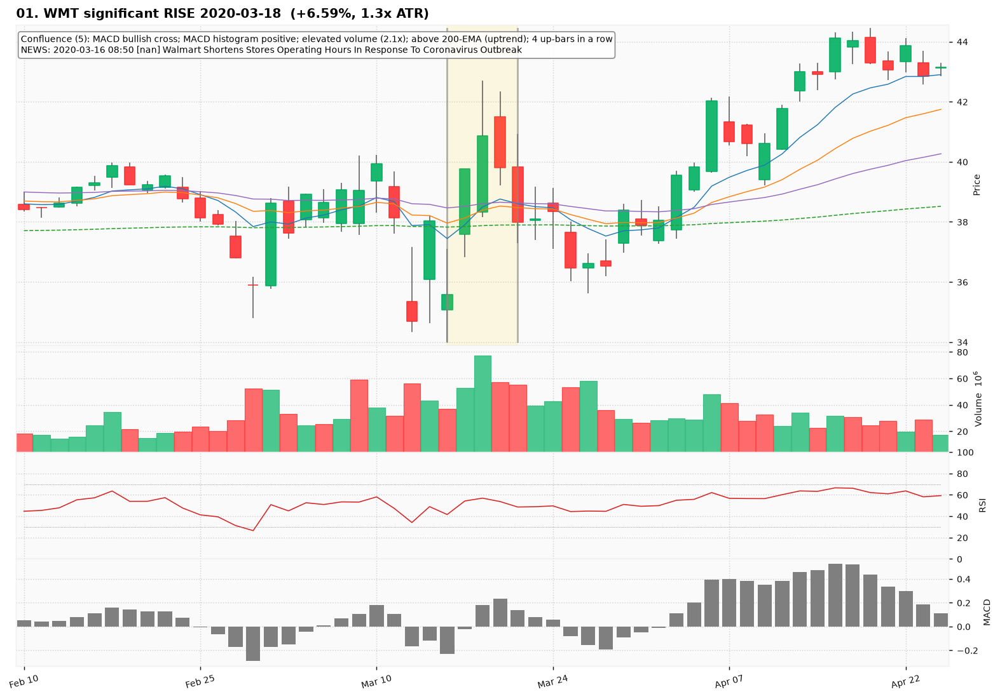
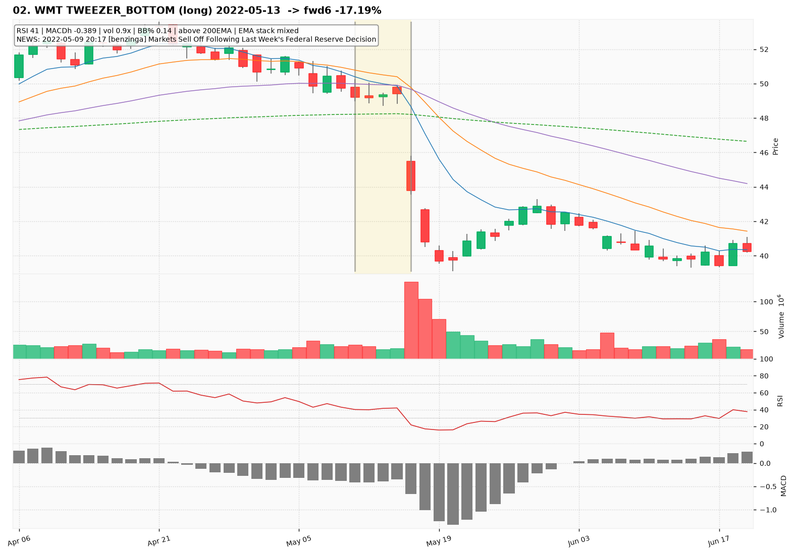
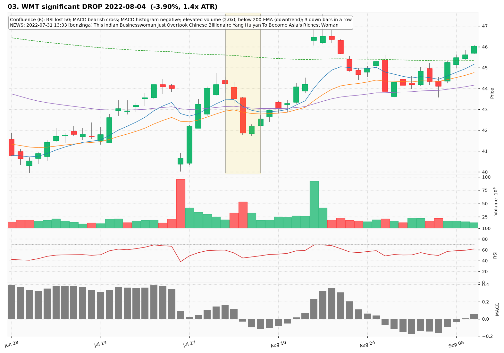
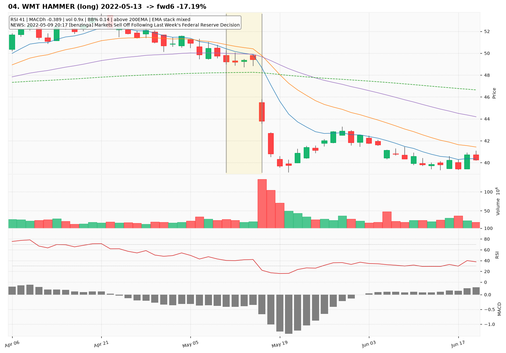
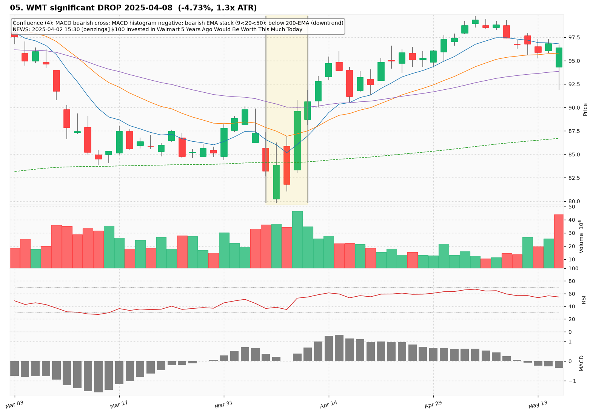
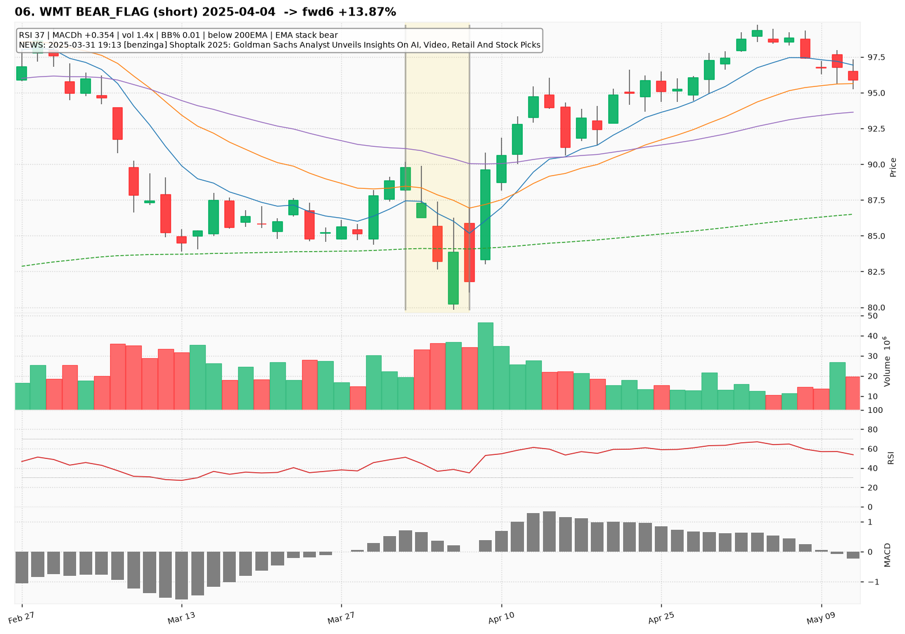
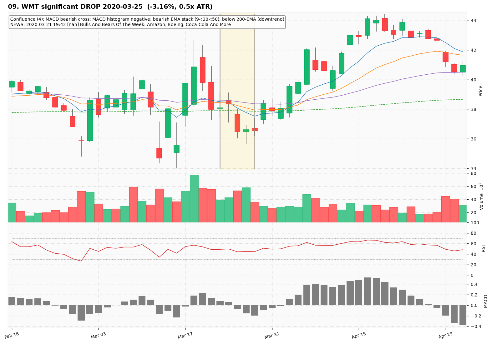
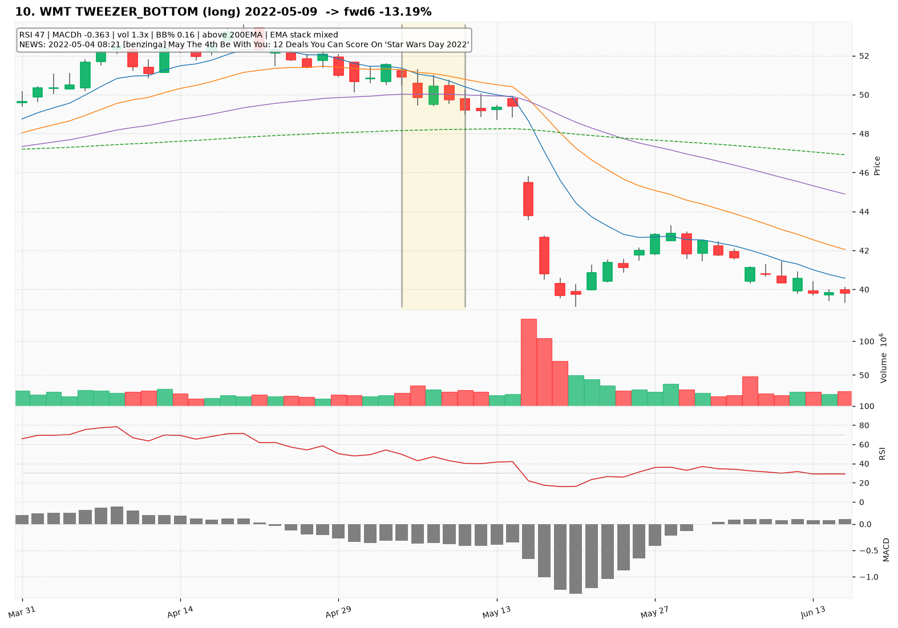

# WMT — Deep TA Dive (daily candles)

**Bars:** 3,781 (2011-06-13 -> 2026-06-25)  |  **News headlines:** 4,717

TA layered per candle: 44 continuous indicators + 19 candlestick patterns + chart-structure (H&S / double top-bottom / flags).

## What was found

- Significant moves (|1-bar return| in the 0.5% tails): **38**
- Candlestick fulfillments: **1,929**
- Structure fulfillments: **346**

Full records (with t-2..t+2 TA windows): `all_events.parquet`, `significant_moves.csv`, `fulfilled_patterns.csv`.

## The 10 charted examples

### 01. WMT significant RISE 2020-03-18  (+6.59%, 1.3x ATR)

- **TA read:** Confluence (5): MACD bullish cross; MACD histogram positive; elevated volume (2.1x); above 200-EMA (uptrend); 4 up-bars in a row
- **News:** 2020-03-16 08:50 [nan] Walmart Shortens Stores Operating Hours In Response To Coronavirus Outbreak
- **Outcome (next 6 bars):** -10.41%

### 02. WMT TWEEZER_BOTTOM (long) 2022-05-13  -> fwd6 -17.19%

- **TA read:** RSI 41 | MACDh -0.389 | vol 0.9x | BB% 0.14 | above 200EMA | EMA stack mixed
- **News:** 2022-05-09 20:17 [benzinga] Markets Sell Off Following Last Week's Federal Reserve Decision
- **Outcome (next 6 bars):** -17.19%

### 03. WMT significant DROP 2022-08-04  (-3.90%, 1.4x ATR)

- **TA read:** Confluence (6): RSI lost 50; MACD bearish cross; MACD histogram negative; elevated volume (2.0x); below 200-EMA (downtrend); 3 down-bars in a row
- **News:** 2022-07-31 13:33 [benzinga] This Indian Businesswoman Just Overtook Chinese Billionaire Yang Huiyan To Become Asia's Richest Woman
- **Outcome (next 6 bars):** +5.30%

### 04. WMT HAMMER (long) 2022-05-13  -> fwd6 -17.19%

- **TA read:** RSI 41 | MACDh -0.389 | vol 0.9x | BB% 0.14 | above 200EMA | EMA stack mixed
- **News:** 2022-05-09 20:17 [benzinga] Markets Sell Off Following Last Week's Federal Reserve Decision
- **Outcome (next 6 bars):** -17.19%

### 05. WMT significant DROP 2025-04-08  (-4.73%, 1.3x ATR)

- **TA read:** Confluence (4): MACD bearish cross; MACD histogram negative; bearish EMA stack (9<20<50); below 200-EMA (downtrend)
- **News:** 2025-04-02 15:30 [benzinga] $100 Invested In Walmart 5 Years Ago Would Be Worth This Much Today
- **Outcome (next 6 bars):** +11.49%

### 06. WMT BEAR_FLAG (short) 2025-04-04  -> fwd6 +13.87%

- **TA read:** RSI 37 | MACDh +0.354 | vol 1.4x | BB% 0.01 | below 200EMA | EMA stack bear
- **News:** 2025-03-31 19:13 [benzinga] Shoptalk 2025: Goldman Sachs Analyst Unveils Insights On AI, Video, Retail And Stock Picks
- **Outcome (next 6 bars):** +13.87%

### 07. WMT significant RISE 2025-04-09  (+7.52%, 2.0x ATR)

- **TA read:** Confluence (5): RSI reclaimed 50; MACD bullish cross; MACD histogram positive; elevated volume (1.7x); above 200-EMA (uptrend)
- **News:** 2025-04-07 11:17 [benzinga] Top 3 Defensive Stocks That Are Preparing To Pump This Month
- **Outcome (next 6 bars):** +4.04%

### 08. WMT DOUBLE_TOP (short) 2025-04-04  -> fwd6 +13.87%

- **TA read:** RSI 37 | MACDh +0.354 | vol 1.4x | BB% 0.01 | below 200EMA | EMA stack bear
- **News:** 2025-03-31 19:13 [benzinga] Shoptalk 2025: Goldman Sachs Analyst Unveils Insights On AI, Video, Retail And Stock Picks
- **Outcome (next 6 bars):** +13.87%

### 09. WMT significant DROP 2020-03-25  (-3.16%, 0.5x ATR)

- **TA read:** Confluence (4): MACD bearish cross; MACD histogram negative; bearish EMA stack (9<20<50); below 200-EMA (downtrend)
- **News:** 2020-03-21 19:42 [nan] Bulls And Bears Of The Week: Amazon, Boeing, Coca-Cola And More
- **Outcome (next 6 bars):** +8.46%

### 10. WMT TWEEZER_BOTTOM (long) 2022-05-09  -> fwd6 -13.19%

- **TA read:** RSI 47 | MACDh -0.363 | vol 1.3x | BB% 0.16 | above 200EMA | EMA stack mixed
- **News:** 2022-05-04 08:21 [benzinga] May The 4th Be With You: 12 Deals You Can Score On 'Star Wars Day 2022'
- **Outcome (next 6 bars):** -13.19%
