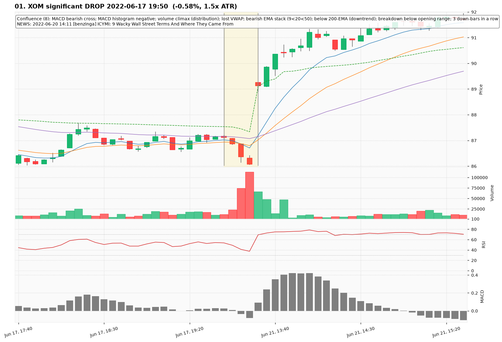
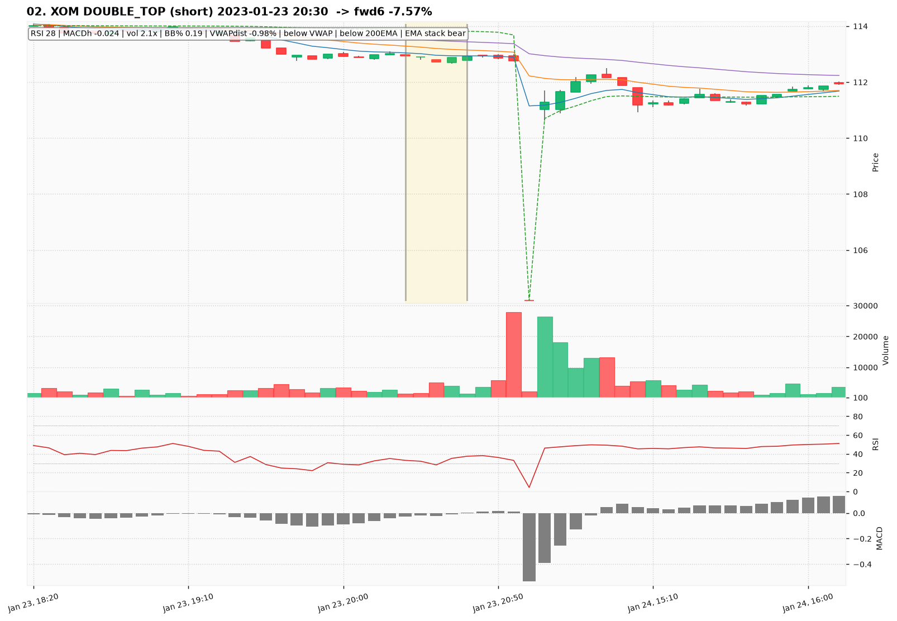
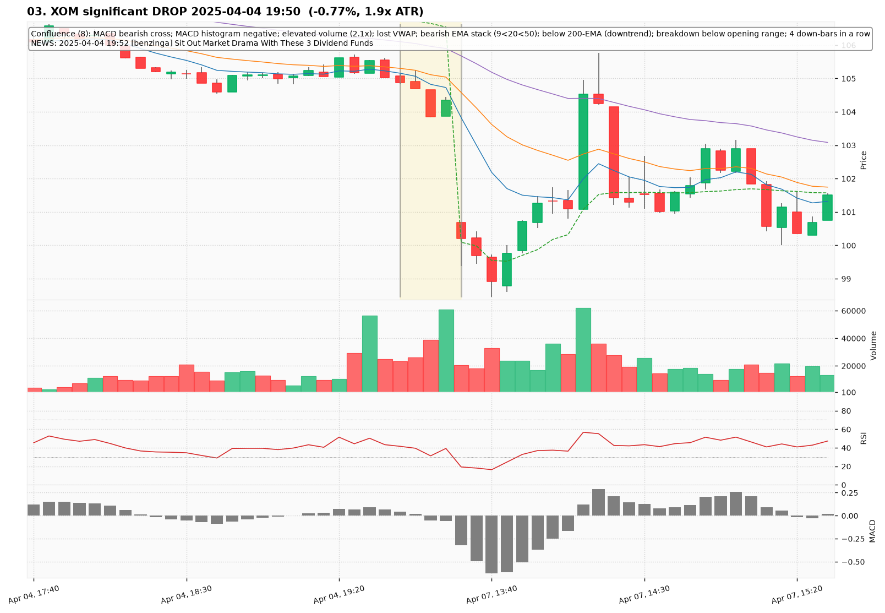
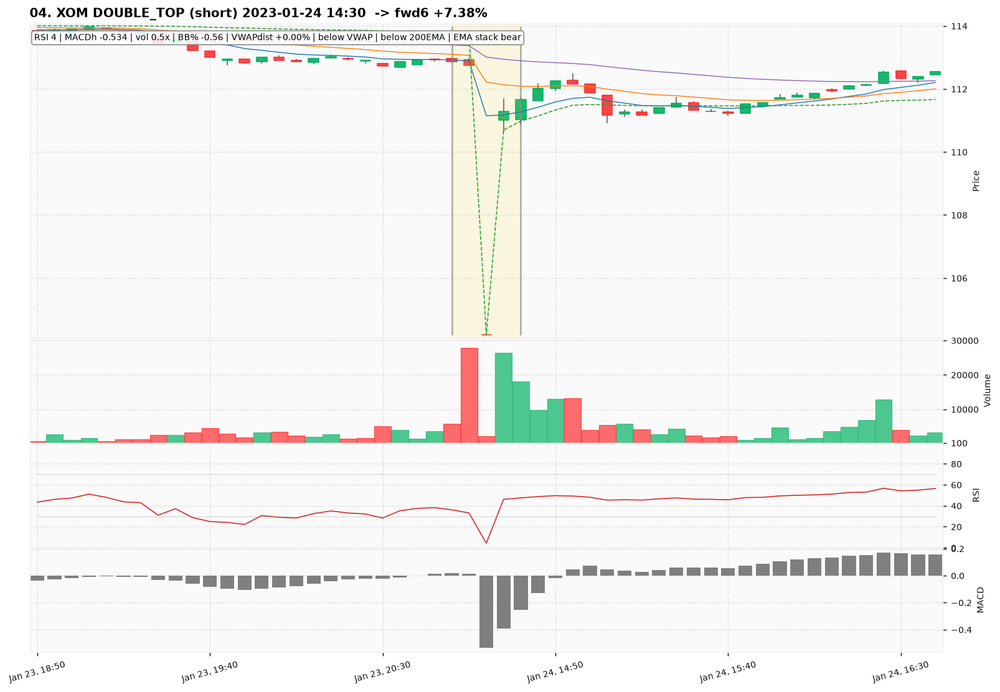
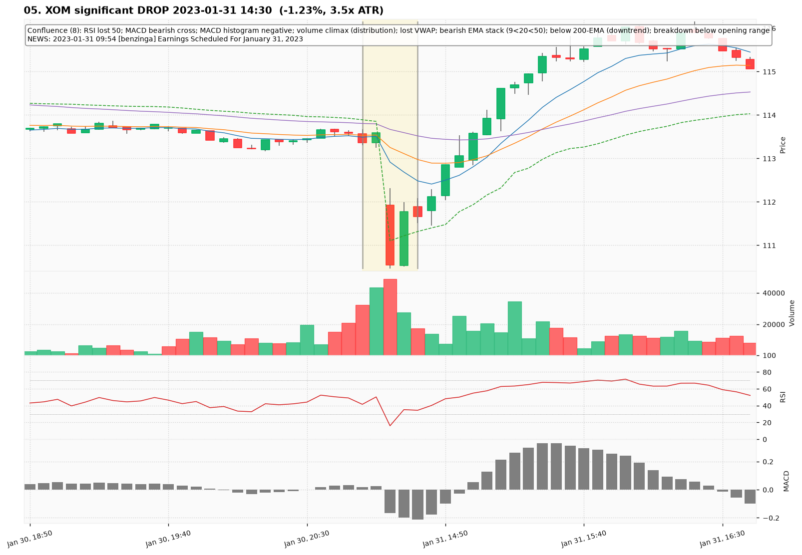
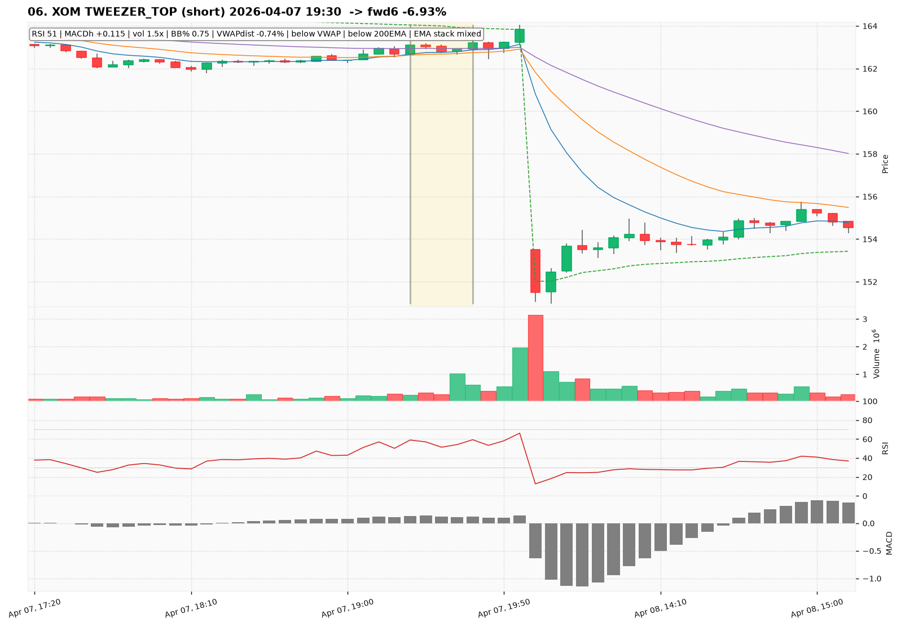
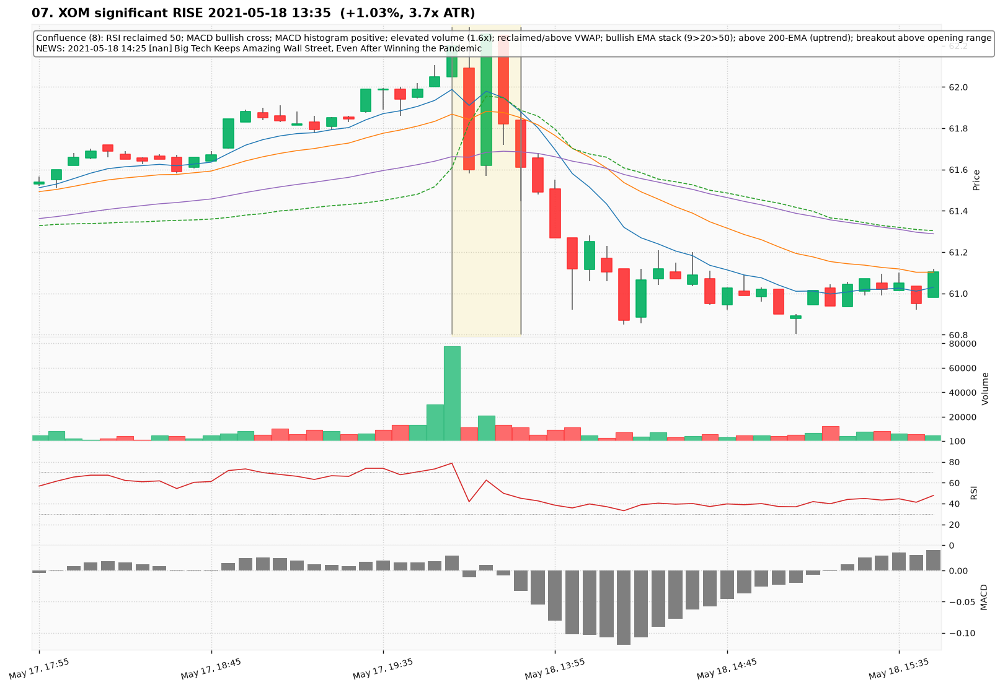
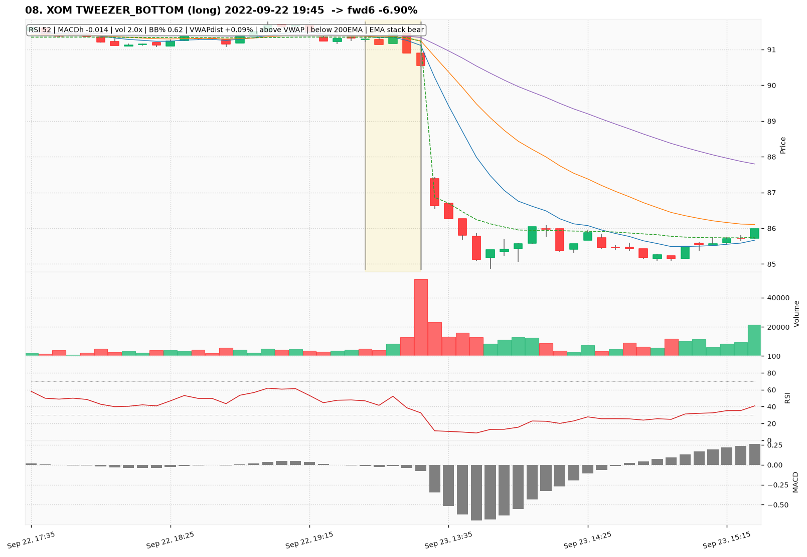
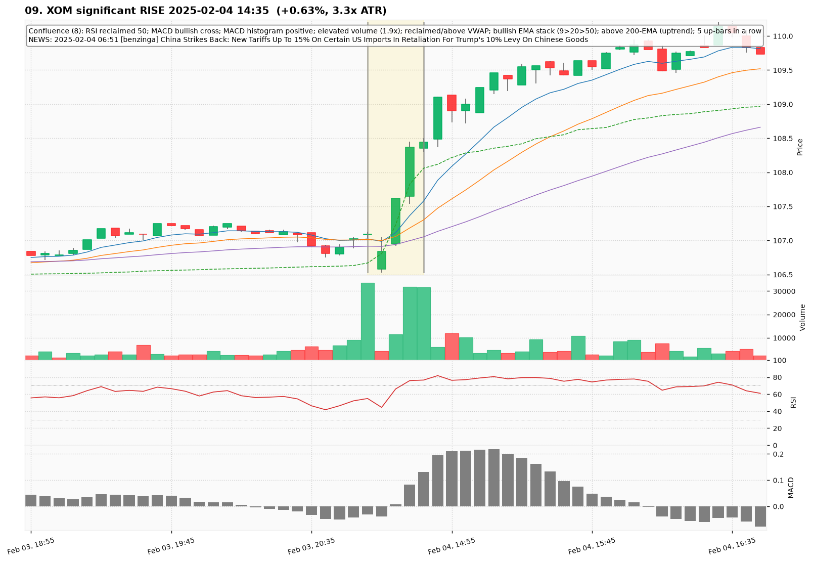
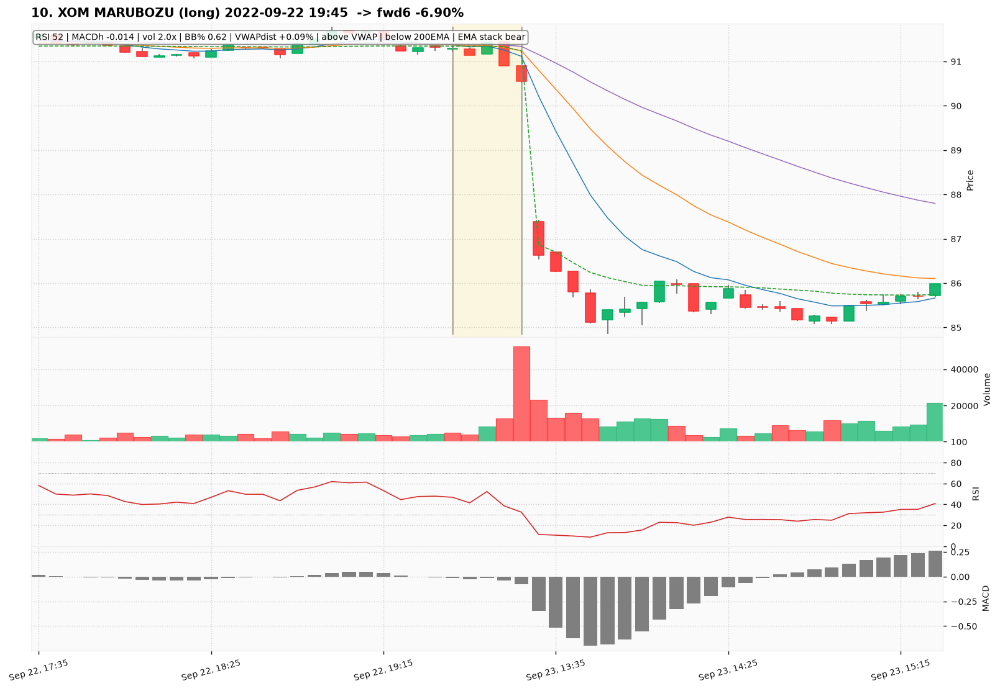

# XOM — Deep TA Dive (5-minute candles)

**Bars:** 106,039 (2021-01-04 -> 2026-06-18)  |  **News headlines:** 2,749

TA layered per candle: 48 continuous indicators + 19 candlestick patterns + chart-structure (H&S / double top-bottom / flags).

## What was found

- Significant moves (|1-bar return| in the 0.5% tails): **1,062**
- Candlestick fulfillments: **102,759**
- Structure fulfillments: **10,758**

Full records (with t-2..t+2 TA windows): `all_events.parquet`, `significant_moves.csv`, `fulfilled_patterns.csv`.

## The 10 charted examples

### 01. XOM significant DROP 2022-06-17 19:50  (-0.58%, 1.5x ATR)

- **TA read:** Confluence (8): MACD bearish cross; MACD histogram negative; volume climax (distribution); lost VWAP; bearish EMA stack (9<20<50); below 200-EMA (downtrend); breakdown below opening range; 3 down-bars in a row
- **News:** 2022-06-20 14:11 [benzinga] ICYMI: 9 Wacky Wall Street Terms And Where They Came From
- **Outcome (next 6 bars):** +4.85%

### 02. XOM DOUBLE_TOP (short) 2023-01-23 20:30  -> fwd6 -7.57%

- **TA read:** RSI 28 | MACDh -0.024 | vol 2.1x | BB% 0.19 | VWAPdist -0.98% | below VWAP | below 200EMA | EMA stack bear
- **News:** (none in window)
- **Outcome (next 6 bars):** -7.57%

### 03. XOM significant DROP 2025-04-04 19:50  (-0.77%, 1.9x ATR)

- **TA read:** Confluence (8): MACD bearish cross; MACD histogram negative; elevated volume (2.1x); lost VWAP; bearish EMA stack (9<20<50); below 200-EMA (downtrend); breakdown below opening range; 4 down-bars in a row
- **News:** 2025-04-04 19:52 [benzinga] Sit Out Market Drama With These 3 Dividend Funds
- **Outcome (next 6 bars):** -3.01%

### 04. XOM DOUBLE_TOP (short) 2023-01-24 14:30  -> fwd6 +7.38%

- **TA read:** RSI 4 | MACDh -0.534 | vol 0.5x | BB% -0.56 | VWAPdist +0.00% | below VWAP | below 200EMA | EMA stack bear
- **News:** (none in window)
- **Outcome (next 6 bars):** +7.38%

### 05. XOM significant DROP 2023-01-31 14:30  (-1.23%, 3.5x ATR)

- **TA read:** Confluence (8): RSI lost 50; MACD bearish cross; MACD histogram negative; volume climax (distribution); lost VWAP; bearish EMA stack (9<20<50); below 200-EMA (downtrend); breakdown below opening range
- **News:** 2023-01-31 09:54 [benzinga] Earnings Scheduled For January 31, 2023
- **Outcome (next 6 bars):** +2.75%

### 06. XOM TWEEZER_TOP (short) 2026-04-07 19:30  -> fwd6 -6.93%

- **TA read:** RSI 51 | MACDh +0.115 | vol 1.5x | BB% 0.75 | VWAPdist -0.74% | below VWAP | below 200EMA | EMA stack mixed
- **News:** (none in window)
- **Outcome (next 6 bars):** -6.93%

### 07. XOM significant RISE 2021-05-18 13:35  (+1.03%, 3.7x ATR)

- **TA read:** Confluence (8): RSI reclaimed 50; MACD bullish cross; MACD histogram positive; elevated volume (1.6x); reclaimed/above VWAP; bullish EMA stack (9>20>50); above 200-EMA (uptrend); breakout above opening range
- **News:** 2021-05-18 14:25 [nan] Big Tech Keeps Amazing Wall Street, Even After Winning the Pandemic
- **Outcome (next 6 bars):** -1.61%

### 08. XOM TWEEZER_BOTTOM (long) 2022-09-22 19:45  -> fwd6 -6.90%

- **TA read:** RSI 52 | MACDh -0.014 | vol 2.0x | BB% 0.62 | VWAPdist +0.09% | above VWAP | below 200EMA | EMA stack bear
- **News:** (none in window)
- **Outcome (next 6 bars):** -6.90%

### 09. XOM significant RISE 2025-02-04 14:35  (+0.63%, 3.3x ATR)

- **TA read:** Confluence (8): RSI reclaimed 50; MACD bullish cross; MACD histogram positive; elevated volume (1.9x); reclaimed/above VWAP; bullish EMA stack (9>20>50); above 200-EMA (uptrend); 5 up-bars in a row
- **News:** 2025-02-04 06:51 [benzinga] China Strikes Back: New Tariffs Up To 15% On Certain US Imports In Retaliation For Trump's 10% Levy On Chinese Goods
- **Outcome (next 6 bars):** +1.51%

### 10. XOM MARUBOZU (long) 2022-09-22 19:45  -> fwd6 -6.90%

- **TA read:** RSI 52 | MACDh -0.014 | vol 2.0x | BB% 0.62 | VWAPdist +0.09% | above VWAP | below 200EMA | EMA stack bear
- **News:** (none in window)
- **Outcome (next 6 bars):** -6.90%
