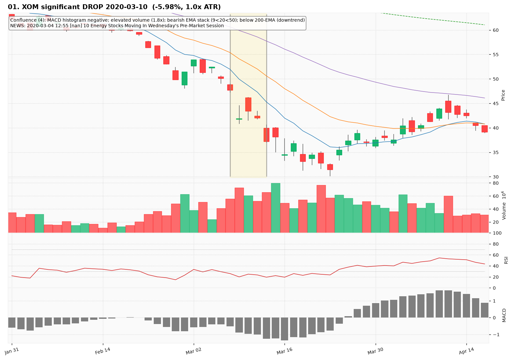
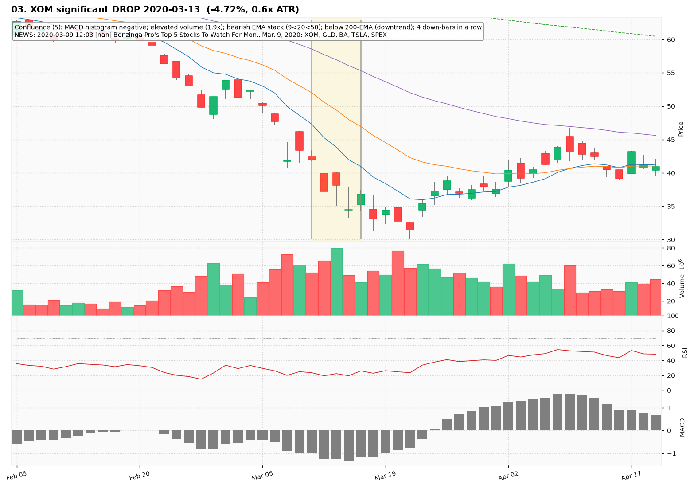
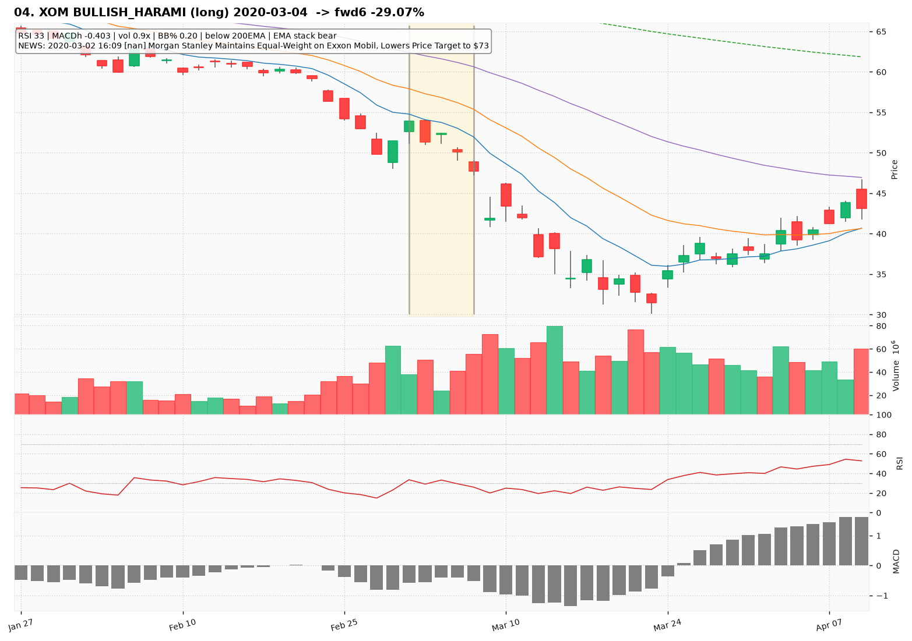
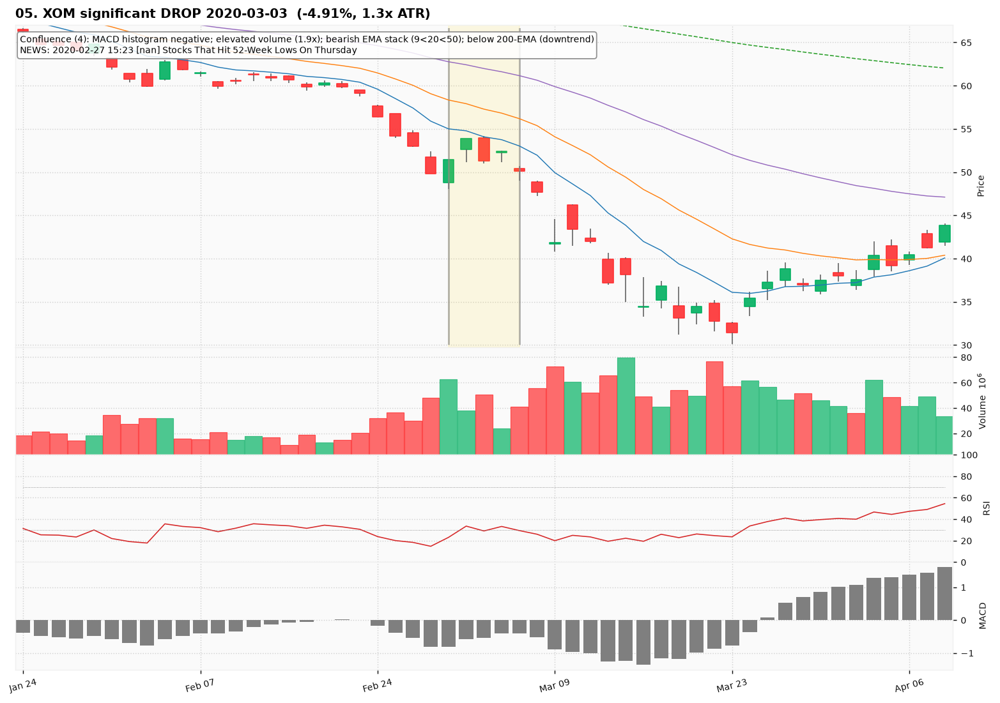
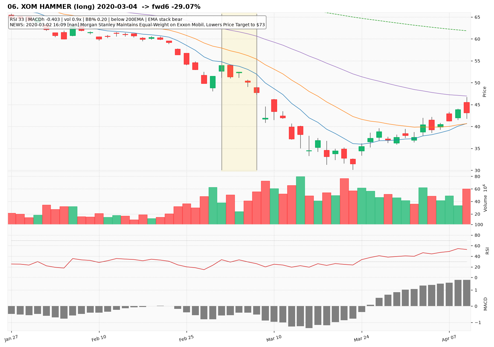
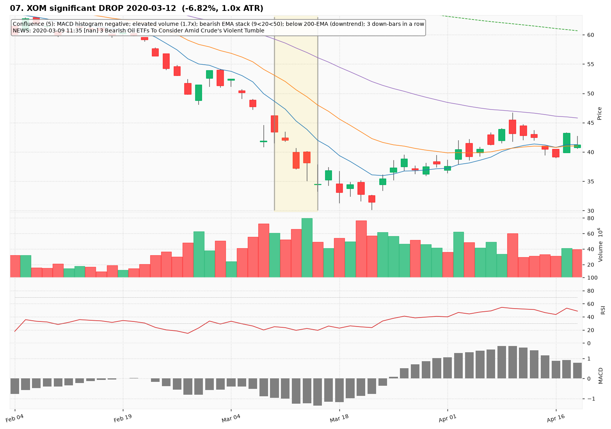
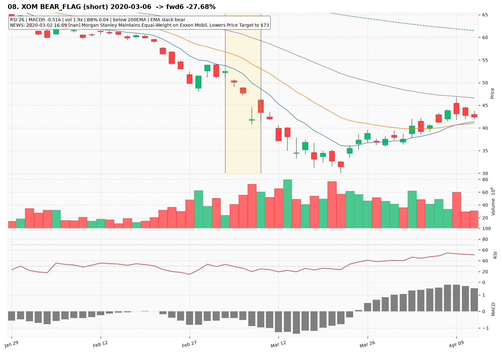
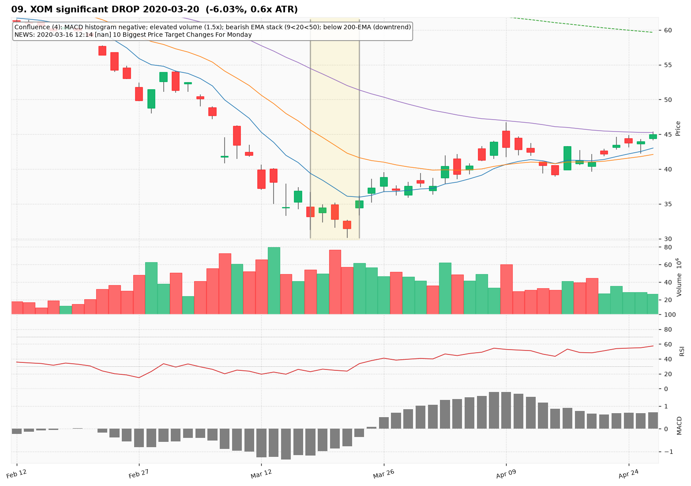
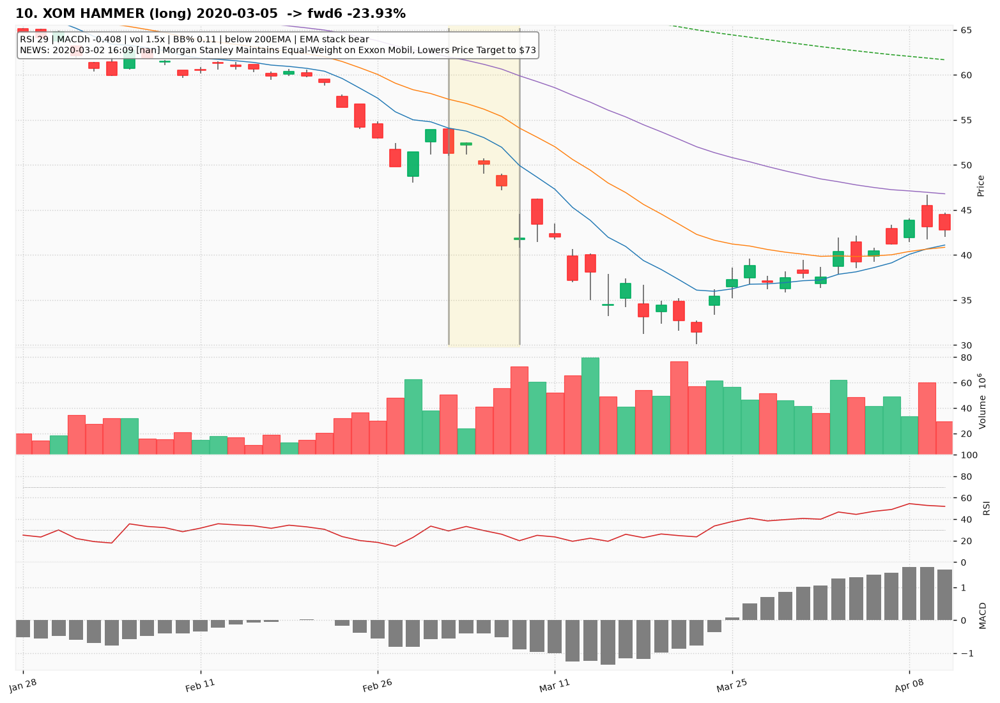

# XOM — Deep TA Dive (daily candles)

**Bars:** 3,781 (2011-06-13 -> 2026-06-25)  |  **News headlines:** 2,749

TA layered per candle: 44 continuous indicators + 19 candlestick patterns + chart-structure (H&S / double top-bottom / flags).

## What was found

- Significant moves (|1-bar return| in the 0.5% tails): **38**
- Candlestick fulfillments: **1,658**
- Structure fulfillments: **368**

Full records (with t-2..t+2 TA windows): `all_events.parquet`, `significant_moves.csv`, `fulfilled_patterns.csv`.

## The 10 charted examples

### 01. XOM significant DROP 2020-03-10  (-5.98%, 1.0x ATR)

- **TA read:** Confluence (4): MACD histogram negative; elevated volume (1.8x); bearish EMA stack (9<20<50); below 200-EMA (downtrend)
- **News:** 2020-03-04 12:55 [nan] 10 Energy Stocks Moving In Wednesday's Pre-Market Session
- **Outcome (next 6 bars):** -23.70%

### 02. XOM TWEEZER_BOTTOM (long) 2020-03-04  -> fwd6 -29.07%

- **TA read:** RSI 33 | MACDh -0.403 | vol 0.9x | BB% 0.20 | below 200EMA | EMA stack bear
- **News:** 2020-03-02 16:09 [nan] Morgan Stanley Maintains Equal-Weight on Exxon Mobil, Lowers Price Target to $73
- **Outcome (next 6 bars):** -29.07%

### 03. XOM significant DROP 2020-03-13  (-4.72%, 0.6x ATR)

- **TA read:** Confluence (5): MACD histogram negative; elevated volume (1.9x); bearish EMA stack (9<20<50); below 200-EMA (downtrend); 4 down-bars in a row
- **News:** 2020-03-09 12:03 [nan] Benzinga Pro's Top 5 Stocks To Watch For Mon., Mar. 9, 2020: XOM, GLD, BA, TSLA, SPEX
- **Outcome (next 6 bars):** -17.50%

### 04. XOM BULLISH_HARAMI (long) 2020-03-04  -> fwd6 -29.07%

- **TA read:** RSI 33 | MACDh -0.403 | vol 0.9x | BB% 0.20 | below 200EMA | EMA stack bear
- **News:** 2020-03-02 16:09 [nan] Morgan Stanley Maintains Equal-Weight on Exxon Mobil, Lowers Price Target to $73
- **Outcome (next 6 bars):** -29.07%

### 05. XOM significant DROP 2020-03-03  (-4.91%, 1.3x ATR)

- **TA read:** Confluence (4): MACD histogram negative; elevated volume (1.9x); bearish EMA stack (9<20<50); below 200-EMA (downtrend)
- **News:** 2020-02-27 15:23 [nan] Stocks That Hit 52-Week Lows On Thursday
- **Outcome (next 6 bars):** -18.17%

### 06. XOM HAMMER (long) 2020-03-04  -> fwd6 -29.07%

- **TA read:** RSI 33 | MACDh -0.403 | vol 0.9x | BB% 0.20 | below 200EMA | EMA stack bear
- **News:** 2020-03-02 16:09 [nan] Morgan Stanley Maintains Equal-Weight on Exxon Mobil, Lowers Price Target to $73
- **Outcome (next 6 bars):** -29.07%

### 07. XOM significant DROP 2020-03-12  (-6.82%, 1.0x ATR)

- **TA read:** Confluence (5): MACD histogram negative; elevated volume (1.7x); bearish EMA stack (9<20<50); below 200-EMA (downtrend); 3 down-bars in a row
- **News:** 2020-03-09 11:35 [nan] 3 Bearish Oil ETFs To Consider Amid Crude's Violent Tumble
- **Outcome (next 6 bars):** -11.94%

### 08. XOM BEAR_FLAG (short) 2020-03-06  -> fwd6 -27.68%

- **TA read:** RSI 26 | MACDh -0.516 | vol 1.9x | BB% 0.04 | below 200EMA | EMA stack bear
- **News:** 2020-03-02 16:09 [nan] Morgan Stanley Maintains Equal-Weight on Exxon Mobil, Lowers Price Target to $73
- **Outcome (next 6 bars):** -27.68%

### 09. XOM significant DROP 2020-03-20  (-6.03%, 0.6x ATR)

- **TA read:** Confluence (4): MACD histogram negative; elevated volume (1.5x); bearish EMA stack (9<20<50); below 200-EMA (downtrend)
- **News:** 2020-03-16 12:14 [nan] 10 Biggest Price Target Changes For Monday
- **Outcome (next 6 bars):** +14.54%

### 10. XOM HAMMER (long) 2020-03-05  -> fwd6 -23.93%

- **TA read:** RSI 29 | MACDh -0.408 | vol 1.5x | BB% 0.11 | below 200EMA | EMA stack bear
- **News:** 2020-03-02 16:09 [nan] Morgan Stanley Maintains Equal-Weight on Exxon Mobil, Lowers Price Target to $73
- **Outcome (next 6 bars):** -23.93%
