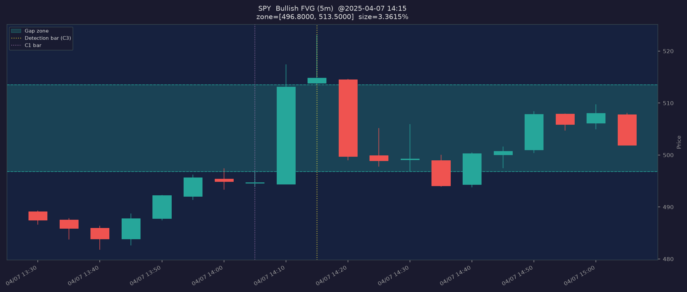
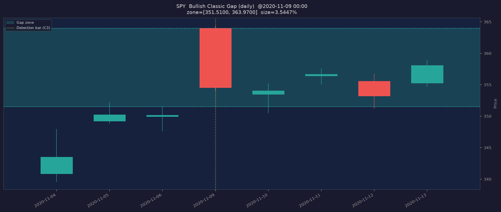

# Gap / FVG Feature — Validity Report

**Branch:** `feat/gaps`  
**Table:** `gaps`  
**Migration:** `db/migrations/0048_gaps.sql`  
**Builder:** `scripts/build_gaps.py`  
**Module:** `src/atlas_research/ta/gaps.py`  
**Date:** 2026-06-21  

---

## 1. What Is Stored

The `gaps` table captures two types of price imbalances:

### 1a. Classic Daily Gap

**Definition:** Today's open jumps completely outside yesterday's H/L range.

```
gap_up  : today.open > prior_day.high
gap_down: today.open < prior_day.low
zone = [prior_day.high, today.open]   (up)
zone = [today.open, prior_day.low]    (down)
```

The gap zone is the entirely untraded price area — no print occurred between those two levels between yesterday's close and today's open.

**Source:** `raw_bars` (daily OHLC).  
**Look-ahead:** None. Only uses yesterday's OHLC (known at yesterday's close) and today's open (known at today's open).

### 1b. Fair Value Gap (FVG) / 3-Bar Imbalance

**Definition (SMC/ICT standard):** For three consecutive bars [C1, C2, C3]:

```
bullish FVG: C1.high < C3.low   → zone = [C1.high, C3.low]
bearish FVG: C1.low  > C3.high  → zone = [C3.high, C1.low]
```

C2 is the impulse (displacement) candle between them. C2's range may or may not overlap the gap zone — the FVG is defined solely by whether C1 and C3 price extremes fail to overlap.

**Source:** `raw_bars` (daily FVGs) and `intraday_bars` (5m FVGs).  
**Timeframes:** `daily`, `5m`.  
**Look-ahead:** Confirmed only at C3's close. The `ts` stored is C3's bar-open timestamp. For 5m bars, C3 closes at `ts + 5 minutes`. No future bar is referenced.

---

## 2. Schema

```sql
gaps (
    id              BIGSERIAL PRIMARY KEY,
    ticker          TEXT NOT NULL,
    ts              TIMESTAMPTZ NOT NULL,       -- detection bar (C3 open / today's date)
    timeframe       TEXT NOT NULL,              -- 'daily', '5m'
    gap_type        TEXT NOT NULL,              -- 'classic', 'fvg'
    direction       TEXT NOT NULL,              -- 'up', 'down'
    zone_top        DOUBLE PRECISION NOT NULL,  -- upper gap boundary
    zone_bottom     DOUBLE PRECISION NOT NULL,  -- lower gap boundary
    size_pct        DOUBLE PRECISION NOT NULL,  -- (zone_top - zone_bottom) / zone_bottom * 100
    detect_close_ts TIMESTAMPTZ NOT NULL,       -- when gap becomes tradeable info (= ts for both types)
    bar1_ts         TIMESTAMPTZ,               -- C1 timestamp (FVG) or prior-day (classic)
    bar3_ts         TIMESTAMPTZ,               -- C3 timestamp (FVG), NULL for classic
    filled          BOOLEAN DEFAULT FALSE,      -- forward label — DO NOT use as detection feature
    fill_ts         TIMESTAMPTZ,               -- forward label — DO NOT use as detection feature
    computed_at     TIMESTAMPTZ NOT NULL DEFAULT now(),
    UNIQUE (ticker, ts, timeframe, gap_type, direction)
)
```

`filled` / `fill_ts` are infrastructure slots for a future fill-tracking pass. They are not populated by the current builder and must not be used as input features.

---

## 3. Look-Ahead Validation

### 3a. FVG — 5m Bullish Example (SPY)

Detection timestamp: `2021-01-04 17:45:00 UTC` (9:45 AM ET)

| Bar | ts (UTC)          | high    | low     | role |
|-----|-------------------|---------|---------|------|
| C1  | 2021-01-04 17:45  | 365.395 | 365.130 | gap bottom boundary |
| C2  | 2021-01-04 17:50  | 366.150 | 365.030 | impulse candle |
| C3  | 2021-01-04 17:55  | 366.400 | 366.060 | gap top boundary |

**Gap zone: [365.3950, 366.0600]** — size 0.182%

Checks:
- `C1.high (365.395) < C3.low (366.060)` → **PASS**  
- `zone_bottom == C1.high` → **PASS**  
- `zone_top == C3.low` → **PASS**  
- `detect_close_ts == bar3_ts` → **PASS**  
- `C1.ts == bar1_ts stored` → **PASS**  
- Next bar after C3 NOT referenced in detection → **PASS**

### 3b. Classic Gap — Largest SPY Gap-Up

2020-11-09 (Pfizer vaccine announcement day):

| field | stored | raw_bars | match |
|-------|--------|----------|-------|
| zone_bottom (prior.high 2020-11-06) | 351.5100 | 351.5100 | PASS |
| zone_top (today.open 2020-11-09) | 363.9700 | 363.9700 | PASS |
| gap condition (today.open > prior.high) | — | 363.97 > 351.51 | PASS |

Look-ahead: None. Uses only prior-day OHLC (closed) and today's open (opened). No future bar required.

---

## 4. Coverage (3-ticker smoke run: SPY, QQQ, AAPL)

| timeframe | gap_type | direction | count  | date range |
|-----------|----------|-----------|--------|------------|
| 5m        | fvg      | down      | 40,259 | 2021-01-04 → 2026-06-18 |
| 5m        | fvg      | up        | 46,314 | 2021-01-04 → 2026-06-18 |
| daily     | classic  | down      |  1,663 | 2011-06-15 → 2026-06-09 |
| daily     | classic  | up        |  2,697 | 2011-06-14 → 2026-06-12 |
| daily     | fvg      | down      |  1,461 | 2011-06-16 → 2026-06-10 |
| daily     | fvg      | up        |  2,548 | 2011-06-22 → 2026-05-29 |

### 5m FVG Direction Balance (per ticker)

| ticker | down   | up     | up% |
|--------|--------|--------|-----|
| AAPL   |  8,827 |  9,762 | 52% |
| QQQ    | 17,082 | 19,777 | 54% |
| SPY    | 14,350 | 16,775 | 54% |

Slight up-bias (~54%) consistent with a net-upward market over 2021–2026. Not surprising.

### SPY Classic Gap Direction & Size

| direction | count | avg_size | median_size |
|-----------|-------|----------|-------------|
| down      |   585 | 0.471%   | 0.278%      |
| up        |   985 | 0.316%   | 0.199%      |

More gap-ups (985 vs 585) — expected in a secular bull market. Gap-downs are larger on average (0.47% vs 0.32%) — consistent with panic selling producing larger opening dislocations.

### SPY 5m FVG Size Distribution

| pct | size_pct |
|-----|----------|
| p25 | 0.0133%  |
| p50 | 0.0319%  |
| p75 | 0.0701%  |
| p90 | 0.143%   |
| p99 | 0.755%   |
| max | 3.54%    |

Tight, right-skewed distribution. Majority of FVGs are micro-gaps (< 0.1%). Large events (> 1%) are rare.

---

## 5. Charts

### 5m FVG Example — SPY 2025-04-07 (Tariff shock day)

`reports/ta/gaps_SPY_fvg_5m_2025-04-07.png`



Shows: 3.36% bullish FVG (green zone) formed during an intraday rebound after a large downside shock. C1 marks gap bottom boundary, C3 marks detection bar (yellow dotted line).

### Classic Gap Example — SPY 2020-11-09 (Pfizer vaccine day)

`reports/ta/gaps_SPY_classic_daily_2020-11-09.png`



Shows: 3.54% gap-up zone (teal shading). Prior day's high was 351.51; SPY opened at 363.97 — leaving an entirely untraded gap zone on the daily chart.

---

## 6. Implementation Notes

### Timestamp Safety

A key bug was caught during validation: `pd.Series.values` in pandas 3.0 returns `numpy.datetime64` (timezone-naive) rather than tz-aware `pd.Timestamp` objects. When these were fed to `strftime("%Y-%m-%d %H:%M:%S%z")`, the `%z` emitted an empty string, causing PostgreSQL to interpret naive timestamp strings in the PST session timezone — resulting in UTC offsets 11 hours wrong.

**Fix applied:**
1. `gaps.py`: uses `df["ts"].tolist()` to iterate tz-aware Timestamps (not `.values`)
2. `build_gaps.py` `upsert_gaps`: explicitly calls `.tz_convert("UTC")` before formatting and always appends literal `+0000` — so PostgreSQL always receives an unambiguous UTC string regardless of session timezone

### COPY Staging Pattern

Bulk upserts use:
1. `CREATE TEMP TABLE _stage_gaps ... ON COMMIT DROP`
2. `COPY _stage_gaps FROM STDIN WITH (FORMAT csv, NULL '')`
3. `INSERT INTO gaps ... SELECT ... FROM _stage_gaps ON CONFLICT DO UPDATE`

Throughput: ~20,000–35,000 rows/ticker/second for the upsert step.

### Resumability

`already_done()` returns `{timeframe: set_of_tickers}` queried before the main loop. Both daily and 5m passes can resume independently after interruption.

---

## 7. Honest Caveats

1. **FVG ≠ signal.** This is a label: "a 3-bar price imbalance existed at this timestamp." Whether price returns to fill the zone — and what that implies — requires separate, look-ahead-free analysis with proper backtesting controls.

2. **`filled`/`fill_ts` are not populated.** The gap table stores zones. Fill tracking requires a separate pass scanning future price data.

3. **Micro-FVGs are noise.** The p25 is 0.013% — well within normal bid-ask spread for liquid names. Sub-0.05% FVGs are likely microstructure artifacts, not meaningful imbalances.

4. **C2 overlapping the zone is normal.** C2 is the impulse candle — it commonly trades through the gap zone. The FVG is defined by C1/C3 extremes, not by C2's range.

5. **Daily FVG on midnight UTC.** Daily bar timestamps are stored as UTC midnight (00:00:00 UTC). The gap is known at the end of C3's trading day, not at midnight UTC. Downstream consumers should treat `detect_close_ts` as the earliest time the gap can be acted upon.

6. **No predictive claims.** This report documents structure detection only. No edge is implied.
